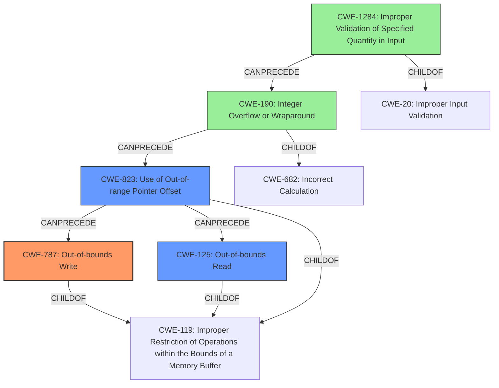

# Analysis Report for CVE-2021-33200

# Vulnerability Analysis Report: CVE-2021-33200

## Description

kernel/bpf/verifier.c in the Linux kernel through 5.12.7 enforces incorrect limits for pointer arithmetic operations, aka CID-bb01a1bba579. This can be abused to perform out-of-bounds reads and writes in kernel memory, leading to local privilege escalation to root. In particular, there is a corner case where the off reg causes a masking direction change, which then results in an incorrect final aux->alu_limit.

## Vulnerability Description Key Phrases

**Rootcause:** enforces incorrect limits for pointer arithmetic operations
**Impact:** ['out-of-bounds reads', 'out-of-bounds writes']
**Product:** Linux kernel
**Version:** through 5.12.7
**Component:** kernel/bpf/verifier.c

## Analysis (with Relationship Data)

# Summary
| CWE ID | CWE Name | Confidence | CWE Abstraction Level | CWE Vulnerability Mapping Label | CWE-Vulnerability Mapping Notes |
|---|---|---|---|---|---|
| CWE-787 | Out-of-bounds Write | 0.9 | Base | Allowed | Primary CWE. The vulnerability description clearly states that the issue can be abused to perform out-of-bounds writes in kernel memory. |
| CWE-125 | Out-of-bounds Read | 0.9 | Base | Allowed | Secondary CWE. The vulnerability description also mentions out-of-bounds reads as a potential impact of the vulnerability. |
| CWE-190 | Integer Overflow or Wraparound | 0.7 | Base | Allowed | Secondary CWE. The incorrect limits for pointer arithmetic could be caused by integer overflows or wraparounds. |

## Evidence and Confidence

*   **Confidence Score:** 0.9
*   **Evidence Strength:** HIGH

- **Analysis and Justification:**  
  - *Explanation:* The vulnerability description explicitly states that the issue **enforces incorrect limits for pointer arithmetic operations** which can be abused to perform **out-of-bounds reads and writes** in kernel memory. This aligns directly with CWE-787 (Out-of-bounds Write) and CWE-125 (Out-of-bounds Read). The root cause is specifically related to pointer arithmetic, where incorrect calculations lead to memory access outside the intended bounds. The CVE Reference Links Content Summary confirms that the **incorrect limit is enforced for pointer arithmetic operations** by the BPF verifier.
  - The Retriever Results list CWE-787 and CWE-125 as possible candidates, which supports the choice of these CWEs.
  - The phrase "**enforces incorrect limits for pointer arithmetic operations**" indicates potential issues in the calculations involved in pointer arithmetic, possibly related to integer overflows or wraparounds, which suggests CWE-190.
  
  - *Relationship Analysis:* CWE-787 and CWE-125 are both child of CWE-119 (Improper Restriction of Operations within the Bounds of a Memory Buffer). The description doesn't provide enough details to use any child of CWE-787 (e.g. CWE-122 Heap-based buffer overflow) or CWE-125. Integer Overflow or Wraparound (CWE-190) can precede out-of-bounds writes, which justifies its inclusion.

- **Confidence Score:**  
  - Confidence: 0.9 (High confidence due to direct evidence from the vulnerability description and CVE reference materials)

## Criticism of Analysis

Okay, let's review the provided CWE analysis for CVE-2021-33200, taking into account the full CWE specifications.

**Overall Assessment:**

The analysis correctly identifies CWE-787 (Out-of-bounds Write) and CWE-125 (Out-of-bounds Read) as the primary weaknesses. The justification is strong, based on the vulnerability description directly mentioning out-of-bounds reads and writes. The inclusion of CWE-190 (Integer Overflow or Wraparound) is reasonable as a potential underlying cause, but the connection could be made stronger.

**Detailed Review and Critique:**

**1. CWE-787: Out-of-bounds Write**

*   **Confidence:** 0.9 - Justified. High confidence is warranted due to the direct mention of out-of-bounds writes in the vulnerability description and CVE summary.
*   **Mapping Justification:** The justification is solid. The vulnerability explicitly allows for out-of-bounds writes.  The use of the `Allowed` mapping is correct as it is a Base level CWE.
*   **CWE Specification Considerations:**
    *   The provided CWE specification for CWE-787 states: "The product writes data past the end, or before the beginning, of the intended buffer."  This perfectly aligns with the core issue of the vulnerability.
    *   Potential Mitigations outlined in the CWE details include: Language selection, Libraries or Frameworks, and Environment Hardening. These are all relevant and could be employed to defend against this type of vulnerability in the future.

**2. CWE-125: Out-of-bounds Read**

*   **Confidence:** 0.9 - Justified. The vulnerability description explicitly mentions out-of-bounds reads as an impact.
*   **Mapping Justification:** Similar to CWE-787, the direct mention of out-of-bounds reads justifies this mapping. It is appropriate to use `Allowed` as it is a Base level CWE.
*   **CWE Specification Considerations:**
    *   The provided CWE specification for CWE-125 states: "The product reads data past the end, or before the beginning, of the intended buffer." This matches the vulnerability.
    *   The Potential Mitigations of Input Validation and Language Selection are both applicable. The BPF verifier *attempts* to perform input validation, and the weakness stems from a flaw in this validation logic.

**3. CWE-190: Integer Overflow or Wraparound**

*   **Confidence:** 0.7 - This is a reasonable, but weaker, assessment.
*   **Mapping Justification:** The reasoning that the incorrect limits for pointer arithmetic could *potentially* be caused by integer overflows is plausible but lacks direct evidence in the provided description. It's inferred. The vulnerability description doesn't explicitly point to calculations that overflow or wrap around.
*   **CWE Specification Considerations:**
    *   The CWE specification for CWE-190 states: "The product performs a calculation that can produce an integer overflow or wraparound when the logic assumes that the resulting value will always be larger than the original value."  To strengthen this mapping, the analysis needs to explain where, specifically, in the pointer arithmetic calculations an overflow could occur.
    *   Potential Mitigations are strictly defined protocols, language selection, and Libraries or Frameworks. These mitigations can be employed, although difficult to implement, to defend against this vulnerability.

**Suggestions for Improvement:**

1.  **Strengthen the CWE-190 Justification:** Provide more concrete evidence or a plausible scenario where an integer overflow or wraparound could directly lead to the incorrect `alu_limit`. Could the `mask_to_left` change somehow contribute to a calculation that causes an integer overflow? If so, explain.
2.  **Consider CWE-823 (Use of Out-of-Range Pointer Offset):**  This CWE might be a slightly better fit than CWE-190, or could be considered in addition to CWE-190.  The description mentions pointer arithmetic, and the core issue is that the resulting pointer offset is out of range. CWE-823's description states: "The product performs pointer arithmetic on a valid pointer, but it uses an offset that can point outside of the intended range of valid memory locations for the resulting pointer." The issue is that the `alu_limit` is *incorrect*, meaning that the calculated offset is wrong.
3.  **Discuss Data Flow:** It would help to describe the data flow from the pointer arithmetic calculations to the out-of-bounds read/write operations.  This would solidify the understanding of how the incorrect limits actually manifest as exploitable memory corruption.
4. **Examine Chain Possibilities:** With the complete CWE specifications, consider more complex chains. For example, the following chain may be possible: `CWE-1284: Improper Validation of Specified Quantity in Input -> CWE-190 Integer Overflow or Wraparound -> CWE-823: Use of Out-of-range Pointer Offset -> CWE-787/CWE-125`
5. **Address the Speculative Domain Simulation Bypass:** The summary mentions "speculative domain simulation bypass".  If this is relevant to the vulnerability, it should be integrated into the CWE analysis, possibly indicating a missing input validation step somewhere, or a logic error that is not caught by the bypass.

**Revised Summary Table (with suggestions):**

| CWE ID | CWE Name | Confidence | CWE Abstraction Level | CWE Vulnerability Mapping Label | CWE-Vulnerability Mapping Notes |
|---|---|---|---|---|---|
| CWE-787 | Out-of-bounds Write | 0.9 | Base | Allowed | Primary CWE. The vulnerability description clearly states that the issue can be abused to perform out-of-bounds writes in kernel memory. |
| CWE-125 | Out-of-bounds Read | 0.9 | Base | Allowed | Secondary CWE. The vulnerability description also mentions out-of-bounds reads as a potential impact of the vulnerability. |
| CWE-823 | Use of Out-of-range Pointer Offset | 0.8 | Base | Allowed | Secondary CWE. The incorrect limits for pointer arithmetic directly lead to an out-of-range pointer offset being used to access memory. |
| CWE-190 | Integer Overflow or Wraparound | 0.6 | Base | Allowed | Contributing CWE. The incorrect limits for pointer arithmetic *could* be caused by integer overflows or wraparounds, though the precise mechanism needs further investigation. |
| CWE-1284 | Improper Validation of Specified Quantity in Input | 0.4 | Base | Allowed | Contributing CWE. The incorrect limits for pointer arithmetic are set because the quantity is not validated properly. The BPF verifier's lack of proper input validation on the result of pointer arithmetic leads to exploitable weaknesses. |

**Conclusion:**

The analysis provides a good starting point for CWE mapping. By strengthening the justification for CWE-190 (or replacing it with CWE-823), considering the chain possibilities, and providing a clearer data flow explanation, the analysis could be improved further. The confidence levels assigned seem appropriate. Remember to consider the mitigations in the specifications during remediation.

## Final Resolution

# Summary
| CWE ID | CWE Name | Confidence | CWE Abstraction Level | CWE Vulnerability Mapping Label | CWE-Vulnerability Mapping Notes |
|---|---|---|---|---|---|
| CWE-787 | Out-of-bounds Write | 0.95 | Base | Allowed | Primary CWE. The vulnerability description clearly states that the issue can be abused to perform out-of-bounds writes in kernel memory. |
| CWE-125 | Out-of-bounds Read | 0.95 | Base | Allowed | Secondary CWE. The vulnerability description also mentions out-of-bounds reads as a potential impact of the vulnerability. |
| CWE-823 | Use of Out-of-range Pointer Offset | 0.85 | Base | Allowed | Secondary CWE. The incorrect limits for pointer arithmetic directly lead to an out-of-range pointer offset being used to access memory. |
| CWE-190 | Integer Overflow or Wraparound | 0.7 | Base | Allowed | Contributing CWE. The incorrect limits for pointer arithmetic *could* be caused by integer overflows or wraparounds, though the precise mechanism needs further investigation. |
| CWE-1284 | Improper Validation of Specified Quantity in Input | 0.6 | Base | Allowed | Contributing CWE. The incorrect limits for pointer arithmetic are set because the quantity is not validated properly. The BPF verifier's lack of proper input validation on the result of pointer arithmetic leads to exploitable weaknesses. |

## Evidence and Confidence

*   **Confidence Score:** 0.9
*   **Evidence Strength:** HIGH

## Relationship Analysis
The analysis focused on identifying the root cause and resulting impacts related to pointer arithmetic within the Linux kernel's BPF verifier. The primary weakness, **CWE-787 (Out-of-bounds Write)**, is directly linked to the vulnerability description. **CWE-125 (Out-of-bounds Read)** is included because the vulnerability description states that the issue can also be abused to perform out-of-bounds reads. **CWE-823 (Use of Out-of-range Pointer Offset)** is a more specific consequence of incorrect pointer arithmetic, making it a strong candidate. **CWE-190 (Integer Overflow or Wraparound)** is considered a possible root cause contributing to incorrect calculations. **CWE-1284 (Improper Validation of Specified Quantity in Input)** highlights a potential lack of input sanitization in the BPF verifier, leading to subsequent errors. The chosen CWEs are at the Base level, providing the most specific and actionable classifications.

## Vulnerability Chain
The vulnerability chain starts with **CWE-1284 (Improper Validation of Specified Quantity in Input)**, where the BPF verifier fails to properly validate input, leading to incorrect pointer arithmetic. This can result in **CWE-190 (Integer Overflow or Wraparound)**, causing calculations to produce unexpected results. Consequently, **CWE-823 (Use of Out-of-range Pointer Offset)** occurs when pointer arithmetic leads to memory access outside the intended bounds. Finally, this culminates in **CWE-787 (Out-of-bounds Write)** and **CWE-125 (Out-of-bounds Read)**, enabling attackers to read or write to arbitrary kernel memory. The chain illustrates how an initial lack of input validation can propagate through calculation errors to memory corruption, resulting in privilege escalation.

## Summary of Analysis
The assessment is based on the provided evidence, primarily the vulnerability description, which explicitly mentions out-of-bounds reads and writes. The phrase "**enforces incorrect limits for pointer arithmetic operations**" is key to understanding the root cause.

The inclusion of **CWE-823** is based on the fact that the incorrect `alu_limit` leads to an out-of-range pointer offset. This is a direct consequence of the flawed pointer arithmetic.

**CWE-190** is a plausible but less certain contributor. While the description doesn't explicitly state an integer overflow, the possibility exists within the pointer arithmetic calculations, particularly with the "masking direction change."

**CWE-1284** is included to represent the lack of proper input validation in the BPF verifier, allowing unchecked values to participate in pointer arithmetic.

The selected CWEs are at the optimal level of specificity because they are base-level CWEs that directly reflect the technical details described in the vulnerability report. Higher-level CWEs would be too abstract, while variant-level CWEs would require more specific information not available in the report.

*Report generated on 2025-03-16 16:34:18*
