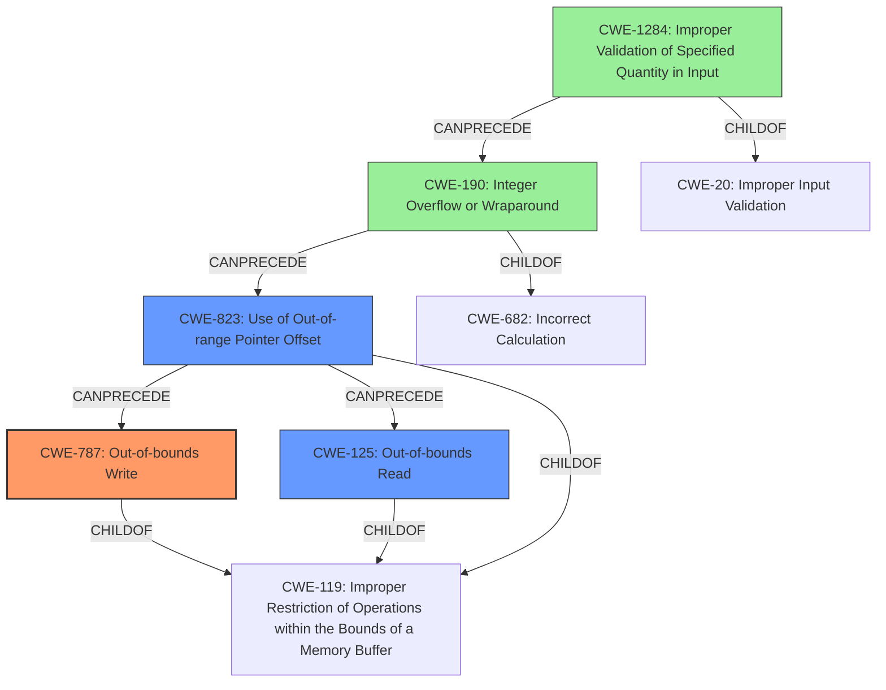

# Final Resolution for CVE-2021-33200

# Summary
| CWE ID | CWE Name | Confidence | CWE Abstraction Level | CWE Vulnerability Mapping Label | CWE-Vulnerability Mapping Notes |
|---|---|---|---|---|---|
| CWE-787 | Out-of-bounds Write | 0.95 | Base | Allowed | Primary CWE. The vulnerability description clearly states that the issue can be abused to perform out-of-bounds writes in kernel memory. |
| CWE-125 | Out-of-bounds Read | 0.95 | Base | Allowed | Secondary CWE. The vulnerability description also mentions out-of-bounds reads as a potential impact of the vulnerability. |
| CWE-823 | Use of Out-of-range Pointer Offset | 0.85 | Base | Allowed | Secondary CWE. The incorrect limits for pointer arithmetic directly lead to an out-of-range pointer offset being used to access memory. |
| CWE-190 | Integer Overflow or Wraparound | 0.7 | Base | Allowed | Contributing CWE. The incorrect limits for pointer arithmetic *could* be caused by integer overflows or wraparounds, though the precise mechanism needs further investigation. |
| CWE-1284 | Improper Validation of Specified Quantity in Input | 0.6 | Base | Allowed | Contributing CWE. The incorrect limits for pointer arithmetic are set because the quantity is not validated properly. The BPF verifier's lack of proper input validation on the result of pointer arithmetic leads to exploitable weaknesses. |

## Evidence and Confidence

*   **Confidence Score:** 0.9
*   **Evidence Strength:** HIGH

## Relationship Analysis
The analysis focused on identifying the root cause and resulting impacts related to pointer arithmetic within the Linux kernel's BPF verifier. The primary weakness, **CWE-787 (Out-of-bounds Write)**, is directly linked to the vulnerability description. **CWE-125 (Out-of-bounds Read)** is included because the vulnerability description states that the issue can also be abused to perform out-of-bounds reads. **CWE-823 (Use of Out-of-range Pointer Offset)** is a more specific consequence of incorrect pointer arithmetic, making it a strong candidate. **CWE-190 (Integer Overflow or Wraparound)** is considered a possible root cause contributing to incorrect calculations. **CWE-1284 (Improper Validation of Specified Quantity in Input)** highlights a potential lack of input sanitization in the BPF verifier, leading to subsequent errors. The chosen CWEs are at the Base level, providing the most specific and actionable classifications.

## Vulnerability Chain
The vulnerability chain starts with **CWE-1284 (Improper Validation of Specified Quantity in Input)**, where the BPF verifier fails to properly validate input, leading to incorrect pointer arithmetic. This can result in **CWE-190 (Integer Overflow or Wraparound)**, causing calculations to produce unexpected results. Consequently, **CWE-823 (Use of Out-of-range Pointer Offset)** occurs when pointer arithmetic leads to memory access outside the intended bounds. Finally, this culminates in **CWE-787 (Out-of-bounds Write)** and **CWE-125 (Out-of-bounds Read)**, enabling attackers to read or write to arbitrary kernel memory. The chain illustrates how an initial lack of input validation can propagate through calculation errors to memory corruption, resulting in privilege escalation.

## Summary of Analysis
The assessment is based on the provided evidence, primarily the vulnerability description, which explicitly mentions out-of-bounds reads and writes. The phrase "**enforces incorrect limits for pointer arithmetic operations**" is key to understanding the root cause.

The inclusion of **CWE-823** is based on the fact that the incorrect `alu_limit` leads to an out-of-range pointer offset. This is a direct consequence of the flawed pointer arithmetic.

**CWE-190** is a plausible but less certain contributor. While the description doesn't explicitly state an integer overflow, the possibility exists within the pointer arithmetic calculations, particularly with the "masking direction change."

**CWE-1284** is included to represent the lack of proper input validation in the BPF verifier, allowing unchecked values to participate in pointer arithmetic.

The selected CWEs are at the optimal level of specificity because they are base-level CWEs that directly reflect the technical details described in the vulnerability report. Higher-level CWEs would be too abstract, while variant-level CWEs would require more specific information not available in the report.