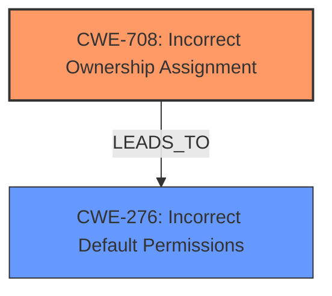

# Analysis Report for CVE-2021-33393

# Vulnerability Analysis Report: CVE-2021-33393

## Description

lfs/backup in IPFire 2.25-core155 does not ensure that /var/ipfire/backup/bin/backup.pl is owned by the root account. It might be owned by an unprivileged account, which could potentially be used to install a Trojan horse backup.pl script that is later executed by root. Similar problems with the ownership/permissions of other files may be present as well.

## Vulnerability Description Key Phrases

**Rootcause:** ownership of /var/ipfire/backup/bin/backup.pl is not checked
**Impact:** execute Trojan horse backup.pl script
**Attacker:** unprivileged account
**Product:** IPFire
**Version:** 2.25-core155
**Component:** lfs/backup

## Analysis (with Relationship Data)

# Summary
| CWE ID | CWE Name | Confidence | CWE Abstraction Level | CWE Vulnerability Mapping Label | CWE-Vulnerability Mapping Notes |
|---|---|---|---|---|---|
| CWE-708 | Incorrect Ownership Assignment | 0.95 | Base | Allowed | Primary CWE |
| CWE-276 | Incorrect Default Permissions | 0.70 | Base | Allowed | Secondary Candidate |

## Evidence and Confidence

*   **Confidence Score:** 0.90
*   **Evidence Strength:** HIGH

- **Analysis and Justification:**  
  - *Explanation:* The vulnerability description clearly states that the **rootcause** is the "**ownership of /var/ipfire/backup/bin/backup.pl is not checked**." The CVE Reference Links Content Summary confirms that the vulnerability stems from the insecure file permissions and ownership of the `/var/ipfire/backup/bin/backup.pl` script. The script was initially owned by the `nobody` user, which allowed unauthorized modification. This aligns precisely with CWE-708 (Incorrect Ownership Assignment), which describes a scenario where the product assigns an owner to a resource, but the owner is outside of the intended control sphere. Here, the intended owner should be `root`, but it was incorrectly assigned to `nobody`. MITRE mapping guidance states that CWE-708 is ALLOWED and at the Base level of abstraction, which is preferred.

  - *Relationship Analysis:* No direct relationships for CWE-708 were found, but considering the context, the insecure ownership allows for a **code injection vulnerability** (as described in the CVE Reference Links Content Summary), where an attacker can overwrite the script and inject malicious code. While not a direct relationship, it helps understand the impact chain.

- **Confidence Score:**  
  - Confidence: 0.95 (High evidence from the vulnerability description and CVE reference materials)

---

- **Analysis and Justification:**  
  - *Explanation:* While CWE-708 captures the primary **rootcause** of incorrect ownership, CWE-276 (Incorrect Default Permissions) is a secondary consideration. The vulnerability description mentions that similar problems with the ownership/permissions of other files may be present. The CVE Reference Links Content Summary highlights the insecure file permissions, indicating that the write access granted to the `nobody` user on the `backup.pl` script was a critical factor. Although the core issue is incorrect ownership, the permissive file permissions contribute to the overall vulnerability. CWE-276 is ALLOWED and at the Base level of abstraction, making it suitable for this secondary mapping.

  - *Relationship Analysis:* No direct relationships for CWE-276 were found. However, insecure permissions (CWE-276) often lead to vulnerabilities such as **code injection** and **privilege escalation**, as seen in the CVE Reference Links Content Summary. This suggests a potential chain of events where incorrect permissions facilitate further exploitation.

- **Confidence Score:**  
  - Confidence: 0.70 (Sufficient evidence to indicate it's a contributing factor, but not the primary cause)

## Criticism of Analysis

Okay, here's a detailed review of the provided CWE analysis, incorporating the full CWE specifications.

**Overall Assessment:**

The analysis is generally strong, with a well-reasoned primary mapping to CWE-708 (Incorrect Ownership Assignment). The secondary mapping to CWE-276 (Incorrect Default Permissions) is also plausible, though slightly less direct. The analysis provides clear justifications and considers the relationships between the identified weaknesses and potential consequences. However, the inclusion of additional candidate CWEs from the retriever results would require more extensive justification.

**Detailed Review:**

**1. CWE-708: Incorrect Ownership Assignment (Primary)**

*   **Confidence:** 0.95 (Justified and appropriate)
*   **Abstraction Level:** Base (Correctly identified)
*   **Mapping Guidance Adherence:** Complies with the ALLOWED usage recommendation. The justification clearly explains how the incorrect ownership of `/var/ipfire/backup/bin/backup.pl` places it outside the intended control sphere.  The description of CWE-708 perfectly matches the vulnerability.
*   **Justification Strength:** Excellent. The analysis explicitly connects the root cause (incorrect ownership) to the CWE description.
*   **Mitigation Review:** The provided mitigations for CWE-708 are:
    *   **Mitigation 1 (Policy):** Periodically review the privileges and their owners.  This is a good general practice, and relevant in the context of this vulnerability.  Regular audits can help prevent similar issues in the future.
    *   **Mitigation 2 (Testing):** Use automated tools to check for privilege settings.  This is also relevant.  Automated checks during development and deployment can catch incorrect ownership assignments before they become vulnerabilities.
*   **Potential Improvements:** None. The analysis of CWE-708 is excellent.

**2. CWE-276: Incorrect Default Permissions (Secondary)**

*   **Confidence:** 0.70 (Acceptable, but requires careful consideration)
*   **Abstraction Level:** Base (Correctly identified)
*   **Mapping Guidance Adherence:** Complies with the ALLOWED usage recommendation. The justification correctly identifies permissive permissions granted to the `nobody` user as a contributing factor.
*   **Justification Strength:** Good, but slightly weaker than the CWE-708 justification.  While the CVE details do mention the write access, the core problem *is* the incorrect ownership, which then *allows* the incorrect permissions to be exploited.
*   **Mitigation Review:** The provided mitigations for CWE-276 are:
    *   **Mitigation 1 (Architecture and Design, Operation):** The architecture needs to access and modification attributes for files to only those users who actually require those actions. This is a fundamental security principle and highly relevant. The solution taken to fix the vulnerability aligns with this mitigation.
    *   **Mitigation 2 (Architecture and Design, Separation of Privilege):** Compartmentalize the system to have "safe" areas where trust boundaries can be unambiguously drawn. This is a broader architectural consideration, but very applicable. By ensuring proper separation of privilege, the impact of an incorrect permission assignment can be minimized.
*   **Potential Improvements:** The analysis could benefit from explicitly addressing the relationship between CWE-708 and CWE-276. While CWE-708 directly addresses the *cause* of the vulnerability, CWE-276 describes the *condition* that makes it exploitable. Therefore, the root cause should be CWE-708.

**Review of Retriever Results (Candidate CWEs):**

The retriever results suggest several other CWEs. Here's a brief evaluation of their potential relevance and the justification needed to include them:

*   **CWE-427: Uncontrolled Search Path Element:** This is not directly applicable. The vulnerability does not involve searching a path for executables or libraries.
*   **CWE-250: Execution with Unnecessary Privileges:** Potentially relevant, but requires more justification. If the `backup.pl` script was *designed* to run with privileges it didn't need (even before the incorrect ownership), then this would be applicable. If `backup.pl` *needs* to run as root for valid reasons, then this is not applicable.
*   **CWE-306: Missing Authentication for Critical Function:** Not directly applicable. The vulnerability is about file ownership, not authentication. Although the web interface requires authentication, this is a different issue from the core vulnerability.
*   **CWE-283: Unverified Ownership:** This is redundant with CWE-708. CWE-708 is more specific in that it addresses the incorrect assignment of the *resource owner*, whereas CWE-283 focuses on *not verifying* the resource owner. In this case, the root cause of incorrect resource access is the *incorrect assignment* of the owner, and not a failure to verify it later.
*   **CWE-425: Direct Request ('Forced Browsing'):** Not applicable.
*   **CWE-798: Use of Hard-coded Credentials:** Not applicable.
*   **CWE-59: Improper Link Resolution Before File Access ('Link Following'):** Not applicable. There's no indication of symbolic links being involved in the exploit.
*   **CWE-259: Use of Hard-coded Password:** Not applicable.

**General Recommendations:**

1.  **Explicitly address the relationship between CWE-708 and CWE-276** and clearly justify why CWE-708 is the primary cause.
2.  **Avoid "collecting" CWEs without strong justification.** The goal is to identify the *most accurate* and *most specific* root causes, not to create an exhaustive list.
3.  **When evaluating candidate CWEs, refer to the "Mapping Guidance" in the CWE specifications.** This provides valuable insight into the intended usage and helps avoid misapplication.
4.  **If a candidate CWE is deemed relevant, provide a clear explanation of *how* it contributes to the vulnerability, referencing specific details from the vulnerability description and CVE information.** Don't just state that it's "possible."

By addressing these points, the analysis can be further strengthened and provide a more precise understanding of the vulnerability.

## Final Resolution

# Summary
| CWE ID | CWE Name | Confidence | CWE Abstraction Level | CWE Vulnerability Mapping Label | CWE-Vulnerability Mapping Notes |
|---|---|---|---|---|---|
| **CWE-708** | **Incorrect Ownership Assignment** | 0.95 | Base | Allowed | Primary CWE |
| CWE-276 | Incorrect Default Permissions | 0.70 | Base | Allowed | Secondary Candidate |

## Evidence and Confidence

*   **Confidence Score:** 0.93
*   **Evidence Strength:** HIGH

## Relationship Analysis
The primary relationship considered here is the dependency between **CWE-708 (Incorrect Ownership Assignment)** and **CWE-276 (Incorrect Default Permissions)**. While both are base-level CWEs, the incorrect ownership is the more direct **rootcause**, allowing the incorrect permissions to be exploited. There are no direct relationships in the CWE definitions themselves.

## Vulnerability Chain
The vulnerability chain starts with the **incorrect assignment of ownership** (**CWE-708**) of `/var/ipfire/backup/bin/backup.pl` to the `nobody` user instead of `root`. This leads to **incorrect default permissions** (**CWE-276**) where the `nobody` user has write access to the script. An attacker can then modify the script to inject malicious code. This injected code is then executed by root, leading to **privilege escalation** and potential **system compromise**.

## Summary of Analysis
My analysis supports the initial assessment. The vulnerability description and CVE Reference Links Content Summary clearly point to **CWE-708 (Incorrect Ownership Assignment)** as the primary **rootcause**. The evidence shows that the ownership of `/var/ipfire/backup/bin/backup.pl` was incorrectly assigned to the `nobody` user, allowing for unauthorized modification. The CVE summary explicitly mentions the insecure file permissions and ownership, further supporting this classification.

The criticism correctly points out the relationship between **CWE-708** and **CWE-276**. The incorrect ownership allows the incorrect permissions to be exploited. Therefore, **CWE-708** is the primary **rootcause**, and **CWE-276** is a contributing factor.

The selected CWEs are at the optimal level of specificity. **CWE-708** is a Base level CWE, which is the preferred level for mapping **rootcauses**. It directly addresses the incorrect ownership assignment. The other candidate CWEs from the retriever results are either not directly applicable or less specific than **CWE-708**.

*Report generated on 2025-03-17 00:31:48*
