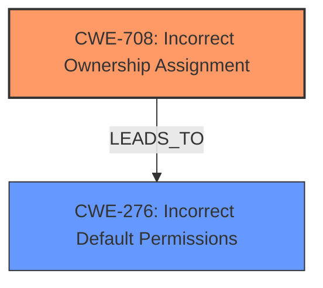

# Final Resolution for CVE-2021-33393

# Summary
| CWE ID | CWE Name | Confidence | CWE Abstraction Level | CWE Vulnerability Mapping Label | CWE-Vulnerability Mapping Notes |
|---|---|---|---|---|---|
| **CWE-708** | **Incorrect Ownership Assignment** | 0.95 | Base | Allowed | Primary CWE |
| CWE-276 | Incorrect Default Permissions | 0.70 | Base | Allowed | Secondary Candidate |

## Evidence and Confidence

*   **Confidence Score:** 0.93
*   **Evidence Strength:** HIGH

## Relationship Analysis
The primary relationship considered here is the dependency between **CWE-708 (Incorrect Ownership Assignment)** and **CWE-276 (Incorrect Default Permissions)**. While both are base-level CWEs, the incorrect ownership is the more direct **rootcause**, allowing the incorrect permissions to be exploited. There are no direct relationships in the CWE definitions themselves.

## Vulnerability Chain
The vulnerability chain starts with the **incorrect assignment of ownership** (**CWE-708**) of `/var/ipfire/backup/bin/backup.pl` to the `nobody` user instead of `root`. This leads to **incorrect default permissions** (**CWE-276**) where the `nobody` user has write access to the script. An attacker can then modify the script to inject malicious code. This injected code is then executed by root, leading to **privilege escalation** and potential **system compromise**.

## Summary of Analysis
My analysis supports the initial assessment. The vulnerability description and CVE Reference Links Content Summary clearly point to **CWE-708 (Incorrect Ownership Assignment)** as the primary **rootcause**. The evidence shows that the ownership of `/var/ipfire/backup/bin/backup.pl` was incorrectly assigned to the `nobody` user, allowing for unauthorized modification. The CVE summary explicitly mentions the insecure file permissions and ownership, further supporting this classification.

The criticism correctly points out the relationship between **CWE-708** and **CWE-276**. The incorrect ownership allows the incorrect permissions to be exploited. Therefore, **CWE-708** is the primary **rootcause**, and **CWE-276** is a contributing factor.

The selected CWEs are at the optimal level of specificity. **CWE-708** is a Base level CWE, which is the preferred level for mapping **rootcauses**. It directly addresses the incorrect ownership assignment. The other candidate CWEs from the retriever results are either not directly applicable or less specific than **CWE-708**.