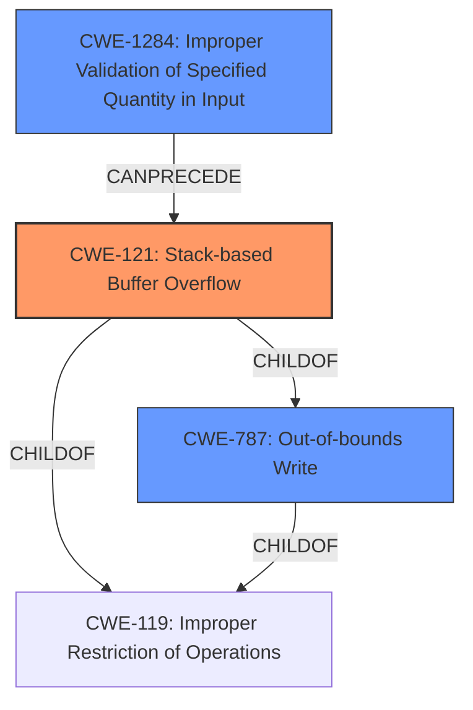

# Final Resolution for CVE-2021-33438

# Summary

| CWE ID  | CWE Name                         | Confidence | CWE Abstraction Level | CWE Vulnerability Mapping Label | CWE-Vulnerability Mapping Notes                                                                                                                                                                             |
| :------ | :-------------------------------- | :--------- | :-------------------- | :------------------------------ | :-------------------------------------------------------------------------------------------------------------------------------------------------------------------------------------------------------- |
| CWE-121 | Stack-based Buffer Overflow         | 0.95       | Variant               | Allowed                       | Primary CWE. Triggered by a crafted JSON input leading to memory corruption on the stack.                                                                                                                   |
| CWE-787 | Out-of-bounds Write               | 0.65       | Base                  | Allowed                       | Secondary Candidate. Describes the fundamental write operation exceeding buffer boundaries, resulting from the overflow condition.                                                                                |
| CWE-125 | Out-of-bounds Read               | 0.65       | Base                  | Allowed                       | Secondary Candidate.  A possible consequence of the overflow, where memory is read from unintended locations; however, not explicitly confirmed in the vulnerability description.                                         |
| CWE-1284  | Improper Validation of Specified Quantity in Input          | 0.40       | Base               | Allowed                       | The root cause likely involves a failure to validate the size of the array being created. Implies a chain: Improper Input -> CWE-121.     |

## Evidence and Confidence

*   **Confidence Score:** 0.92
*   **Evidence Strength:** HIGH

## Relationship Analysis

The primary relationship influencing the decision is the hierarchical relationship between CWE-121 (Stack-based Buffer Overflow), CWE-787 (Out-of-bounds Write), and CWE-119 (Improper Restriction of Operations within the Bounds of a Memory Buffer). CWE-121 is a variant of CWE-119 and also a more specific case of CWE-787. The chain relationship is that improper input validation (CWE-1284) can precede a stack buffer overflow (CWE-121).

## Vulnerability Chain

The vulnerability chain starts with **CWE-1284: Improper Validation of Specified Quantity in Input**. This leads to **CWE-121: Stack-based Buffer Overflow**, where a buffer on the stack is overwritten due to the lack of proper size checks. The overflow can then potentially result in **CWE-125: Out-of-bounds Read**, as the program might try to read data from memory locations beyond the intended buffer. The final impact is a denial of service.

## Summary of Analysis

The initial analysis correctly identified **CWE-121: Stack-based Buffer Overflow** as the primary **WEAKNESS**, given the explicit mention of "stack buffer overflow" in the vulnerability description. The inclusion of **CWE-787: Out-of-bounds Write** and **CWE-125: Out-of-bounds Read** as secondary candidates is also reasonable.

The criticism provided valuable suggestions, particularly regarding the inclusion of **CWE-1284: Improper Validation of Specified Quantity in Input** to represent the **ROOTCAUSE** of the vulnerability. The suggestion to explicitly frame the vulnerability as a chain also helped clarify the relationship between the weaknesses.

The graph relationships influenced the final selection by highlighting the hierarchical relationships between the CWEs and the chain relationship between input validation and the buffer overflow.

The selected CWEs are at the optimal level of specificity. **CWE-121** is the most specific CWE that directly matches the vulnerability description. **CWE-787** and **CWE-125** are included as secondary candidates to provide a more complete picture of the vulnerability. The inclusion of **CWE-1284** is to show the full vulnerability chain and to highlight the need for input validation.