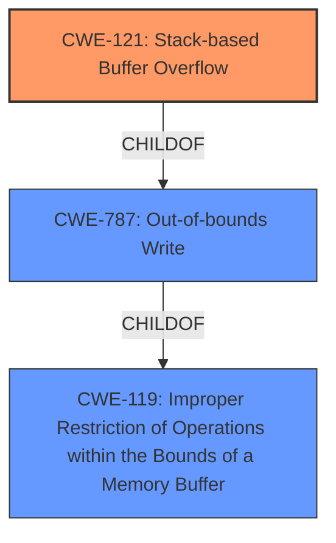

# Final Resolution for CVE-2021-33448

# Summary
| CWE ID  | CWE Name                     | Confidence | CWE Abstraction Level | CWE Vulnerability Mapping Label | CWE-Vulnerability Mapping Notes                                                                                                                                                                                                       |
| :------ | :--------------------------- | :--------- | :---------------------- | :------------------------------ | :------------------------------------------------------------------------------------------------------------------------------------------------------------------------------------------------------------------------------------ |
| CWE-121 | Stack-based Buffer Overflow | 0.95       | Variant               | Allowed                       | Primary CWE. Explicitly matches the vulnerability description and CVE details. Addresses the stack-based nature of the overflow. Mitigations include stack canaries and bounds checking.  Preferred over CWE-119 due to specificity. |

## Evidence and Confidence

*   **Confidence Score:** 0.95
*   **Evidence Strength:** HIGH

## Relationship Analysis
The primary relationship is that CWE-121 (Stack-based Buffer Overflow) is a variant of CWE-119 (Improper Restriction of Operations within the Bounds of a Memory Buffer). The "stack-based" nature provides sufficient specificity to select CWE-121 over its parent. Although not strictly incorrect, CWE-787 (Out-of-bounds Write) is a parent of CWE-121. CWE-787 is a Base level CWE and provides an alternative perspective, but sticking with CWE-121 is still the best choice due to the 'stack-based' qualifier.

## Vulnerability Chain
The vulnerability chain starts with the **ROOTCAUSE** which is an improper restriction of operations within the bounds of a memory buffer (CWE-119), specifically on the stack. This leads to a stack-based buffer overflow (**WEAKNESS**) (CWE-121), where data is written beyond the allocated buffer on the stack. The consequence is potential code execution or denial of service.

## Summary of Analysis
The initial analysis and criticism both agree that CWE-121 (Stack-based Buffer Overflow) is the most appropriate classification for the vulnerability. The vulnerability description explicitly states a "**stack buffer overflow**" and the CVE reference link summary confirms "**Stack buffer overflow in mjs**". This direct mention is strong evidence.

The analysis also considered other CWEs with higher retriever scores but correctly determined that they represent contributing factors or related access patterns rather than the core vulnerability itself. For instance, while an integer overflow (CWE-190) or off-by-one error (CWE-193) could potentially lead to a buffer overflow, the primary issue here is the overflow itself.

The selection of CWE-121 is at the optimal level of specificity because it's a Variant that accurately reflects the stack-based nature of the buffer overflow. Choosing the more general CWE-119 (Improper Restriction of Operations within the Bounds of a Memory Buffer) would lose this crucial detail. The evidence supports this decision, and the relationship analysis confirms that CWE-121 is a specific type of CWE-119.