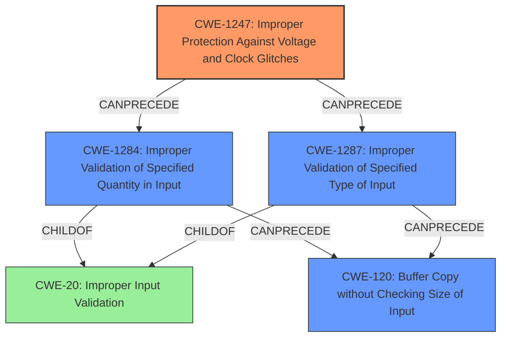

# Final Resolution for CVE-2021-33478

# Summary
| CWE ID     | CWE Name                                                                                                 | Confidence | CWE Abstraction Level | CWE Vulnerability Mapping Label | CWE-Vulnerability Mapping Notes |
| :---------- | :------------------------------------------------------------------------------------------------------- | :--------- | :---------------------- | :------------------------------ | :------------------------------ |
| CWE-1247    | Improper Protection Against Voltage and Clock Glitches                                                   | 0.90        | Base                    | Primary                         | Allowed                         |
| CWE-1284    | Improper Validation of Specified Quantity in Input                                                         | 0.75        | Base                    | Secondary                       | Allowed                         |
| CWE-120     | Buffer Copy without Checking Size of Input ('Classic Buffer Overflow')                                     | 0.70        | Base                    | Secondary                       | Allowed-with-Review             |
| CWE-1287    | Improper Validation of Specified Type of Input                                                         | 0.65        | Base                    | Secondary                       | Allowed                         |

  - The Primary CWE should be first and noted as the Primary CWEs
  - The secondary candidate CWEs should be next and noted as secondary candidates.
  - The confidence is a confidence score 0 to 1 to rate your confidence in your assessment for that CWE.
  - The CWE Abstraction Level as one of these values: Base, Variant, Pillar, Class, Compound
  - The Mapping Notes Usage as one of these values: Allowed, Allowed-with-Review, Prohibited, Discouraged

## Evidence and Confidence

*   **Confidence Score:** 0.80
*   **Evidence Strength:** MEDIUM

## Relationship Analysis
The most significant relationships influencing the decision were the hierarchical relationships, particularly how CWE-20, as a Class, has more specific Base-level children like CWE-1284 and CWE-1287. This guided the shift from the general CWE-20 to more precise classifications. The chain relationship highlights the progression from hardware manipulation (CWE-1247) leading to input validation issues (CWE-1284 and CWE-1287) and ultimately a buffer overflow (CWE-120).

## Vulnerability Chain
The vulnerability chain begins with **CWE-1247 (Improper Protection Against Voltage and Clock Glitches)**, which allows an attacker with physical access to manipulate the device's voltage. This manipulation enables a special boot mode, where the attacker can inject crafted commands. The device then fails to adequately validate the *quantity* or *type* of input in these commands (**CWE-1284: Improper Validation of Specified Quantity in Input** and **CWE-1287: Improper Validation of Specified Type of Input**). This lack of validation leads to a **CWE-120 (Buffer Copy without Checking Size of Input)**, resulting in arbitrary code execution. The root cause is the hardware-level protection failure (CWE-1247), and the subsequent weaknesses stem from inadequate input validation at the software level.

## Summary of Analysis
The initial analysis correctly identified CWE-1247 as the primary **WEAKNESS** due to the explicit mention of voltage manipulation requiring physical access. The criticism highlighted the overuse of CWE-20 and suggested more specific alternatives, which was a key factor in refining the secondary **WEAKNESSES**.

The graph relationships reinforced the need for specificity, guiding the shift from the general **CWE-20 (Improper Input Validation)** to the more precise **CWE-1284 (Improper Validation of Specified Quantity in Input)** and **CWE-1287 (Improper Validation of Specified Type of Input)**. The final selection reflects a more accurate representation of the vulnerability based on the available evidence and relationship analysis. The chain relationship shows how the **ROOTCAUSE** (CWE-1247) leads to a chain of validation failures (CWE-1284, CWE-1287) culminating in a buffer overflow (CWE-120).

The selected CWEs are at the optimal level of specificity because they directly address the technical indicators in the vulnerability description and align with the MITRE mapping guidance.
The following quotes from the initial analysis and criticism support this conclusion:
*   "The primary weakness appears to be related to hardware-level **improper protection against voltage and clock glitches** (CWE-1247)."
*   "Replace CWE-20 with *specific* types of input validation failures...If the format of the crafted commands is not validated, consider CWE-1286 (Improper Validation of Syntactic Correctness of Input). If a specific type of value (e.g. an integer, a filename) is not validated to be of the correct type, consider CWE-1287 (Improper Validation of Specified Type of Input)."