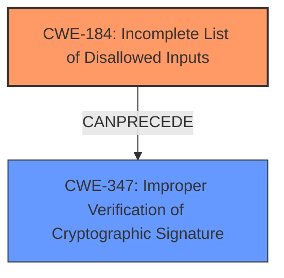

# Final Resolution for CVE-2021-33592

# Summary
| CWE ID | CWE Name | Confidence | CWE Abstraction Level | CWE Vulnerability Mapping Label | CWE-Vulnerability Mapping Notes |
|---|---|---|---|---|---|
| CWE-184 | Incomplete List of Disallowed Inputs | 0.85 | Base | Allowed | Primary CWE |
| CWE-347 | Improper Verification of Cryptographic Signature | 0.65 | Base | Allowed | Secondary Candidate |

## Evidence and Confidence

*   **Confidence Score:** 0.80
*   **Evidence Strength:** MEDIUM

## Relationship Analysis
The primary weakness is identified as **CWE-184 (Incomplete List of Disallowed Inputs)**, which aligns with the vulnerability description stating that **special characters** bypass the code signing check. This indicates insufficient input validation. A secondary weakness is **CWE-347 (Improper Verification of Cryptographic Signature)** because the vulnerability specifically mentions bypassing the code signing check, suggesting a potential flaw in the signature verification process itself.

## Vulnerability Chain
The vulnerability chain begins with **CWE-184 (Incomplete List of Disallowed Inputs)**, where the application fails to properly filter **special characters** in the filename parameter of the upgrade.xml file. This leads to **CWE-347 (Improper Verification of Cryptographic Signature)**, as the insufficient input validation allows attackers to bypass the code signing check function, ultimately leading to arbitrary code execution. The chain highlights how poor input validation can undermine security mechanisms, enabling attackers to execute malicious code.

## Summary of Analysis
The initial analysis correctly identified **CWE-184 (Incomplete List of Disallowed Inputs)** as a potential **root cause**, but it needed further refinement to capture the full scope of the vulnerability. The criticism highlighted the importance of considering how the code signing check is bypassed and suggested exploring **CWE-347 (Improper Verification of Cryptographic Signature)**.

The final decision includes **CWE-184 (Incomplete List of Disallowed Inputs)** as the primary **weakness**, with a confidence score of 0.85. The vulnerability description explicitly mentions that **special characters** bypass the code signing check, confirming the lack of proper input validation.

The inclusion of **CWE-347 (Improper Verification of Cryptographic Signature)** as a secondary **weakness**, with a confidence score of 0.65, acknowledges the potential flaw in the signature verification process itself. The vulnerability description states "Special characters in filename parameter can be the cause of bypassing code signing check function," indicating the check is either not in place, or implemented in a way that allows it to be bypassed.

The graph relationships influenced the final selection by emphasizing the connection between input validation and the code signing check. **CWE-184 (Incomplete List of Disallowed Inputs)** can precede **CWE-347 (Improper Verification of Cryptographic Signature)**, as the input validation failure enables the bypass of the signature verification.

The selected CWEs are at the optimal level of specificity because they accurately represent the **root cause** and contributing factors of the vulnerability. **CWE-184 (Incomplete List of Disallowed Inputs)** captures the input validation failure, while **CWE-347 (Improper Verification of Cryptographic Signature)** addresses the flawed signature verification process.