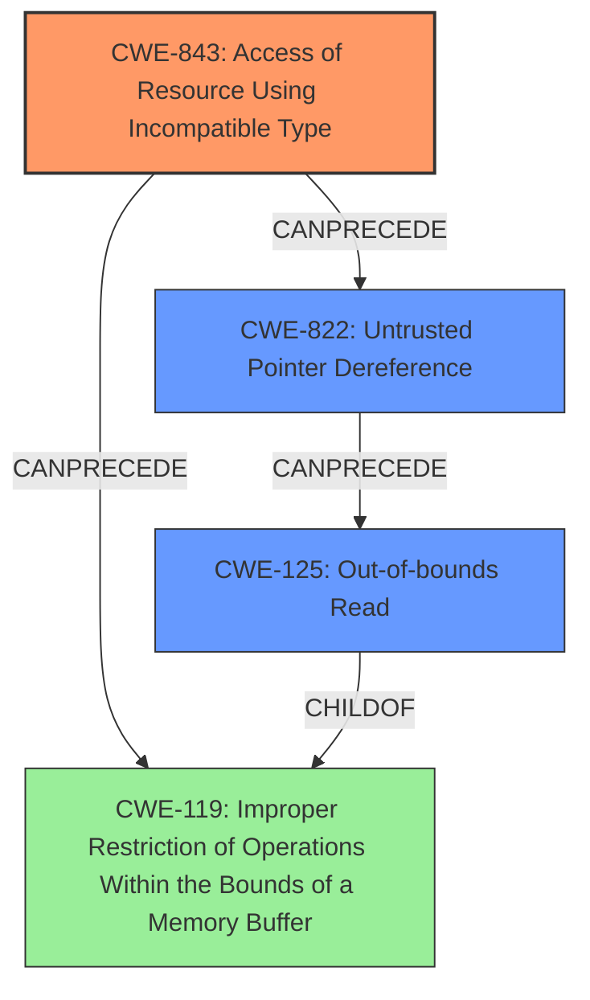

# Final Resolution for CVE-2021-33624

# Summary
| CWE ID | CWE Name | Confidence | CWE Abstraction Level | CWE Vulnerability Mapping Label | CWE-Vulnerability Mapping Notes |
|---|---|---|---|---|---|
| CWE-843 | Access of Resource Using Incompatible Type ('**Type Confusion**') | 0.95 | Base | Allowed | Primary CWE. Matches the vulnerability's root cause of **type confusion**.|
| CWE-822 | Untrusted Pointer Dereference | 0.85 | Base | Allowed | Secondary CWE. The **type confusion** results in the use of attacker-controlled value as a pointer. |
| CWE-125 | Out-of-bounds Read | 0.75 | Base | Allowed | Consequence of the **type confusion** allowing read arbitrary memory locations.|

## Evidence and Confidence

*   **Confidence Score:** 0.92
*   **Evidence Strength:** HIGH

## Relationship Analysis
The primary weakness is **CWE-843 (Access of Resource Using Incompatible Type)** because it accurately reflects the root cause of the vulnerability: a branch misprediction leading to **type confusion**. **CWE-822 (Untrusted Pointer Dereference)** is a strong secondary candidate because the **type confusion** results in using an attacker-influenced value as a pointer, which is then dereferenced. **CWE-125 (Out-of-bounds Read)** is also relevant because the incorrect memory address from the **type confusion** leads to reading data outside the intended buffer.

## Vulnerability Chain
The vulnerability chain starts with a branch misprediction which causes **CWE-843 (Access of Resource Using Incompatible Type)**, where a register holds a value with an incorrect type. This leads to **CWE-822 (Untrusted Pointer Dereference)**, where the attacker-influenced, incorrectly typed value is used as a pointer. Finally, this results in **CWE-125 (Out-of-bounds Read)**, where arbitrary memory locations are read.

## Summary of Analysis
The initial analysis correctly identified **CWE-843 (Access of Resource Using Incompatible Type)** as the primary **ROOTCAUSE** due to the **type confusion** in the BPF verifier. The criticism suggested adding **CWE-822 (Untrusted Pointer Dereference)** as a secondary CWE, which I agree with. The vulnerability description states, "a branch can be mispredicted (e.g., because of **type confusion**) and consequently an unprivileged BPF program can read arbitrary memory locations via a side-channel attack". This indicates that the **type confusion** allows the attacker to control the pointer being dereferenced. **CWE-125 (Out-of-bounds Read)** is a consequence of the **type confusion**. The selected CWEs are at the optimal level of specificity because they accurately describe the root cause and its consequences. The relationship analysis confirms that **CWE-843** can lead to **CWE-822**, which in turn can lead to **CWE-125**.