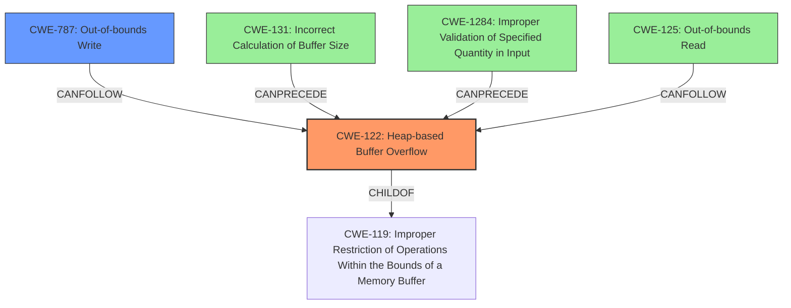

# Final Resolution for CVE-2021-33657

# Summary
| CWE ID | CWE Name | Confidence | CWE Abstraction Level | CWE Vulnerability Mapping Label | CWE-Vulnerability Mapping Notes |
|---|---|---|---|---|---|
| CWE-122 | Heap-based Buffer Overflow | 0.95 | Variant | Primary | Allowed |
| CWE-787 | Out-of-bounds Write | 0.70 | Base | Secondary Candidate | Allowed |
| CWE-131 | Incorrect Calculation of Buffer Size | 0.65 | Base | Contributing Factor | Allowed |
| CWE-125 | Out-of-bounds Read | 0.60 | Base | Contributing Factor | Allowed |
| CWE-1284 | Improper Validation of Specified Quantity in Input | 0.40 | Base | Contributing Factor | Allowed |

## Evidence and Confidence

*   **Confidence Score:** 0.90
*   **Evidence Strength:** HIGH

## Relationship Analysis
The primary relationship identified is that **CWE-122 (Heap-based Buffer Overflow)** is a specific type of buffer overflow occurring on the heap. **CWE-787 (Out-of-bounds Write)** is a direct consequence of this overflow, representing the action that causes the vulnerability. **CWE-131 (Incorrect Calculation of Buffer Size)** is identified as a potential root cause, describing the flawed logic that leads to the undersized buffer allocation. **CWE-125 (Out-of-bounds Read)** may also occur as a consequence of the **heap overflow**, while reading color values from the undersized palette map, but this is not explicitly stated. **CWE-1284 (Improper Validation of Specified Quantity in Input)** could be considered since the code doesn't validate the size of the color palette specified in the input file, which leads to the allocation of an insufficient buffer.

## Vulnerability Chain
The vulnerability chain starts with **CWE-131 (Incorrect Calculation of Buffer Size)**/**CWE-1284 (Improper Validation of Specified Quantity in Input)**, which results in a smaller than expected buffer being allocated on the heap. This leads to **CWE-122 (Heap-based Buffer Overflow)** when the program attempts to write more data into the buffer than it can hold. The **heap overflow** leads to **CWE-787 (Out-of-bounds Write)**, corrupting adjacent memory regions. **CWE-125 (Out-of-bounds Read)** can occur when the program tries to read from the undersized color palette. The ultimate impact is denial of service or code execution.

## Summary of Analysis
The initial analysis correctly identified **CWE-122 (Heap-based Buffer Overflow)** as the primary **weakness**, given the vulnerability description explicitly mentions a "**heap overflow**". The inclusion of **CWE-787 (Out-of-bounds Write)** and **CWE-125 (Out-of-bounds Read)** as secondary candidates is also reasonable, since these are common consequences of buffer overflows.

The criticism makes a strong case for including **CWE-131 (Incorrect Calculation of Buffer Size)** as a contributing factor, since the root cause is that the code incorrectly calculates (or doesn't correctly calculate) the required buffer size for the palette map, leading directly to the **heap overflow**. The analysis has been updated to include **CWE-131**. Additionally, **CWE-1284 (Improper Validation of Specified Quantity in Input)** could be considered since the code doesn't validate the size of the color palette specified in the input file, which leads to the allocation of an insufficient buffer, and has been included.

The final classification reflects the optimal level of specificity by identifying the primary **weakness** (**CWE-122**) and the contributing factors (**CWE-787**, **CWE-131**, **CWE-125**, **CWE-1284**). The relationships between these CWEs are clear, with **CWE-131**/**CWE-1284** leading to **CWE-122**, which in turn leads to **CWE-787** and potentially **CWE-125**. This chain of events accurately describes the vulnerability.