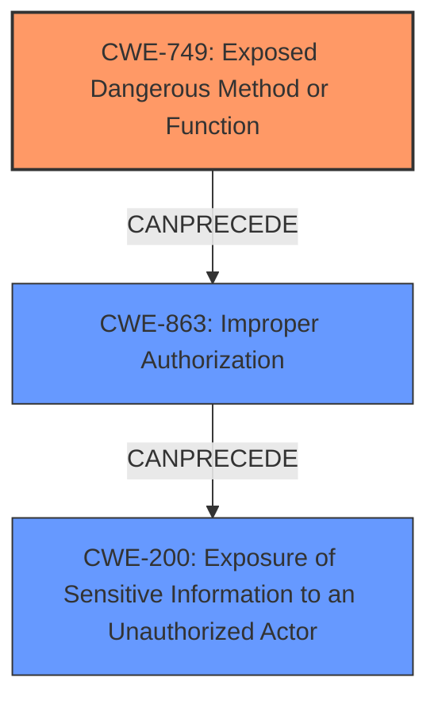

# Final Resolution for CVE-2021-33677

# Summary
| CWE ID | CWE Name | Confidence | CWE Abstraction Level | CWE Vulnerability Mapping Label | CWE-Vulnerability Mapping Notes |
|---|---|---|---|---|---|
| CWE-749 | Exposed Dangerous Method or Function | 0.85 | Base | Allowed | This is the primary CWE because the vulnerability description states that the product "expose functions to external which can lead to information disclosure," and CWE-749 directly addresses the scenario where a product exposes a dangerous method or function to external actors. The vulnerability description directly states that the product exposes functions. |
| CWE-200 | Exposure of Sensitive Information to an Unauthorized Actor | 0.5 | Class | Discouraged | This is a secondary candidate because the vulnerability results in "information disclosure", which falls under the umbrella of exposing sensitive information. However, CWE-200 is a high-level class and is often misused. It is included as a secondary candidate since the **root cause** is the exposure of dangerous functions, and the **impact** is information disclosure. |
| CWE-863 | Improper Authorization | 0.6 | Class | Allowed-with-Review | If exposed functions lack proper authorization checks, resulting in unintended access. Further investigation to confirm this scenario is needed, but it is a strong potential secondary CWE given the high likelihood that exposed functions would have authorization flaws. |

## Evidence and Confidence

*   **Confidence Score:** 0.80
*   **Evidence Strength:** MEDIUM

## Relationship Analysis
- Parent-child hierarchical relationships: CWE-749 has no direct parent/child relationships in the provided data. CWE-200 is a class, and CWE-863 is also a class. The relationships highlight that more specific Base-level CWEs should be preferred when available.
- Chain relationships: The vulnerability chain starts with exposing a dangerous function (CWE-749), which can lead to missing authorization (CWE-863) and ultimately results in information disclosure (CWE-200).
- Peer relationships: No peer relationships were explicitly relevant in the provided data.
- Abstraction levels: The choice of CWE-749 at the Base level is optimal. CWE-200 is a Class and is only included to show the **impact** of the vulnerability, not the **root cause**. CWE-863 is a Class and requires further investigation to determine if it's applicable.

## Vulnerability Chain
- Initial flaw: Exposure of functions to external actors (CWE-749).
- Weakness: Lack of proper authorization checks on these exposed functions (CWE-863 - potential).
- Impact: Information disclosure (CWE-200).
- The chain starts with the intentional exposure of functions (CWE-749), which could lead to missing authorization (CWE-863), and then finally information disclosure (CWE-200).

## Summary of Analysis
The initial analysis and criticism both agree on CWE-749 as the primary **root cause**. The vulnerability description explicitly mentions "expose functions to external which can lead to information disclosure." This directly aligns with CWE-749, "Exposed Dangerous Method or Function."

The relationship analysis reinforces the need to prioritize Base-level CWEs over Class-level CWEs when possible. The addition of CWE-863 "Improper Authorization" as a potential secondary CWE is based on the high likelihood that exposed functions would lack proper authorization checks. This addition strengthens the analysis and provides a more complete picture of the vulnerability chain.

The decision to include CWE-200 is solely based on it being the end result, but it is a high level and not nearly as useful as including CWE-749 and potentially CWE-863.

The selected CWEs are at the optimal level of specificity, with CWE-749 accurately representing the **root cause** and CWE-863 being considered as a possible contributing factor, pending further investigation.