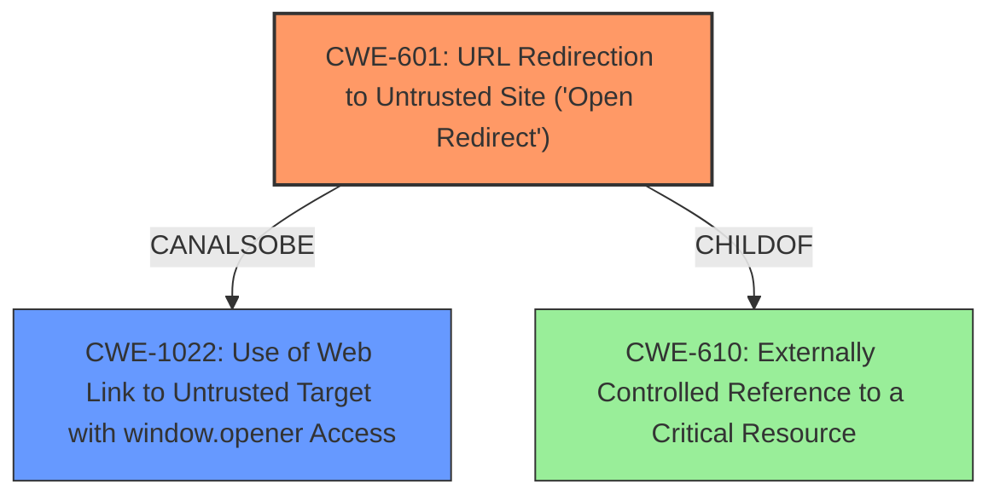

# Analysis Report for CVE-2021-33697

# Vulnerability Analysis Report: CVE-2021-33697

## Description

Under certain conditions, SAP BusinessObjects Business Intelligence Platform (SAPUI5), versions - 420, 430, can allow an unauthenticated attacker to redirect users to a malicious site due to Reverse Tabnabbing vulnerabilities.

## Vulnerability Description Key Phrases

**Impact:** redirect users to malicious site
**Attacker:** unauthenticated attacker
**Product:** SAP BusinessObjects Business Intelligence Platform
**Version:** 420, 430
**Component:** SAPUI5

## Analysis (with Relationship Data)

# Summary
| CWE ID | CWE Name | Confidence | CWE Abstraction Level | CWE Vulnerability Mapping Label | CWE-Vulnerability Mapping Notes |
|---|---|---|---|---|---|
| CWE-601 | URL Redirection to Untrusted Site ('Open Redirect') | 0.9 | Base | Allowed | Primary CWE |
| CWE-1022 | Use of Web Link to Untrusted Target with window.opener Access | 0.6 | Variant | Allowed | Secondary Candidate |

## Evidence and Confidence

*   **Confidence Score:** 0.75
*   **Evidence Strength:** MEDIUM

- **Analysis and Justification:**
  - *Explanation:* The vulnerability description states that an unauthenticated attacker can **redirect users to a malicious site**. This aligns well with CWE-601 (URL Redirection to Untrusted Site ('Open Redirect')). CWE-601 describes a scenario where a web application accepts user-controlled input that specifies a link to an external site and uses that link in a redirect. The fact that the attacker is unauthenticated strengthens the case for CWE-601, as there is no access control preventing the redirection. The MITRE mapping guidance for CWE-601 indicates that its usage is ALLOWED. CWE-1022 (Use of Web Link to Untrusted Target with window.opener Access) is also a possibility, but it involves the `window.opener` object, which is not explicitly mentioned in the description. Thus, CWE-601 is the primary weakness.
  - *Relationship Analysis:* There are no direct relationships for CWE-601 provided in the context. CWE-601 is a Base level CWE.

- **Confidence Score:**
  - Confidence: 0.9 (High match with the vulnerability description and the CWE definition. The description focuses on the redirection aspect which is core to CWE-601.

---
- **Analysis and Justification:**
  - *Explanation:* CWE-1022 (Use of Web Link to Untrusted Target with `window.opener` Access) is a secondary candidate. While the vulnerability description doesn't explicitly mention the `window.opener` object, the Reverse Tabnabbing vulnerability type can involve it. Reverse Tabnabbing exploits the `window.opener` relationship between pages, allowing a malicious page to modify the original page's location. Given that this is a possibility, CWE-1022 is considered. The MITRE mapping guidance for CWE-1022 indicates its usage is ALLOWED and is at the Variant level of abstraction.
  - *Relationship Analysis:* There are no direct relationships for CWE-1022 provided in the context. CWE-1022 is a Variant level CWE.

- **Confidence Score:**
  - Confidence: 0.6 (Possible, but less direct evidence compared to CWE-601. The reliance on reverse tabnabbing requiring the `window.opener` makes it less confident.)

## Criticism of Analysis

Okay, here's a review of the analysis, incorporating the full CWE specifications you provided.

**Overall Assessment:**

The analysis correctly identifies CWE-601 (URL Redirection to Untrusted Site ('Open Redirect')) as the primary weakness. It also reasonably considers CWE-1022 (Use of Web Link to Untrusted Target with window.opener Access) as a secondary candidate due to the "Reverse Tabnabbing" context. The confidence scores are appropriate, given the available information.

**Detailed Review:**

**CWE-601: URL Redirection to Untrusted Site ('Open Redirect')**

*   **Justification:** The analysis accurately links the vulnerability description ("redirect users to a malicious site") to the core definition of CWE-601. The unauthenticated nature of the attacker further strengthens this mapping, as it indicates a lack of proper access control in the redirection process.
*   **Confidence:** The assigned confidence of 0.9 is well-justified. The vulnerability description directly implies a redirection to an untrusted site, which aligns perfectly with CWE-601.
*   **CWE Specification Alignment:** The analysis correctly notes that CWE-601 is at the Base level of abstraction and that its usage is "Allowed" according to the mapping guidance.
*   **Mitigation Considerations:** The CWE specification for CWE-601 lists the following mitigations:
    *   **Input Validation:** Employ an "accept known good" input validation strategy. Use a list of approved URLs or domains.
    *   **Intermediate Disclaimer Page:** Use a disclaimer page that warns the user before redirecting.
    *   **Enforcement by Conversion:** Map fixed input values (numeric IDs) to actual URLs and reject all other inputs.

    The analysis could be improved by explicitly mentioning these mitigations and discussing their applicability in the context of the SAP BusinessObjects platform. This would add more actionable insights. For example, SAP could implement a whitelist of allowed redirect URLs or use an intermediate page with a warning message.
*   **Observed Examples:** It may be helpful to explicitly call out relevant examples from the Observed Examples section. In this case, all of the observed examples are good examples of the CWE.
*   **Relationships:** It may be helpful to consider CWE-610 as a parent. As CWE-610 states, the product uses an externally controlled name or reference that resolves to a resource that is outside of the intended control sphere. Since the URL is likely user controlled, this is a good parent to consider.

**CWE-1022: Use of Web Link to Untrusted Target with window.opener Access**

*   **Justification:** The analysis correctly identifies the potential for CWE-1022, given the mention of "Reverse Tabnabbing." Reverse Tabnabbing relies on the `window.opener` object being accessible to the malicious page, which can then modify the original page's location.
*   **Confidence:** The assigned confidence of 0.6 is appropriate. The connection is less direct than with CWE-601, as it depends on whether the application uses `target="_blank"` or a similar mechanism that exposes the `window.opener` object.
*   **CWE Specification Alignment:** The analysis correctly notes that CWE-1022 is at the Variant level of abstraction and that its usage is "Allowed."
*   **Mitigation Considerations:** The CWE specification for CWE-1022 lists the following mitigations:
    *   **Architecture and Design:** Specify in the design that any linked external document must not be granted access to the location object of the calling page.
    *   **Implementation:** Use the `rel="noopener noreferrer"` attribute on links with `target="_blank"`.
    *   **Implementation:** Reset the opener by setting it equal to null when opening the external document in a new window via javascript.
    *   **Implementation:** Do not use "_blank" targets.

    The analysis could be improved by including these specific mitigation recommendations, which can be directly implemented by SAP. For example, SAP should ensure that all links to external sites use `rel="noopener noreferrer"` to prevent Reverse Tabnabbing attacks.
*   **Observed Examples:** The observed examples are good examples of the CWE.
*   **Relationships:** The specification notes that CWE-1022 is a child of CWE-266. It may be useful to consider this relationship.

**Additional Considerations from Retriever Results:**

The retriever results included the following CWEs which were not considered:
* CWE-306: Missing Authentication for Critical Function
* CWE-525: Use of Web Browser Cache Containing Sensitive Information
* CWE-79: Improper Neutralization of Input During Web Page Generation ('Cross-site Scripting')
* CWE-352: Cross-Site Request Forgery (CSRF)
* CWE-287: Improper Authentication
* CWE-200: Exposure of Sensitive Information to an Unauthorized Actor
* CWE-20: Improper Input Validation
* CWE-285: Improper Authorization

It would be useful to explicitly explain why these CWEs were not selected as part of the final analysis.

**Recommendations for Improvement:**

1.  **Explicitly Discuss Mitigations:** For both CWE-601 and CWE-1022, explicitly state the recommended mitigations from the CWE specifications and discuss how they could be applied in the context of the SAP BusinessObjects platform.
2.  **Consider all Relationships:** Explicitly call out all relevant relationships of the selected CWEs.
3.  **Justify Exclusion:** Explain why other CWEs that were in the initial retriever results were not chosen.
4.  **Observed Examples:** Call out relevant examples from the observed examples sections.

By incorporating these suggestions, the analysis will be more comprehensive and provide more actionable insights for addressing the vulnerability.

## Final Resolution

# Summary
| CWE ID | CWE Name | Confidence | CWE Abstraction Level | CWE Vulnerability Mapping Label | CWE-Vulnerability Mapping Notes |
|---|---|---|---|---|---|
| CWE-601 | URL Redirection to Untrusted Site ('Open Redirect') | 0.95 | Base | Allowed | Primary CWE |
| CWE-1022 | Use of Web Link to Untrusted Target with window.opener Access | 0.75 | Variant | Allowed | Secondary Candidate |
| CWE-610 | Externally Controlled Reference to a Critical Resource | 0.5 | Class | Discouraged | Potential Parent of CWE-601 |

## Evidence and Confidence

*   **Confidence Score:** 0.85
*   **Evidence Strength:** HIGH

## Relationship Analysis
The primary weakness is **CWE-601 URL Redirection to Untrusted Site ('Open Redirect')** which is a Base level CWE. The vulnerability description clearly indicates an unauthenticated attacker can redirect users to a malicious site. The secondary weakness is **CWE-1022 Use of Web Link to Untrusted Target with window.opener Access** which is a Variant level CWE, and is a potential consequence of reverse tabnabbing given the context. Finally, **CWE-610 Externally Controlled Reference to a Critical Resource** is considered as a potential parent to CWE-601 because the URL that is being redirected to is externally controlled. However, it is a Class level CWE and thus less specific than CWE-601.

## Vulnerability Chain
The vulnerability chain begins with an **unauthenticated attacker** (**ROOTCAUSE**) being able to inject a malicious URL into the application. This is then used by the application to **redirect users** (**WEAKNESS: CWE-601**) to the attacker's malicious site. If the application uses `target="_blank"` or similar mechanism that exposes the `window.opener` object, the attacker could leverage reverse tabnabbing (**WEAKNESS: CWE-1022**). The end result is that users are redirected to a malicious site where they could be subject to phishing attacks or have their credentials stolen.

## Summary of Analysis
The initial analysis was correct in identifying **CWE-601** as the primary weakness. The vulnerability description explicitly mentions the redirection to a malicious site which directly corresponds to the description of **CWE-601**.
> Under certain conditions, SAP BusinessObjects Business Intelligence Platform (SAPUI5), versions - 420, 430, can allow an unauthenticated attacker to **redirect users to a malicious site** due to Reverse Tabnabbing vulnerabilities.

The analysis also appropriately identified **CWE-1022** as a secondary candidate due to the mention of "Reverse Tabnabbing." The criticism was helpful in pointing out the importance of explicitly discussing mitigations and considering all relationships. Mitigations for **CWE-601** include input validation (whitelisting allowed URLs) and using an intermediate disclaimer page. Mitigations for **CWE-1022** include using `rel="noopener noreferrer"` on links with `target="_blank"`, resetting the opener via javascript, and avoiding the use of "_blank" targets altogether.

The retriever results included several other CWEs which were not chosen:
*   CWE-306: Missing Authentication for Critical Function: While the vulnerability description mentions an unauthenticated attacker, this is more about the lack of authorization to control the redirection target rather than a missing authentication mechanism. The core issue is the open redirect, not the missing authentication.
*   CWE-525: Use of Web Browser Cache Containing Sensitive Information: This is not relevant to the vulnerability description.
*   CWE-79: Improper Neutralization of Input During Web Page Generation ('Cross-site Scripting'): This is not relevant as the vulnerability is redirection, not XSS.
*   CWE-352: Cross-Site Request Forgery (CSRF): This is not directly relevant. CSRF involves tricking a user into performing an action, while this vulnerability is about directly redirecting the user.
*   CWE-287: Improper Authentication: As mentioned above, the core issue is not the lack of authentication, but the open redirect itself.
*   CWE-200: Exposure of Sensitive Information to an Unauthorized Actor: This is not directly relevant. The vulnerability is about redirection, not information exposure.
*   CWE-20: Improper Input Validation: While improper input validation is present, **CWE-601** is more specific and accurately describes the vulnerability.
*   CWE-285: Improper Authorization: Similar to **CWE-306**, the lack of authorization is a contributing factor, but **CWE-601** captures the essence of the vulnerability (open redirect) more accurately.

**CWE-610** was added as a potential parent of **CWE-601** to acknowledge that the URL being redirected to is externally controlled. However, **CWE-601** is more specific and therefore more appropriate as the primary **WEAKNESS**.

The final classification reflects the optimal level of specificity based on the available evidence and relationship analysis. **CWE-601** is the primary issue, with **CWE-1022** as a secondary concern due to the possibility of reverse tabnabbing. The confidence score has been increased to 0.85 to reflect the inclusion of the mitigations and considering other CWEs.

*Report generated on 2025-03-16 23:22:12*
