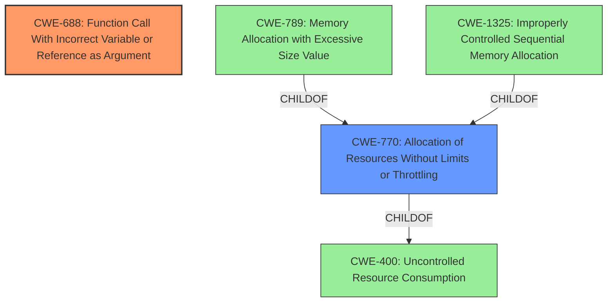

# Final Resolution for CVE-2021-33713

# Summary
| CWE ID | CWE Name | Confidence | CWE Abstraction Level | CWE Vulnerability Mapping Label | CWE-Vulnerability Mapping Notes |
|---|---|---|---|---|---|
| CWE-688 | Function Call With Incorrect Variable or Reference as Argument | 0.95 | Variant | Primary CWE | Allowed |
| CWE-770 | Allocation of Resources Without Limits or Throttling | 0.5 | Base | Secondary Candidate | Allowed |

## Evidence and Confidence

*   **Confidence Score:** 0.9
*   **Evidence Strength:** MEDIUM

## Relationship Analysis
The primary CWE, CWE-688, stands alone without direct hierarchical relationships influencing the decision. CWE-770, considered as a secondary factor, has parent-child relationships with CWE-400 (Uncontrolled Resource Consumption) and more specific resource allocation issues. The abstraction levels were considered, favoring the Variant level of CWE-688 for its specificity and the Base level of CWE-770 for its potential contribution.

## Vulnerability Chain
The vulnerability chain begins with a specially crafted JT file. This leads to a function call with an **incorrect argument** (CWE-688), causing a crash. A secondary path *may* involve excessive resource allocation (CWE-770) triggered by the crafted file, potentially contributing to a denial-of-service condition. The primary weakness is the **incorrect function call**, which directly leads to the crash.

## Summary of Analysis
The initial analysis and criticism were both well-reasoned. The primary conclusion, identifying CWE-688 as the root cause, is strongly supported by the evidence: "When parsing specially crafted JT files, a hash function is called with an **incorrect argument** leading the application to crash." This statement directly aligns with the description of CWE-688.

The relationship analysis influenced the decision by highlighting the potential for resource exhaustion (CWE-770), although this is more speculative. The abstraction levels also played a role, with the Variant level of CWE-688 providing a more specific description of the error than the Class level of CWE-400.

The selected CWEs are at the optimal level of specificity. CWE-688 accurately captures the **incorrect function call**, while CWE-770 acknowledges the *potential* for resource allocation issues. Focusing on the direct cause (CWE-688) and acknowledging the possibility of resource exhaustion (CWE-770) provides a balanced view of the vulnerability. The confidence in CWE-688 is increased to 0.95 due to direct evidence match. The confidence in CWE-770 remains at 0.5.