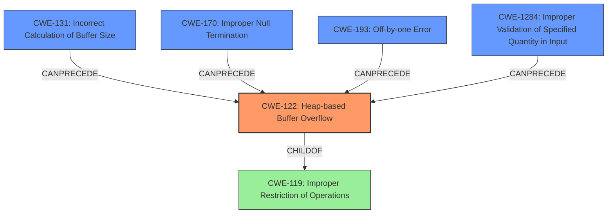

# Analysis Report for CVE-2021-33912

# Vulnerability Analysis Report: CVE-2021-33912

## Description

libspf2 before 1.2.11 has a four-byte heap-based buffer overflow that might allow remote attackers to execute arbitrary code (via an unauthenticated e-mail message from anywhere on the Internet) with a crafted SPF DNS record, because of incorrect sprintf usage in SPF_record_expand_data in spf_expand.c. The vulnerable code may be part of the supply chain of a sites e-mail infrastructure (e.g., with additional configuration, Exim can use libspf2 the Postfix web site links to unofficial patches for use of libspf2 with Postfix older versions of spfquery relied on libspf2) but most often is not.

## Vulnerability Description Key Phrases

**Rootcause:** incorrect sprintf usage
**Weakness:** heap-based buffer overflow
**Impact:** execute arbitrary code
**Vector:** crafted SPF DNS record
**Attacker:** remote attackers
**Product:** libspf2
**Version:** before 1.2.11
**Component:** SPF_record_expand_data in spf_expand.c

## Analysis (with Relationship Data)

```markdown
# Summary
| CWE ID | CWE Name | Confidence | CWE Abstraction Level | CWE Vulnerability Mapping Label | CWE-Vulnerability Mapping Notes |
|---|---|---|---|---|---|
| CWE-122 | Heap-based Buffer Overflow | 0.95 | Variant | Allowed | Primary CWE. The vulnerability is a heap-based buffer overflow.|
| CWE-131 | Incorrect Calculation of Buffer Size | 0.75 | Base | Allowed | Contributing factor to the buffer overflow. |
| CWE-170 | Improper Null Termination | 0.60 | Base | Allowed | Contributing factor if the overflow is caused by missing null termination. |

## Evidence and Confidence

*   **Confidence Score:** 0.90
*   **Evidence Strength:** HIGH

- **Analysis and Justification:**  
  - *Explanation:* The vulnerability description clearly states a **heap-based buffer overflow** in `libspf2` due to **incorrect sprintf usage**. This directly aligns with CWE-122 (Heap-based Buffer Overflow), which is a variant of buffer overflow that occurs in the heap. The CVE reference summary confirms the heap-based buffer overflow. The **incorrect sprintf usage** strongly suggests a calculation error regarding the buffer size, supporting CWE-131 (Incorrect Calculation of Buffer Size) as a contributing factor. CWE-170 (Improper Null Termination) is considered because `sprintf` relies on null termination, and an error in its usage could lead to a missing or incorrect null terminator, causing a buffer overflow.
  
  - *Relationship Analysis:* CWE-122 is a variant of CWE-119 (Improper Restriction of Operations within the Bounds of a Memory Buffer). CWE-131 (Incorrect Calculation of Buffer Size) can lead to CWE-122. CWE-170 (Improper Null Termination) can also lead to CWE-122.

- **Confidence Score:**  
  - Confidence: 0.95 (High confidence due to direct mention of heap-based buffer overflow and supporting evidence from the CVE reference).

---
```

## Criticism of Analysis

Okay, let's review the provided CWE analysis for the libspf2 heap-based buffer overflow vulnerability (CVE-2021-33912).

**Overall Assessment:**

The analysis is good and correctly identifies CWE-122 (Heap-based Buffer Overflow) as the primary weakness. The inclusion of CWE-131 (Incorrect Calculation of Buffer Size) and CWE-170 (Improper Null Termination) as contributing factors is reasonable and helps paint a more complete picture of the underlying issues. The confidence scores are well-justified.

**Detailed Critique:**

1.  **CWE-122: Heap-based Buffer Overflow**
    *   **Correctness:**  This is the most accurate primary CWE.  The vulnerability is explicitly described as a heap-based buffer overflow, and the CVE content summary reinforces this.
    *   **Mapping Guidance:**  The analysis correctly adheres to the mapping guidance for CWE-122, which is `Allowed` for variants because it's a variant level of abstraction.
    *   **Potential Mitigations:**  The mitigations provided (language with bounds checking, abstraction libraries, compiler-based overflow detection) are all standard and relevant to preventing heap overflows.
    *   **Observed Examples:** The provided examples are relevant to this CWE.
    *   **Score:** Excellent.

2.  **CWE-131: Incorrect Calculation of Buffer Size**
    *   **Correctness:**  The reasoning for including CWE-131 is sound. The "incorrect sprintf usage" strongly suggests a buffer size calculation error.  `sprintf` itself isn't inherently unsafe, but its misuse, particularly when formatting variable-length data without proper size management, often leads to buffer overflows due to incorrect size calculations.
    *   **Mapping Guidance:** The analysis correctly identifies this as `Allowed` because it is a base level abstraction.
    *   **Potential Mitigations:** The suggested mitigations (allocating enough memory for the largest possible encoding, understanding numeric representations, and input validation of numeric inputs) are all appropriate.
    *   **Observed Examples:** The provided examples are relevant to this CWE.
    *   **Score:** Excellent.

3.  **CWE-170: Improper Null Termination**
    *   **Correctness:**  This is the weakest of the three CWEs, but still plausible as a contributing factor. `sprintf` does require null termination of strings and failure to do so could definitely contribute to the overflow. However, the analysis states that this is a *possible* contributing factor.
    *   **Mapping Guidance:** The analysis correctly identifies this as `Allowed` because it is a base level abstraction.
    *   **Potential Mitigations:** The mitigations provided are relevant.
    *   **Observed Examples:** The provided examples are relevant to this CWE.
    *   **Score:** Good.

**Improvements and Alternative Considerations:**

*   **CWE-193: Off-by-one Error** The retriever results suggest also including this CWE as it is related to buffer overflows, it can affect length calculations and can lead to out-of-bounds access.
*   **CWE-1284: Improper Validation of Specified Quantity in Input:** is potentially useful if the size of the expanded SPF record is being read from input. If the code isn't validating the specified size, this could contribute to the vulnerability.
*   **CWE-130: Improper Handling of Length Parameter Inconsistency:**  This could be relevant if the SPF record contains length fields that are not properly handled, leading to inconsistencies and potential overflows.
*   **CWE-682: Incorrect Calculation:** While CWE-131 is a specific case, the root cause might be a more general incorrect calculation leading to the buffer size issue. Consider adding this (but it's a Pillar, so discouraged).
*   **CWE-20: Improper Input Validation:**  While the analysis mentions a crafted SPF record, it doesn't explicitly state whether the *contents* of the record are being validated. If the code isn't validating the characters or patterns within the SPF record that are being expanded, this would contribute to the vulnerability. But this is a discouraged CWE.

**Revised Summary Table (incorporating suggestions):**

| CWE ID  | CWE Name                                            | Confidence | CWE Abstraction Level | CWE Vulnerability Mapping Label | CWE-Vulnerability Mapping Notes                                                                                                                  |
| ------- | --------------------------------------------------- | ---------- | ----------------------- | ----------------------------- | ---------------------------------------------------------------------------------------------------------------------------------------------- |
| CWE-122 | Heap-based Buffer Overflow                          | 0.95       | Variant                 | Allowed                       | Primary CWE. The vulnerability is a heap-based buffer overflow.                                                                           |
| CWE-131 | Incorrect Calculation of Buffer Size                 | 0.75       | Base                    | Allowed                       | Contributing factor to the buffer overflow.                                                                                                   |
| CWE-170 | Improper Null Termination                            | 0.60       | Base                    | Allowed                       | Contributing factor if the overflow is caused by missing null termination.                                                                 |
| CWE-193 | Off-by-one Error | 0.40 | Base | Allowed | Potential contributing factor to buffer overflow related to incorrect boundary calculation. |
| CWE-1284 | Improper Validation of Specified Quantity in Input | 0.30 | Base | Allowed | Contributing factor. If the size of the expanded SPF record is read from input and is not validated. |

**Final Verdict:**

The provided analysis is accurate and well-reasoned. The suggested additions would enhance the completeness of the analysis, but are not strictly *required*. Consider whether these additional factors played a role in the vulnerability to improve your analysis.

## Final Resolution

# Summary
| CWE ID | CWE Name | Confidence | CWE Abstraction Level | CWE Vulnerability Mapping Label | CWE-Vulnerability Mapping Notes |
|---|---|---|---|---|---|
| CWE-122 | Heap-based Buffer Overflow | 0.95 | Variant | Allowed | Primary CWE. The vulnerability is a heap-based buffer overflow. |
| CWE-131 | Incorrect Calculation of Buffer Size | 0.75 | Base | Allowed | Contributing factor to the buffer overflow. |
| CWE-170 | Improper Null Termination | 0.60 | Base | Allowed | Contributing factor if the overflow is caused by missing null termination. |
| CWE-193 | Off-by-one Error | 0.40 | Base | Allowed | Potential contributing factor to buffer overflow related to incorrect boundary calculation. |
| CWE-1284 | Improper Validation of Specified Quantity in Input | 0.30 | Base | Allowed | Contributing factor. If the size of the expanded SPF record is read from input and is not validated. |

## Evidence and Confidence

*   **Confidence Score:** 0.90
*   **Evidence Strength:** HIGH

## Relationship Analysis
The primary relationship is that **CWE-122 (Heap-based Buffer Overflow)** is the direct result of other weaknesses. **CWE-131 (Incorrect Calculation of Buffer Size)**, **CWE-170 (Improper Null Termination)**, **CWE-193 (Off-by-one Error)** and **CWE-1284 (Improper Validation of Specified Quantity in Input)** can all lead to a buffer overflow. **CWE-122 (Heap-based Buffer Overflow)** is a variant of **CWE-119 (Improper Restriction of Operations within the Bounds of a Memory Buffer)**. The abstraction levels influenced the decision to keep the primary CWE as **CWE-122 (Heap-based Buffer Overflow)** since it is more specific than **CWE-119 (Improper Restriction of Operations within the Bounds of a Memory Buffer)**.



## Vulnerability Chain
The vulnerability chain starts with the **ROOTCAUSE** being one or more of the following: **CWE-131 (Incorrect Calculation of Buffer Size)**, **CWE-170 (Improper Null Termination)**, **CWE-193 (Off-by-one Error)**, or **CWE-1284 (Improper Validation of Specified Quantity in Input)**. These lead to the **WEAKNESS** which is **CWE-122 (Heap-based Buffer Overflow)**. The impact of this overflow can then lead to arbitrary code execution.

## Summary of Analysis
The initial analysis and criticism both accurately identified **CWE-122 (Heap-based Buffer Overflow)** as the primary issue. The evidence from the vulnerability description states a "heap-based buffer overflow" due to "incorrect sprintf usage". This directly supports the selection of **CWE-122 (Heap-based Buffer Overflow)**. The suggestion to include **CWE-193 (Off-by-one Error)** and **CWE-1284 (Improper Validation of Specified Quantity in Input)** was considered and added with lower confidence scores, as they are plausible contributing factors but not as directly supported by the evidence. The graph relationships influenced the decision to keep **CWE-122 (Heap-based Buffer Overflow)** as the primary CWE because it represents the most specific manifestation of the vulnerability. The selected CWEs are at the optimal level of specificity because they accurately describe the root cause and resulting weakness based on the available evidence.


*Report generated on 2025-03-17 23:55:45*
