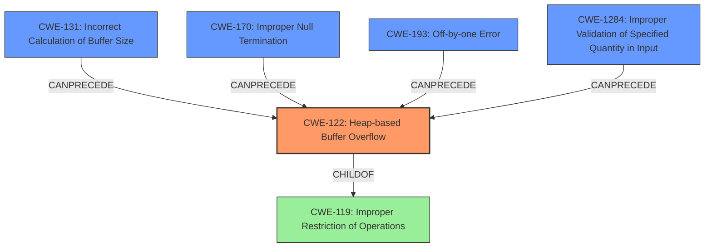

# Final Resolution for CVE-2021-33912

# Summary
| CWE ID | CWE Name | Confidence | CWE Abstraction Level | CWE Vulnerability Mapping Label | CWE-Vulnerability Mapping Notes |
|---|---|---|---|---|---|
| CWE-122 | Heap-based Buffer Overflow | 0.95 | Variant | Allowed | Primary CWE. The vulnerability is a heap-based buffer overflow. |
| CWE-131 | Incorrect Calculation of Buffer Size | 0.75 | Base | Allowed | Contributing factor to the buffer overflow. |
| CWE-170 | Improper Null Termination | 0.60 | Base | Allowed | Contributing factor if the overflow is caused by missing null termination. |
| CWE-193 | Off-by-one Error | 0.40 | Base | Allowed | Potential contributing factor to buffer overflow related to incorrect boundary calculation. |
| CWE-1284 | Improper Validation of Specified Quantity in Input | 0.30 | Base | Allowed | Contributing factor. If the size of the expanded SPF record is read from input and is not validated. |

## Evidence and Confidence

*   **Confidence Score:** 0.90
*   **Evidence Strength:** HIGH

## Relationship Analysis
The primary relationship is that **CWE-122 (Heap-based Buffer Overflow)** is the direct result of other weaknesses. **CWE-131 (Incorrect Calculation of Buffer Size)**, **CWE-170 (Improper Null Termination)**, **CWE-193 (Off-by-one Error)** and **CWE-1284 (Improper Validation of Specified Quantity in Input)** can all lead to a buffer overflow. **CWE-122 (Heap-based Buffer Overflow)** is a variant of **CWE-119 (Improper Restriction of Operations within the Bounds of a Memory Buffer)**. The abstraction levels influenced the decision to keep the primary CWE as **CWE-122 (Heap-based Buffer Overflow)** since it is more specific than **CWE-119 (Improper Restriction of Operations within the Bounds of a Memory Buffer)**.

## Vulnerability Chain
The vulnerability chain starts with the **ROOTCAUSE** being one or more of the following: **CWE-131 (Incorrect Calculation of Buffer Size)**, **CWE-170 (Improper Null Termination)**, **CWE-193 (Off-by-one Error)**, or **CWE-1284 (Improper Validation of Specified Quantity in Input)**. These lead to the **WEAKNESS** which is **CWE-122 (Heap-based Buffer Overflow)**. The impact of this overflow can then lead to arbitrary code execution.

## Summary of Analysis
The initial analysis and criticism both accurately identified **CWE-122 (Heap-based Buffer Overflow)** as the primary issue. The evidence from the vulnerability description states a "heap-based buffer overflow" due to "incorrect sprintf usage". This directly supports the selection of **CWE-122 (Heap-based Buffer Overflow)**. The suggestion to include **CWE-193 (Off-by-one Error)** and **CWE-1284 (Improper Validation of Specified Quantity in Input)** was considered and added with lower confidence scores, as they are plausible contributing factors but not as directly supported by the evidence. The graph relationships influenced the decision to keep **CWE-122 (Heap-based Buffer Overflow)** as the primary CWE because it represents the most specific manifestation of the vulnerability. The selected CWEs are at the optimal level of specificity because they accurately describe the root cause and resulting weakness based on the available evidence.