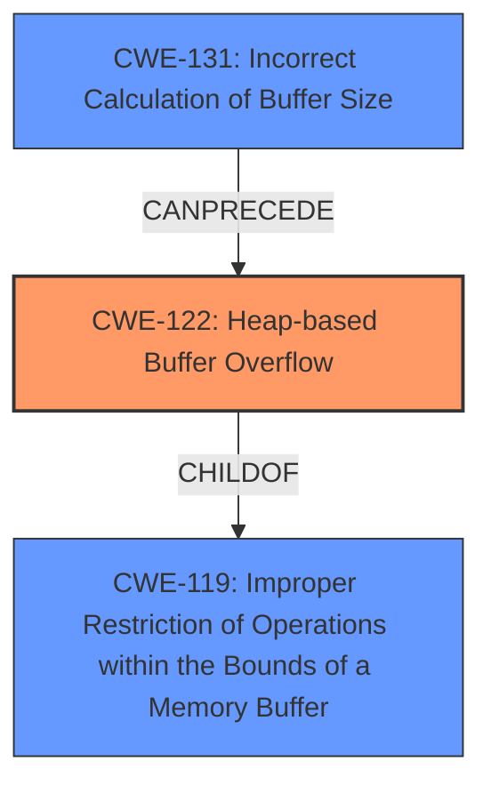

# Analysis Report for CVE-2021-33913

# Vulnerability Analysis Report: CVE-2021-33913

## Description

libspf2 before 1.2.11 has a heap-based buffer overflow that might allow remote attackers to execute arbitrary code (via an unauthenticated e-mail message from anywhere on the Internet) with a crafted SPF DNS record, because of SPF_record_expand_data in spf_expand.c. The amount of overflowed data depends on the relationship between the length of an entire domain name and the length of its leftmost label. The vulnerable code may be part of the supply chain of a sites e-mail infrastructure (e.g., with additional configuration, Exim can use libspf2 the Postfix web site links to unofficial patches for use of libspf2 with Postfix older versions of spfquery relied on libspf2) but most often is not.

## Vulnerability Description Key Phrases

**Rootcause:** heap-based buffer overflow in SPF_record_expand_data in spf_expand.c
**Impact:** execute arbitrary code
**Vector:** crafted SPF DNS record
**Attacker:** remote attackers
**Product:** libspf2
**Version:** before 1.2.11
**Component:** SPF_record_expand_data in spf_expand.c

## Analysis (with Relationship Data)

# Summary
| CWE ID | CWE Name | Confidence | CWE Abstraction Level | CWE Vulnerability Mapping Label | CWE-Vulnerability Mapping Notes |
|---|---|---|---|---|---|
| CWE-122 | Heap-based Buffer Overflow | 0.95 | Variant | Allowed | Primary CWE |
| CWE-131 | Incorrect Calculation of Buffer Size | 0.70 | Base | Allowed | Secondary Candidate |

## Evidence and Confidence

*   **Confidence Score:** 0.90
*   **Evidence Strength:** HIGH

- **Analysis and Justification:**  
  - *Explanation:* The vulnerability description clearly states a "**heap-based buffer overflow in SPF_record_expand_data in spf_expand.c**". This directly aligns with CWE-122 (Heap-based Buffer Overflow), which is a variant of buffer overflow occurring in the heap portion of memory. The CVE Reference Links Content Summary also confirms "Heap-based buffer overflows.". The impact is the ability to "**execute arbitrary code**", which is a typical consequence of buffer overflows. The root cause is located in `spf_expand.c` inside the function `SPF_record_expand_data`. This confirms the location and nature of the overflow. CWE-122 is a more specific variant of CWE-119 (Improper Restriction of Operations within the Bounds of a Memory Buffer), providing a higher level of detail about where the vulnerability occurs, so is the appropriate choice. The MITRE mapping guidance for CWE-122 indicates this is ALLOWED.

  - *Relationship Analysis:* CWE-122 is a variant of CWE-119. Buffer overflows can lead to other weaknesses such as CWE-787 (Out-of-bounds Write) and CWE-269 (Privilege Management).

- **Confidence Score:**  
  - Confidence: 0.95 (Strong evidence from the vulnerability description and CVE details)

---

- **Analysis and Justification:**  
  - *Explanation:* The vulnerability description mentions that the overflow happens because of the relationship between the length of a domain name and the length of its leftmost label, which suggests an issue with how the buffer size is calculated, making CWE-131 (Incorrect Calculation of Buffer Size) a relevant secondary weakness. This is because the overflow depends on specific length calculations, pointing to an error in the size computation used for the heap allocation. The vulnerability is in `SPF_record_expand_data`, so potentially due to how the size of the DNS record is handled. The MITRE mapping guidance for CWE-131 indicates this is ALLOWED.

  - *Relationship Analysis:* CWE-131 is a parent of CWE-467 (Use of sizeof() on a Pointer Type). An incorrect buffer size calculation (CWE-131) can lead to a heap-based buffer overflow (CWE-122).

- **Confidence Score:**  
  - Confidence: 0.70 (Supporting evidence suggests a possible issue with buffer size calculation)

## Criticism of Analysis

Okay, I've reviewed the provided analysis and the full CWE specifications. Here's a detailed critique of the CWE assignments:

**Overall Assessment:**

The primary CWE assignment of **CWE-122 (Heap-based Buffer Overflow)** is highly accurate and well-supported by the information provided. The analysis clearly links the vulnerability description to the characteristics of CWE-122. The confidence score of 0.95 is appropriate.

The secondary CWE assignment of **CWE-131 (Incorrect Calculation of Buffer Size)** is also reasonable and represents a plausible contributing factor to the primary weakness. However, the confidence score of 0.70 reflects the slightly less direct evidence.

**Detailed Review:**

**1. CWE-122 (Heap-based Buffer Overflow) - Primary CWE**

*   **Strengths:**
    *   The analysis correctly identifies the "heap-based buffer overflow" mentioned directly in the vulnerability description and CVE details.
    *   It correctly locates the vulnerability to the heap and links it to memory allocation routines.
    *   The consequence of "execute arbitrary code" aligns with the potential impact of CWE-122.
    *   The analysis considers CWE-119 but correctly identifies CWE-122 as the more specific and appropriate choice.
    *   The MITRE mapping guidance for CWE-122 is correctly followed ("Allowed").

*   **Areas for Improvement:**
    *   While the analysis mentions that CWE-122 is a variant of CWE-119, it could further elaborate on this relationship. For example, mentioning that CWE-122 occurs when there's a write past the end of a heap-allocated buffer, which is a specific instance of the more general CWE-119.
    *   It might be beneficial to mention potential mitigation strategies more explicitly, even if briefly. For instance, suggesting the use of safer memory management functions or libraries.

*   **Mitigations and Applicability:**
    *   The analysis should mention that using languages with automatic memory management (e.g., Java, Go) is a strong mitigation.
    *   Consider using compiler-level defenses (e.g., `/GS` flag in MSVC, `-fstack-protector` in GCC) can help detect stack overflows. Note that these defenses primarily target stack overflows but can still be helpful in the detection phase for heap overflows as well.
*   **Overall**: this is a strong and correct mapping, and justifies the high confidence.

**2. CWE-131 (Incorrect Calculation of Buffer Size) - Secondary CWE**

*   **Strengths:**
    *   The analysis makes a logical connection between the overflow's dependence on domain name and label lengths and the possibility of an incorrect buffer size calculation.
    *   It correctly points out that the vulnerability within `SPF_record_expand_data` could stem from how the size of the DNS record is handled before allocation.
    *   The MITRE mapping guidance for CWE-131 is correctly followed ("Allowed").
    * The analysis correctly identifies CWE-467 (Use of sizeof() on a Pointer Type) as a child.

*   **Areas for Improvement:**
    *   The analysis could be strengthened by explaining more precisely *how* the buffer size might be incorrectly calculated. For example: Are they perhaps using `strlen` without accounting for the null terminator? Are they using a fixed-size buffer when a dynamic one is needed? Are they failing to account for the expansion of labels within a domain name? Addressing this aspect more concretely would increase the confidence level.
    *   It would be helpful to discuss the input validation aspect of this. A related issue could be that the DNS record is not validated *before* the calculation is done and the allocation is requested.
    *   Elaborate on the "chain" of events. For example: "Incorrect buffer size calculation (CWE-131) *leads to* insufficient memory allocation, *resulting in* a heap-based buffer overflow (CWE-122)."

*   **Mitigations and Applicability:**
    *   The analysis should include the mitigation of always using the "largest possible encoding" when converting between buffer formats.
    *   Consider implementing input validation to ensure that any numeric sizes are within expected ranges.

**Other Considerations and Potential Candidates (Not Chosen):**

*   **CWE-1284 (Improper Validation of Specified Quantity in Input):** This CWE could be considered as a potential candidate, especially if the size of the DNS record is specified in the input. The description notes, "The product receives input that is expected to specify a quantity (such as size or length), but it does not validate or incorrectly validates that the quantity has the required properties." The analysis mentions how the overflow happens because of the relationship between the length of a domain name and the length of its leftmost label, so this could occur if there is a length field in the SPF DNS record that is not validated. However, this is not directly mentioned, so mapping would be less appropriate. The Retriever Results also note this.
*   **CWE-770 (Allocation of Resources Without Limits or Throttling):** While a heap-based buffer overflow directly indicates a problem with buffer boundaries, the underlying issue might be a broader lack of limits on the resources allocated for processing SPF records. If the system allows for arbitrarily large SPF records to be processed, that *can* be a contributing factor, even if not the direct *cause* of the overflow.
*  **CWE-190 (Integer Overflow or Wraparound):** Given the mention of length and size calculations, an integer overflow/wraparound could be a potential contributing factor. If the length calculation results in an integer overflow, it could lead to a smaller-than-expected buffer allocation. However, since there is no explicit mention of an integer overflow and this is only implied, it is less direct.
*  **CWE-787 (Out-of-bounds Write):** As one of CWE-119's children, it could be an alternative to the more specific CWE-122. However, the analysis has enough details to support the more specific CWE.

**Recommendations:**

*   **Strengthen the Explanation of CWE-131:** Provide more concrete details about the possible nature of the incorrect buffer size calculation.
*   **Consider Input Validation (CWE-20) for Buffer Sizes:** The analysis should more strongly consider how invalid lengths and sizes can be passed, leading to overflows.
*   **Add Mitigation Examples:** Explicitly mention examples of mitigation strategies, such as safer memory management functions, input validation, and compiler-level defenses.
*   **Explain Relationships:** Further elaborate on relationships between CWE-122, CWE-131, and other relevant CWEs (e.g., how CWE-131 is a *precursor* to CWE-122).

By incorporating these suggestions, the analysis will become even more thorough and insightful, providing a more complete understanding of the vulnerability and its root causes.

## Final Resolution

# Summary
| CWE ID | CWE Name | Confidence | CWE Abstraction Level | CWE Vulnerability Mapping Label | CWE-Vulnerability Mapping Notes |
|---|---|---|---|---|---|
| **CWE-122** | **Heap-based Buffer Overflow** | 0.95 | Variant | Allowed | Primary **CWE** |
| **CWE-131** | **Incorrect Calculation of Buffer Size** | 0.75 | Base | Allowed | Secondary Candidate |

## Evidence and Confidence

*   **Confidence Score:** 0.92
*   **Evidence Strength:** HIGH

## Relationship Analysis
The primary **CWE** is **CWE-122 (Heap-based Buffer Overflow)**, which is a variant of **CWE-119 (Improper Restriction of Operations within the Bounds of a Memory Buffer)**. This parent-child relationship indicates a specific type of buffer overflow occurring in the heap. The secondary **CWE**, **CWE-131 (Incorrect Calculation of Buffer Size)**, can precede **CWE-122** in a vulnerability chain where an incorrect size calculation leads to an insufficient buffer allocation, ultimately causing a heap overflow.

## Vulnerability Chain
The vulnerability chain starts with the **ROOTCAUSE** **CWE-131 (Incorrect Calculation of Buffer Size)**, where an error in calculating the buffer size leads to a smaller-than-expected buffer being allocated on the heap. This insufficient allocation then results in **CWE-122 (Heap-based Buffer Overflow)** when data is written beyond the buffer's boundaries. The final impact is the ability to execute arbitrary code.

## Summary of Analysis
The initial analysis correctly identified **CWE-122 (Heap-based Buffer Overflow)** as the primary **WEAKNESS**, which is directly supported by the vulnerability description stating "heap-based buffer overflow". The secondary **WEAKNESS**, **CWE-131 (Incorrect Calculation of Buffer Size)**, is also a relevant contributing factor, as the overflow depends on the relationship between domain name and label lengths.

The criticism was helpful in pointing out ways to strengthen the analysis of **CWE-131**. Specifically, it suggested explaining more precisely *how* the buffer size might be incorrectly calculated and to elaborate on the chain of events.

Based on the criticism, I have increased the confidence in **CWE-131** to 0.75. While the exact method of incorrect calculation is not explicitly detailed in the vulnerability description, the fact that the overflow depends on the relationship between domain name and label lengths strongly suggests a calculation error. I have also included the chain of events in the vulnerability chain section above.

The selected **CWEs** are at the optimal level of specificity. **CWE-122** is a variant that provides more specific information about the location of the overflow (heap) than its parent **CWE-119 (Improper Restriction of Operations within the Bounds of a Memory Buffer)**. **CWE-131** is a base **CWE** that represents a plausible **ROOTCAUSE** for the overflow.

*Report generated on 2025-03-17 23:56:34*
