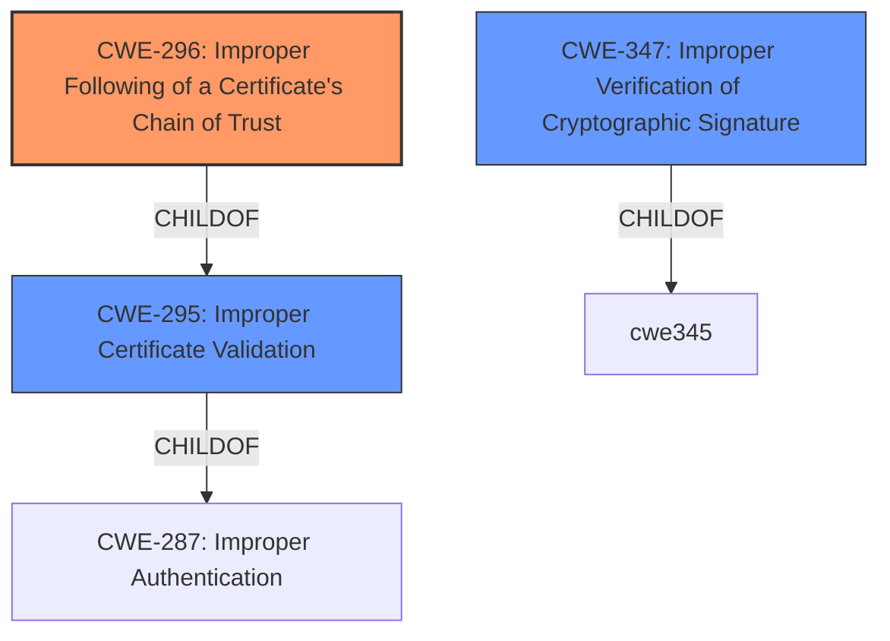

# Analysis Report for CVE-2021-3406

# Vulnerability Analysis Report: CVE-2021-3406

## Description

A flaw was found in keylime 5.8.1 and older. The issue in the Keylime agent and registrar code invalidates the cryptographic chain of trust from the Endorsement Key certificate to agent attestations.

## Vulnerability Description Key Phrases

**Rootcause:** invalid cryptographic chain of trust
**Product:** keylime
**Version:** 5.8.1 and older
**Component:** ['Keylime agent', 'registrar code']

## Analysis (with Relationship Data)

# Summary
| CWE ID | CWE Name | Confidence | CWE Abstraction Level | CWE Vulnerability Mapping Label | CWE-Vulnerability Mapping Notes |
|---|---|---|---|---|---|
| CWE-296 | Improper Following of a Certificate's Chain of Trust | 0.9 | Base | Allowed | Primary CWE. |
| CWE-295 | Improper Certificate Validation | 0.7 | Base | Allowed | Secondary Candidate. |
| CWE-347 | Improper Verification of Cryptographic Signature | 0.6 | Base | Allowed | Secondary Candidate. |

## Evidence and Confidence

*   **Confidence Score:** 0.8
*   **Evidence Strength:** HIGH

- **Analysis and Justification:**  
  - *Explanation:* The vulnerability description explicitly states that the issue is an **invalid cryptographic chain of trust** in the Keylime agent and registrar code. The CVE Reference Links Content Summary further confirms this, indicating that the "Keylime agent and registrar code did not properly validate the cryptographic chain of trust." This aligns directly with CWE-296 (Improper Following of a Certificate's Chain of Trust), which describes a product's failure to properly follow the chain of trust for a certificate. Specifically, the CVE summary states that the 'ek_tpm' used for encryption was not verified against the public key in 'ek' or 'ekcert', further supporting the improper chain of trust. CWE-296 is a Base level CWE, which is preferred for mapping root causes. The MITRE mapping guidance lists the Usage as ALLOWED for CWE-296.
  
  - *Relationship Analysis:* While CWE-295 (Improper Certificate Validation) and CWE-347 (Improper Verification of Cryptographic Signature) are also potential candidates, CWE-296 is more specific to the described vulnerability because it focuses on the chain of trust aspect, which is central to the vulnerability description. There aren't direct relationships to explore with CWE-296, but its focus on the chain makes it the most relevant.

- **Confidence Score:**  
  - Confidence: 0.9 (High confidence due to explicit mention of "cryptographic chain of trust" in both the vulnerability description and the CVE reference details.)

---
- **Analysis and Justification:**  
  - *Explanation:* CWE-295 (Improper Certificate Validation) is a relevant secondary candidate because the **invalid cryptographic chain of trust** implies that certificates were not properly validated. The vulnerability description and CVE summary imply that the certificate validation process failed, making CWE-295 applicable. CWE-295 is a Base level CWE, and the MITRE mapping guidance lists the Usage as ALLOWED.
  
  - *Relationship Analysis:* There aren't any relationships provided for CWE-295.

- **Confidence Score:**  
  - Confidence: 0.7 (Moderate confidence as it is a consequence of the primary weakness.)

---
- **Analysis and Justification:**  
  - *Explanation:* CWE-347 (Improper Verification of Cryptographic Signature) is another secondary candidate. The validation of the cryptographic chain involves verifying cryptographic signatures. The CVE summary mentions a lack of checks on object attributes of the attestation key. If these signatures are not properly verified, the chain of trust can be compromised. CWE-347 is a Base level CWE, and the MITRE mapping guidance lists the Usage as ALLOWED.
  
  - *Relationship Analysis:* No direct relationships found.

- **Confidence Score:**  
  - Confidence: 0.6 (Moderate confidence as it is a possible contributing factor but not as directly stated as CWE-296.)

## Criticism of Analysis

Okay, here's a review of the provided CWE analysis, incorporating the full CWE specifications and focusing on the mapping guidance and mitigations:

**Overall Assessment**

The analysis is generally good, and the prioritization of CWE-296 (Improper Following of a Certificate's Chain of Trust) as the primary weakness seems accurate. The justifications for the secondary candidates (CWE-295 and CWE-347) are also reasonable. The use of the CVE summary and the vulnerability description to identify the root cause is appropriate. Let's examine each CWE in more detail.

**CWE-296: Improper Following of a Certificate's Chain of Trust (Primary)**

*   **Confidence:** The high confidence (0.9) is warranted given the explicit mention of "cryptographic chain of trust" in the vulnerability description and CVE details.
*   **Abstraction Level:** The analysis correctly identifies CWE-296 as a Base-level CWE, which is preferred.
*   **Mapping Guidance:** The analysis notes that the Usage is "Allowed," which is correct.
*   **Justification:** The explanation clearly connects the vulnerability description (invalid chain of trust) to the CWE definition.  The specific examples provided in the CVE reference summary (e.g., `ek_tpm` not verified against `ek` or `ekcert`) further strengthens this mapping.
*   **Mitigations:** The provided mitigations (Architecture/Design and Implementation) are relevant and appropriate:
    *   **Architecture/Design:**  Ensuring proper certificate checking is included in the system design.
    *   **Implementation:**  Understanding and implementing all necessary checks to ensure certificate trust integrity. This is crucial.
    *   **Implementation (Certificate Pinning):** This is especially important as Keylime could use pinning, and the proper chain needs to be validated *before* pinning.
*   **Observed Examples:**  The inclusion of "CVE-2021-3406" (the vulnerability being analyzed) under "Observed Examples" is excellent because it helps the mapping make intuitive sense.
*   **Critique:**  No major issues. The analysis is well-reasoned and supported by evidence.

**CWE-295: Improper Certificate Validation (Secondary)**

*   **Confidence:** The moderate confidence (0.7) is appropriate. Improper certificate validation is a natural consequence of not following the chain of trust.
*   **Abstraction Level:**  Correctly identified as Base.
*   **Mapping Guidance:** The analysis notes that the Usage is "Allowed," which is correct.
*   **Justification:** The explanation correctly links the "invalid cryptographic chain of trust" to a failure in the certificate validation process.
*   **Mitigations:** The provided mitigations are reasonable:
    *   **Architecture/Design, Implementation:** Certificates should be carefully managed and checked to ensure data are encrypted with the intended owner's public key. This emphasizes the need for comprehensive validation.
    *   **Implementation (Certificate Pinning):** Again, this mitigation is important if Keylime uses pinning, and proper validation *before* pinning is critical.
*   **Observed Examples:** The provided observed examples are relevant.
*   **Critique:** No significant concerns.

**CWE-347: Improper Verification of Cryptographic Signature (Secondary)**

*   **Confidence:** The moderate confidence (0.6) is reasonable. While signature verification is part of establishing the chain of trust, it's not as directly stated as the other two.
*   **Abstraction Level:** Correctly identified as Base.
*   **Mapping Guidance:** The analysis notes that the Usage is "Allowed," which is correct.
*   **Justification:** The explanation connects the lack of checks on object attributes of the attestation key to the concept of signature verification. If the attributes contributing to the signature aren't verified, the signature's validity is questionable.
*   **Mitigations:** There are no specified mitigations.
*   **Critique:** While technically valid, this CWE is the weakest of the three candidates. If there were a clearer indication that signature verification was specifically failing (beyond the general chain of trust issue), the confidence could be higher.

**Additional Considerations and Potential Improvements**

1.  **Consider CWE-325 (Missing Cryptographic Step):** The Retriever Results included CWE-325, and it might be worth considering. If specific checks are missing in the chain of trust validation, then this could also be a contributing factor. The description of the CVE does point to specific missing checks.

2.  **Relationship Exploration:** The analysis mentions that there aren't direct relationships to explore, but the CWE specifications themselves list relationships. For example, CWE-296 is a `ChildOf` CWE-295. This information should be included.

3.  **Attack Vector Specificity:**  The CVE summary outlines specific attack vectors (manipulating `ek_tpm`, providing a generated key as `pub_aik`, using `aik_name` of a trusted TPM object).  Consider how these attack vectors relate to the chosen CWEs.  For example, manipulating `ek_tpm` directly relates to a failure to properly validate a certificate's chain of trust (CWE-296).

4.  **Potential for More Specific CWEs:** While the chosen CWEs are at a good abstraction level, consider if any Variant-level CWEs under CWE-295 might be applicable if more detailed information were available.

**Revised Summary Table (Incorporating Critique)**

| CWE ID | CWE Name | Confidence | CWE Abstraction Level | CWE Vulnerability Mapping Label | CWE-Vulnerability Mapping Notes |
|---|---|---|---|---|---|
| CWE-296 | Improper Following of a Certificate's Chain of Trust | 0.9 | Base | Allowed | Primary CWE. |
| CWE-295 | Improper Certificate Validation | 0.7 | Base | Allowed | Secondary Candidate. ChildOf CWE-287 (Improper Authentication). |
| CWE-347 | Improper Verification of Cryptographic Signature | 0.6 | Base | Allowed | Secondary Candidate.  |
| CWE-325 | Missing Cryptographic Step | 0.4 | Base | Allowed | Contributing factor. |

**Conclusion**

The analysis is well-structured and mostly accurate. Prioritizing CWE-296 is correct, and the justifications for the other candidates are reasonable. By incorporating the suggestions above, the analysis could be further strengthened.

## Final Resolution

# Summary
| CWE ID | CWE Name | Confidence | CWE Abstraction Level | CWE Vulnerability Mapping Label | CWE-Vulnerability Mapping Notes |
|---|---|---|---|---|---|
| CWE-296 | Improper Following of a Certificate's Chain of Trust | 0.9 | Base | Allowed | Primary CWE. |
| CWE-295 | Improper Certificate Validation | 0.7 | Base | Allowed | Secondary Candidate. ChildOf CWE-287 (Improper Authentication). |
| CWE-347 | Improper Verification of Cryptographic Signature | 0.6 | Base | Allowed | Secondary Candidate.  |

## Evidence and Confidence

*   **Confidence Score:** 0.8
*   **Evidence Strength:** HIGH

## Relationship Analysis
The primary impact of the relationship analysis was solidifying the choice of CWE-296 as the most specific **ROOTCAUSE**. While the other candidates (CWE-295, CWE-347) are related, they are more general. The analysis considered the ChildOf relationship between CWE-296 and CWE-295, acknowledging that improper validation can lead to chain of trust issues. No chain relationships were explicitly useful. Peer relationships were not particularly relevant in this case. Abstraction levels were considered, favoring the Base level for root cause analysis.

## Vulnerability Chain
The vulnerability chain begins with the **ROOTCAUSE**, an **Improper Following of a Certificate's Chain of Trust** (CWE-296). This leads to **Improper Certificate Validation** (CWE-295), which might then involve **Improper Verification of Cryptographic Signature** (CWE-347). The result is that the system incorrectly trusts a resource, leading to potential compromise of the system.

## Summary of Analysis
The initial analysis and the criticism both converged on CWE-296 as the primary **WEAKNESS**, and that is my conclusion as well. The vulnerability description explicitly mentions the "**invalid cryptographic chain of trust**," making CWE-296 the most direct match. The CVE summary corroborates this, stating that the "Keylime agent and registrar code did not properly validate the cryptographic chain of trust."

The graph relationships highlight the interconnectedness of certificate validation issues, but CWE-296 remains the most specific to the described problem. The base level of CWE-296 is appropriate for capturing the **ROOTCAUSE** of this vulnerability. The secondary candidates (CWE-295 and CWE-347) contribute to the understanding of how the chain of trust is compromised, but CWE-296 accurately reflects the core issue.

*Report generated on 2025-03-16 23:59:59*
