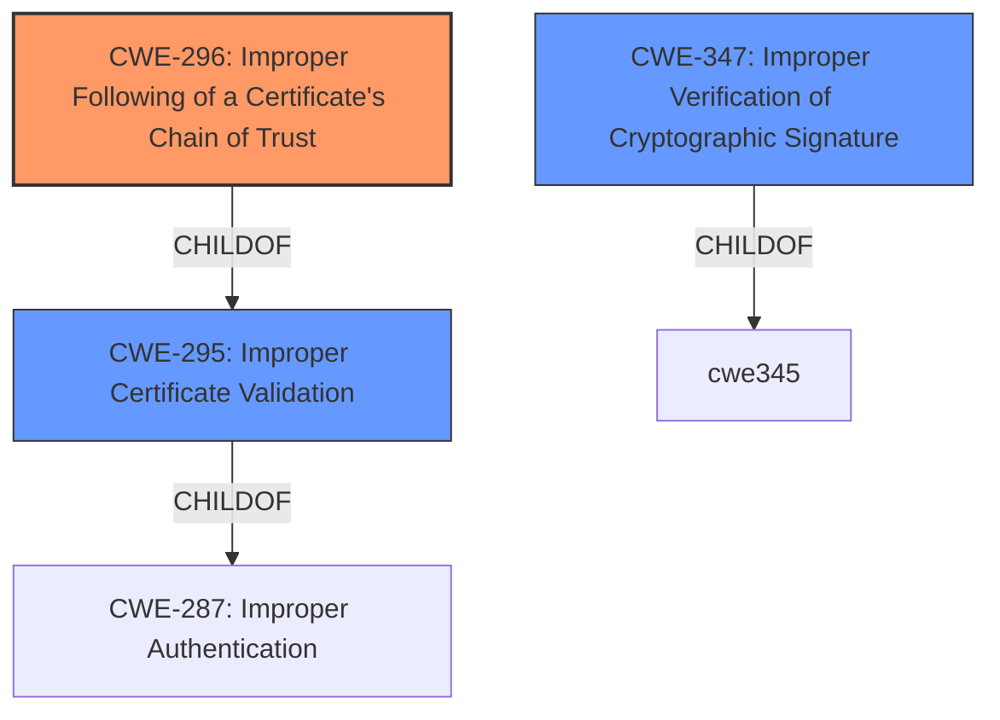

# Final Resolution for CVE-2021-3406

# Summary
| CWE ID | CWE Name | Confidence | CWE Abstraction Level | CWE Vulnerability Mapping Label | CWE-Vulnerability Mapping Notes |
|---|---|---|---|---|---|
| CWE-296 | Improper Following of a Certificate's Chain of Trust | 0.9 | Base | Allowed | Primary CWE. |
| CWE-295 | Improper Certificate Validation | 0.7 | Base | Allowed | Secondary Candidate. ChildOf CWE-287 (Improper Authentication). |
| CWE-347 | Improper Verification of Cryptographic Signature | 0.6 | Base | Allowed | Secondary Candidate.  |

## Evidence and Confidence

*   **Confidence Score:** 0.8
*   **Evidence Strength:** HIGH

## Relationship Analysis
The primary impact of the relationship analysis was solidifying the choice of CWE-296 as the most specific **ROOTCAUSE**. While the other candidates (CWE-295, CWE-347) are related, they are more general. The analysis considered the ChildOf relationship between CWE-296 and CWE-295, acknowledging that improper validation can lead to chain of trust issues. No chain relationships were explicitly useful. Peer relationships were not particularly relevant in this case. Abstraction levels were considered, favoring the Base level for root cause analysis.

## Vulnerability Chain
The vulnerability chain begins with the **ROOTCAUSE**, an **Improper Following of a Certificate's Chain of Trust** (CWE-296). This leads to **Improper Certificate Validation** (CWE-295), which might then involve **Improper Verification of Cryptographic Signature** (CWE-347). The result is that the system incorrectly trusts a resource, leading to potential compromise of the system.

## Summary of Analysis
The initial analysis and the criticism both converged on CWE-296 as the primary **WEAKNESS**, and that is my conclusion as well. The vulnerability description explicitly mentions the "**invalid cryptographic chain of trust**," making CWE-296 the most direct match. The CVE summary corroborates this, stating that the "Keylime agent and registrar code did not properly validate the cryptographic chain of trust."

The graph relationships highlight the interconnectedness of certificate validation issues, but CWE-296 remains the most specific to the described problem. The base level of CWE-296 is appropriate for capturing the **ROOTCAUSE** of this vulnerability. The secondary candidates (CWE-295 and CWE-347) contribute to the understanding of how the chain of trust is compromised, but CWE-296 accurately reflects the core issue.