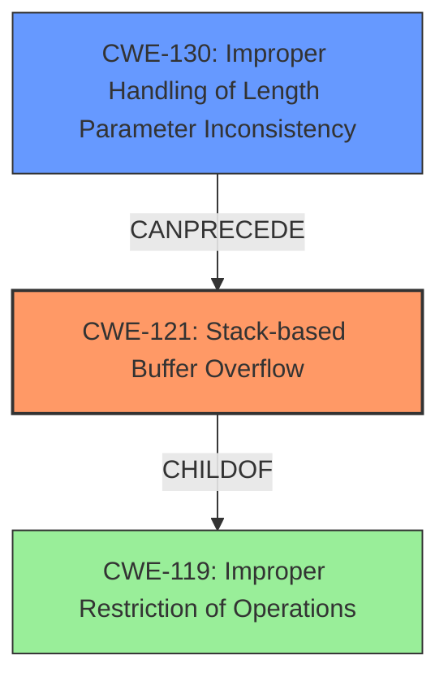

# Final Resolution for CVE-2021-3434

# Summary
| CWE ID | CWE Name | Confidence | CWE Abstraction Level | CWE Vulnerability Mapping Label | CWE-Vulnerability Mapping Notes |
|---|---|---|---|---|---|
| CWE-121 | Stack-based Buffer Overflow | 1.0 | Variant | Primary | Allowed. While CWE-121 is the direct cause, CWE-130 (Improper Handling of Length Parameter Inconsistency) *may* contribute if the size of the input is derived from an unvalidated length parameter. Further code review is needed to confirm this. |
| CWE-130 | Improper Handling of Length Parameter Inconsistency | 0.6 | Base | Secondary | Allowed. May contribute to the primary **WEAKNESS** if input length is not validated |

## Evidence and Confidence

*   **Confidence Score:** 0.9
*   **Evidence Strength:** MEDIUM

## Relationship Analysis
The primary relationship considered was the parent-child relationship between CWE-121 (Stack-based Buffer Overflow) and CWE-119 (Improper Restriction of Operations within the Bounds of a Memory Buffer), where CWE-121 is a variant of CWE-119. This reinforces the specificity of the classification. Additionally, CWE-130 (Improper Handling of Length Parameter Inconsistency) was considered as a potential contributing factor. While not explicitly stated in the vulnerability description, the criticism suggests it is a common precursor to buffer overflows, especially if input length validation is lacking. The abstraction levels influenced the decision by favoring the more specific Variant level CWE-121 for the primary classification.

## Vulnerability Chain
The vulnerability chain starts with a potential **ROOTCAUSE** of CWE-130 (Improper Handling of Length Parameter Inconsistency), which, if present, leads to CWE-121 (Stack-based Buffer Overflow). The overflow then results in arbitrary code execution or denial of service. The missing link is the explicit confirmation of CWE-130 in the provided vulnerability details; it is inferred from common buffer overflow scenarios.

## Summary of Analysis
The initial analysis correctly identified CWE-121 (Stack-based Buffer Overflow) as the primary **WEAKNESS**. The criticism highlighted the potential contribution of CWE-130 (Improper Handling of Length Parameter Inconsistency), which aligns with common buffer overflow causes.

The decision to include CWE-130 as a secondary CWE is based on the understanding that improper length handling often precedes buffer overflows. The evidence supporting this is the criticism's statement: "A stack-based buffer overflow often occurs because the code doesn't properly validate the length of the input before copying it into a stack-allocated buffer." Although not explicitly stated in the vulnerability description, this inference is reasonable. Further code review would be needed to confirm the presence of CWE-130.

CWE-121 is the optimal level of specificity because the vulnerability description explicitly mentions "Stack-based buffer overflow," making it more precise than its parent CWE-119. CWE-130 is included as a potential contributing factor based on common vulnerability patterns, though its presence requires further verification.