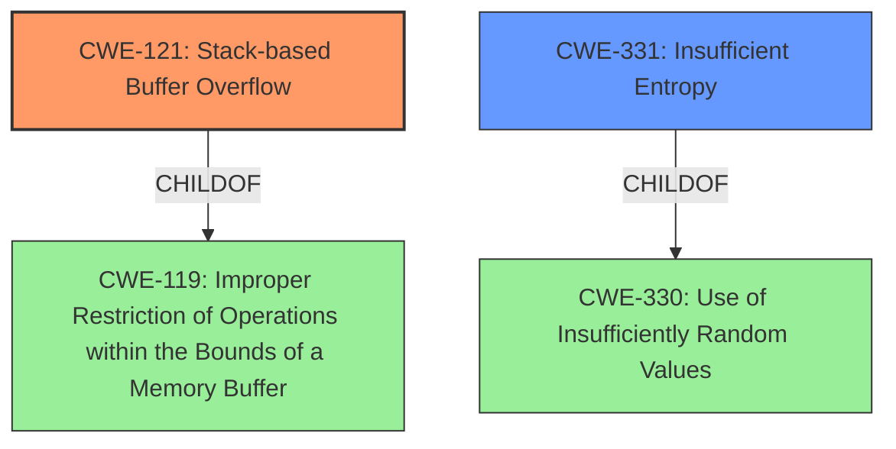

# Final Resolution for CVE-2021-34375

# Summary
| CWE ID | CWE Name | Confidence | CWE Abstraction Level | CWE Vulnerability Mapping Label | CWE-Vulnerability Mapping Notes |
|---|---|---|---|---|---|
| CWE-121 | CWE-121: Stack-based Buffer Overflow | 0.9 | Variant | Primary CWE | Allowed |
| CWE-331 | CWE-331: Insufficient Entropy | 0.7 | Base | Secondary Candidate | Allowed |

## Evidence and Confidence

*   **Confidence Score:** 0.8
*   **Evidence Strength:** HIGH

## Relationship Analysis
The analysis focuses on hierarchical relationships and potential alternatives. CWE-121 is a variant of CWE-119 (Improper Restriction of Operations within the Bounds of a Memory Buffer). The criticism suggests replacing CWE-344 with CWE-331, which is a child of CWE-330 (Use of Insufficiently Random Values). The selection of CWE-331 is based on its better alignment with the root cause, specifically the lack of entropy in the stack cookie generation.

## Vulnerability Chain
The vulnerability chain starts with **CWE-331: Insufficient Entropy** in the stack cookie generation. This lack of entropy makes the stack cookie predictable. A predictable stack cookie then allows an attacker to more easily exploit a **CWE-121: Stack-based Buffer Overflow**. The root cause is the insufficient entropy, which leads to the exploitable buffer overflow.

## Summary of Analysis
The initial analysis correctly identified **CWE-121 (Stack-based Buffer Overflow)** as the primary weakness due to the explicit mention in the vulnerability description: "Trusty contains a vulnerability... where the stack cookie was not randomized, which might result in **stack-based buffer overflow**...".

The criticism suggested a more accurate secondary CWE. The initial choice of **CWE-344 (Use of Invariant Value in Dynamically Changing Context)** was plausible, but the criticism correctly pointed out that it is more of a contributing factor. The suggested alternative, **CWE-331 (Insufficient Entropy)**, more directly addresses the root cause: "the **stack cookie was not randomized**". This lack of randomization directly implies insufficient entropy.

The graph relationships support this decision. **CWE-331** is a child of **CWE-330 (Use of Insufficiently Random Values)**, which is the broader class encompassing the issue of non-random stack cookies.

The selection of **CWE-331** provides a more specific and accurate classification of the underlying weakness that enables the buffer overflow. It is at the optimal level of specificity as it is a Base level CWE, directly addressing the entropy issue. The evidence provided directly supports this classification.