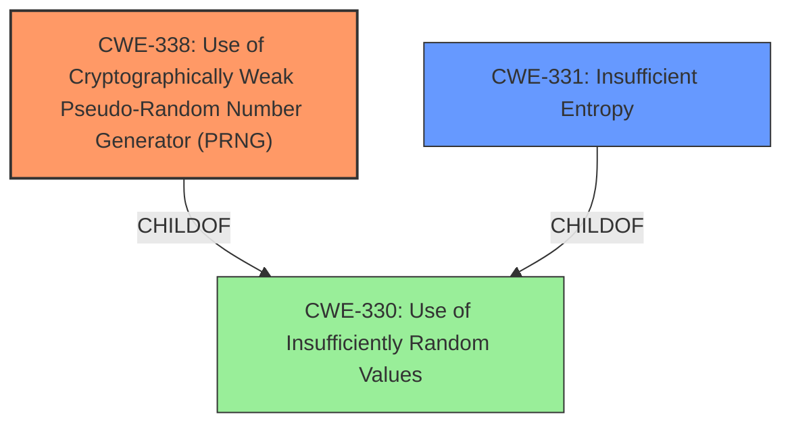

# Analysis Report for CVE-2021-34430

# Vulnerability Analysis Report: CVE-2021-34430

## Description

Eclipse TinyDTLS through 0.9-rc1 relies on the rand function in the C library, which makes it easier for remote attackers to compute the master key and then decrypt DTLS traffic.

## Vulnerability Description Key Phrases

**Rootcause:** reliance on rand function
**Impact:** decrypt DTLS traffic
**Attacker:** remote attackers
**Product:** Eclipse TinyDTLS
**Version:** through 0.9-rc1

## Analysis (with Relationship Data)

# Summary
| CWE ID | CWE Name | Confidence | CWE Abstraction Level | CWE Vulnerability Mapping Label | CWE-Vulnerability Mapping Notes |
|---|---|---|---|---|---|
| CWE-338 | Use of Cryptographically Weak Pseudo-Random Number Generator (PRNG) | 0.95 | Base | Allowed | Primary CWE |
| CWE-331 | Insufficient Entropy | 0.75 | Base | Allowed | Secondary Candidate |

## Evidence and Confidence

*   **Confidence Score:** 0.9
*   **Evidence Strength:** HIGH

- **Analysis and Justification:**
  - *Explanation:* The vulnerability description states that Eclipse TinyDTLS uses the `rand` function in the C library, which is a known, **cryptographically weak PRNG**. The CVE reference confirms this, stating TinyDTLS uses the standard library's `rand()` function and that the `server_random` and `client_random` values are derived from this **insecure PRNG**. This aligns precisely with CWE-338 (Use of Cryptographically Weak Pseudo-Random Number Generator (PRNG)). The root cause is the usage of the weak PRNG, which allows attackers to decrypt DTLS traffic. CWE-338 is a Base level CWE and is ALLOWED for this type of vulnerability.
  - The analysis further indicates a secondary weakness: **insufficient entropy** in the seed for the PRNG. The `rand()` function's predictable output is made worse if the initial seed doesn't have enough entropy. While the description doesn't explicitly state the entropy of the seed is low, the fact that the state of `rand()` can be brute-forced in 0.014 seconds suggests the seed also lacks sufficient entropy, making CWE-331 (Insufficient Entropy) a reasonable secondary mapping. The report mentions that increasing the seed value width does not resolve the vulnerability. The internal state is still predictable even with a larger initial seed value, which further supports this.
  - *Relationship Analysis:* CWE-338 is a child of CWE-330 (Use of Insufficiently Random Values), but CWE-338 is more specific because it focuses on cryptographic contexts. CWE-331 is also a child of CWE-330, representing insufficient entropy for the PRNG.

- **Confidence Score:**
  - Confidence: 0.95 (High confidence due to clear evidence from the vulnerability description and CVE reference materials)

---

## Criticism of Analysis

Okay, here's a review of the CWE analysis, taking into account the full CWE specifications provided.

**Overall Assessment:**

The analysis is strong and accurately identifies the primary CWE as **CWE-338: Use of Cryptographically Weak Pseudo-Random Number Generator (PRNG)**.  The justification is well-supported by the vulnerability description and the CVE reference information. The inclusion of **CWE-331: Insufficient Entropy** as a secondary candidate is also reasonable and well-argued. The Confidence scores reflect the strength of evidence.

**Detailed Review:**

**1.  CWE-338: Use of Cryptographically Weak Pseudo-Random Number Generator (PRNG)**

*   **Correctness:**  This is the most appropriate CWE. The core issue is the *use* of a known weak PRNG (`rand()`) in a cryptographic context (DTLS handshake).  The analysis clearly explains how this allows for the recovery of the PRNG state and subsequent compromise of the DTLS session.
*   **Abstraction Level:** The analysis adheres to the mapping guidance by selecting a Base-level CWE.
*   **Mapping Guidance Compliance:** The analysis notes that CWE-338 is a child of CWE-330, however, CWE-338 is the more specific mapping here.
*   **Potential Mitigations (from CWE Specification):** The analysis should mention the suggested mitigation, which aligns with the recommendations within the CVE report itself. That is, **use functions or hardware which use a hardware-based random number generation for all crypto. This is the recommended solution. Use CyptGenRandom on Windows, or hw_rand() on Linux.**
*   **Observed Examples:** The analysis could benefit from including one or more of the "Observed Examples" from the CWE specification to further illustrate the applicability of CWE-338.  For example, "CVE-2009-3278: Crypto product uses rand() library function to generate a recovery key, making it easier to conduct brute force attacks."
*   **Confidence:** The confidence score of 0.95 is warranted, as the connection is direct and strongly evidenced.

**2. CWE-331: Insufficient Entropy**

*   **Correctness:** While the primary issue is the use of a weak PRNG algorithm, the vulnerability is exacerbated by the potential for insufficient entropy in the initial seed. The fact that the PRNG state can be brute-forced quickly suggests that the seed's entropy is limited. The analysis correctly identifies this as a *potential* contributing factor.
*   **Abstraction Level:**  Adheres to Base level.
*   **Mapping Guidance Compliance:** Satisfied.
*   **Potential Mitigations (from CWE Specification):** The analysis should mention the suggested mitigation, which aligns with improving the seed used in `rand()`: **Determine the necessary entropy to adequately provide for randomness and predictability. This can be achieved by increasing the number of bits of objects such as keys and seeds.** Note that the report mentions that increasing the seed value width does not resolve the vulnerability, but this does not discount the relevance of CWE-331.
*   **Observed Examples:** The analysis could include a known example here to further support the mapping.
*   **Confidence:** The confidence score of 0.75 is appropriate. While the usage of a weak PRNG is the primary cause, the insufficient entropy in the seed is a contributing factor.

**Other CWEs Considered (from Retriever Results) and Why They Are Less Appropriate:**

*   **CWE-335: Incorrect Usage of Seeds in Pseudo-Random Number Generator (PRNG):** This is partially applicable. While the seed *could* be better, the *algorithmic weakness* of `rand()` is the dominant factor. CWE-331 already captures the insufficient entropy of the seed.
*   **CWE-1204: Generation of Weak Initialization Vector (IV):** This is not directly applicable. The vulnerability does not involve the generation of a weak IV. The weakness exists in the generation of `server_random` and `client_random` which are values exchanged in the DTLS handshake that are used in key derivation, but are not considered IVs.
*   **CWE-208: Observable Timing Discrepancy:** This is not applicable. The primary vulnerability is not related to timing differences that could reveal information.
*   **CWE-319: Cleartext Transmission of Sensitive Information:** While DTLS aims to *prevent* cleartext transmission, the vulnerability is in the *cryptographic process itself*, not a failure to encrypt.
*   **CWE-321: Use of Hard-coded Cryptographic Key:**  This is not applicable. The keys are not hard-coded.
*   **CWE-327: Use of a Broken or Risky Cryptographic Algorithm:** While `rand()` could be *considered* a "risky cryptographic algorithm" in this context, CWE-338 is more specific, focusing on the use of weak PRNGs.  Using `rand()` isn't inherently "broken" - it's just inappropriate for *cryptographic* applications.
*   **CWE-330: Use of Insufficiently Random Values:** This is a valid, higher-level categorization, but CWE-338 is a more precise, Base-level mapping. As the Mapping Guidance for CWE-330 states, examine the children of this entry to see if there is a better fit.
*   **CWE-1391: Use of Weak Credentials:** This is not applicable. The vulnerability is not related to the use of weak credentials.

**Recommendations:**

1.  **Include Potential Mitigations:** Add the suggested mitigations from the CWE specifications for CWE-338 and CWE-331.
2.  **Include Observed Examples:** Add one or two "Observed Examples" from the CWE specification to further solidify the mappings.
3.  **Minor Wording:** No significant changes needed to the wording; the justification is already clear and well-written.

By incorporating these suggestions, the analysis will be even more robust and demonstrate a thorough understanding of the CWE specifications.

## Final Resolution

# Summary
| CWE ID | CWE Name | Confidence | CWE Abstraction Level | CWE Vulnerability Mapping Label | CWE-Vulnerability Mapping Notes |
|---|---|---|---|---|---|
| CWE-338 | Use of Cryptographically Weak Pseudo-Random Number Generator (PRNG) | 0.95 | Base | Allowed | Primary CWE |
| CWE-331 | Insufficient Entropy | 0.75 | Base | Allowed | Secondary Candidate |

## Evidence and Confidence

*   **Confidence Score:** 0.95
*   **Evidence Strength:** HIGH

## Relationship Analysis
The primary relationship influencing the decision is that **CWE-338 (Use of Cryptographically Weak Pseudo-Random Number Generator (PRNG))** is a more specific child of **CWE-330 (Use of Insufficiently Random Values)**. While **CWE-330** could apply, **CWE-338** is preferred due to its focus on cryptographic contexts, aligning precisely with the vulnerability description. **CWE-331 (Insufficient Entropy)** is related to both **CWE-338** and **CWE-330** and describes a contributing factor. There are no strong chain relationships to consider in this instance.

## Vulnerability Chain
The vulnerability chain starts with the **ROOTCAUSE**, which is the use of `rand()` function, a **cryptographically weak PRNG** (**CWE-338**). This is exacerbated by **insufficient entropy** in the seed used to initialize the PRNG (**CWE-331**). This allows an attacker to predict or brute-force the PRNG's output, compute the master key, and then decrypt the DTLS traffic, leading to a compromise of confidentiality.

## Summary of Analysis
The initial analysis and criticism are both strong and lead to a clear conclusion. The primary **WEAKNESS** is the use of a **cryptographically weak PRNG** (**CWE-338**), as evidenced by the vulnerability description stating that Eclipse TinyDTLS relies on the `rand` function in the C library. This is further confirmed by the CVE reference, which states that the `server_random` and `client_random` values are derived from this **insecure PRNG**.

The relationship analysis reinforces the decision to choose **CWE-338** over its parent, **CWE-330**, due to the greater specificity of **CWE-338** in the context of cryptography. The inclusion of **CWE-331** as a secondary candidate is also justified, as the quick brute-forcing of the PRNG state suggests **insufficient entropy** in the seed.

The selected CWEs are at the optimal level of specificity. **CWE-338** is a Base-level CWE that directly addresses the use of a **cryptographically weak PRNG**, while **CWE-331** is another Base-level CWE that describes a contributing factor, the **insufficient entropy** in the seed.

*Report generated on 2025-03-16 23:55:40*
