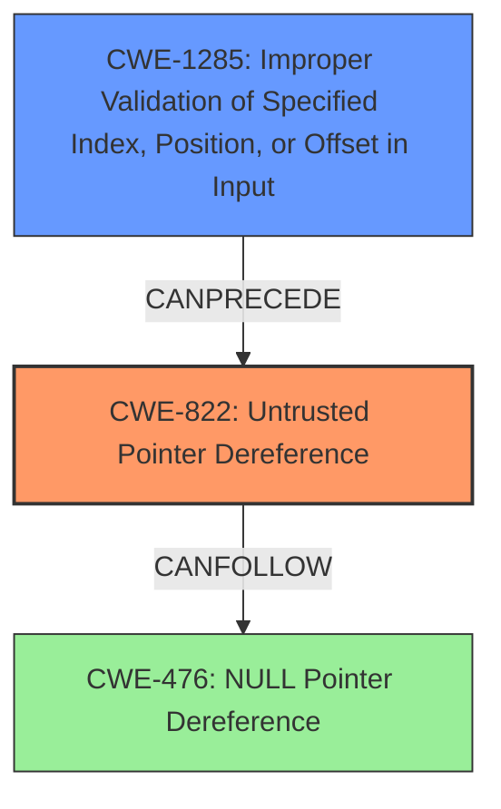

# Analysis Report for CVE-2021-34516

# Vulnerability Analysis Report: CVE-2021-34516

## Description

Win32k Elevation of Privilege Vulnerability

## Vulnerability Description Key Phrases

**Product:** Windows
**Component:** Win32k

## Analysis (with Relationship Data)

# Summary
| CWE ID  | CWE Name    | Confidence | CWE Abstraction Level | CWE Vulnerability Mapping Label | CWE-Vulnerability Mapping Notes |
|--------------|--------------------------------------------------------------------------------------------|------------|-----------------------|------------------------------------|---------------------------------------------------------------------------------------------------------------------------------------------------------------------------------|
| CWE-476 | NULL Pointer Dereference | 0.9 | Base | Allowed | The product dereferences a pointer that it expects to be valid but is NULL. |
| CWE-822 | Untrusted Pointer Dereference | 0.9 | Base | Allowed | The product obtains a value from an untrusted source, converts this value to a pointer, and dereferences the resulting pointer. |

## Evidence and Confidence

*   **Confidence Score:** 0.9
*   **Evidence Strength:** HIGH

- **Analysis and Justification:**  
  - *Explanation:* The vulnerability description explicitly mentions **null pointer dereference vulnerabilities** and **untrusted pointer dereference** in multiple functions within cdd.dll. Specifically, the functions **DrvFillPath**, **DrvLineTo**, **DrvStrokeAndFillPath**, **DrvGradientFill**, **DrvTextOut**, **DrvStrokePath**, and **ColorFillBitmap** are affected by **null pointer dereference vulnerabilities**. Additionally, the functions **DrvStrokeAndFillPath**, **DrvStretchBltInternal**, **DrvLineTo**, **DrvStrokePath**, **DrvPlgBltInternal**, **DrvBitBltInternal**, **DrvGradientFill**, **DrvTransparentBltInternal**, **DrvFillPath**, **DrvStretchBltROPInternal**, **DrvAlphaBlendInternal**, and **DrvTextOut** are affected by **untrusted pointer dereference vulnerabilities** due to a lack of proper input validation. This direct evidence strongly supports mapping to CWE-476 (NULL Pointer Dereference) and CWE-822 (Untrusted Pointer Dereference). Both CWEs are at the Base level of abstraction, which is preferred, and the MITRE mapping guidance indicates that they are ALLOWED.

  - *Relationship Analysis:* CWE-476 (NULL Pointer Dereference) has a parent relationship to CWE-754 (Improper Check for Unusual or Exceptional Conditions) and CWE-710 (Fault Masking Errors). It can also precede CWE-789 (Uncontrolled Memory Allocation) or CWE-362 (Concurrent Execution using Shared Resource with Improper Synchronization ('Race Condition')). CWE-822 (Untrusted Pointer Dereference) shares similarities with CWE-416 (Use After Free) and CWE-415 (Double Free) but is more specific to the case where the pointer value is derived from an untrusted source.

- **Confidence Score:**  
  - Confidence: 0.9 (High confidence due to the explicit mention of the weaknesses in the vulnerability description and CVE reference materials)

---

## Criticism of Analysis

Okay, I've reviewed the provided analysis against the full CWE specifications. Here's my critique, focusing on the accuracy of the CWE mappings, the abstraction level, and potential alternative or more specific CWEs based on the evidence.

**Overall Assessment:**

The analysis correctly identifies and maps the primary issues to CWE-476 (NULL Pointer Dereference) and CWE-822 (Untrusted Pointer Dereference) with high confidence. The justifications provided are well-reasoned and directly supported by the vulnerability description.  The analysis uses the correct abstraction level (Base) as recommended by MITRE's mapping guidance. However, there are opportunities to add even more specific CWEs or chains to better represent the nuances of the described vulnerabilities, and to consider some potential related weaknesses.

**Detailed Review:**

*   **CWE-476: NULL Pointer Dereference**
    *   **Assessment:** The mapping to CWE-476 is accurate and well-justified. The vulnerability description explicitly mentions null pointer dereferences in several functions.
    *   **Abstraction Level:** Base, which is the preferred level.
    *   **Critique:**  The analysis could be improved by considering *why* the pointer might be NULL. Is it due to:
        *   **CWE-754: Improper Check for Unusual or Exceptional Conditions**: The code might not be adequately checking for error conditions that would cause a pointer to be assigned NULL.  This would be a super-CWE relationship and already mentioned in the current analysis.
        *  **CWE-457: Reliance on Uninitialized Variable**: Although less likely it would be good to rule out or confirm the possibility that the null pointer is used without being initialized. This may happen when an API function that would return a pointer is not called.

*   **CWE-822: Untrusted Pointer Dereference**
    *   **Assessment:** The mapping to CWE-822 is also accurate and well-justified. The description specifically highlights untrusted pointer dereferences due to a lack of input validation. The analysis correctly links the untrusted pointer to user-supplied values.
    *   **Abstraction Level:** Base, which is the preferred level.
    *   **Critique:**
        *   **CWE-1285: Improper Validation of Specified Index, Position, or Offset in Input:** The untrusted value *becomes* a pointer. Thus the lack of validation of the untrusted value *before* it becomes a pointer is a contributing factor. The attacker influences what pointer gets used by supplying the user-supplied value.
        *   **CWE-787: Out-of-bounds Write:** If the untrusted pointer dereference is used to *write* to memory, this could lead to an out-of-bounds write. This relationship is already mentioned in the CWE specification for CWE-822 and also in the current analysis.
        *   **CWE-125: Out-of-bounds Read:** If the untrusted pointer dereference is used to *read* from memory, this could lead to an out-of-bounds read.
        *  **CWE-781: Improper Address Validation in IOCTL with METHOD_NEITHER I/O Control Code:** This is not applicable here because an IOCTL is not used.
    *  **Potential chain:** CWE-20 (Improper Input Validation) -> CWE-822 (Untrusted Pointer Dereference) -> CWE-787/CWE-125 (Out-of-bounds Write/Read)

**Consideration of Retriever Results**

The retriever results propose a variety of potentially relevant CWEs. Let's look at the top 5.

1.  **CWE-1386: Insecure Operation on Windows Junction / Mount Point:**  This is unlikely to be relevant. The description concerns symbolic links, junctions, and mount points, and there's no mention of these in the CVE details.

2.  **CWE-59: Improper Link Resolution Before File Access ('Link Following'):** Similar to CWE-1386, this is unlikely to be relevant for the same reasons.

3.  **CWE-266: Incorrect Privilege Assignment:** While the *impact* is privilege escalation, the *cause* is not a direct incorrect assignment of privileges. Therefore, this is unlikely.

4.  **CWE-787: Out-of-bounds Write:** As discussed above, this is a very possible result from both NULL and Untrusted Pointer Dereference.

5.  **CWE-1285: Improper Validation of Specified Index, Position, or Offset in Input:** This is relevant as discussed above as the user-supplied value which becomes the pointer was not validated and therefore the pointer ends up being malicious.

**Use of CWE Specifications**

The analysis appropriately uses the CWE specifications to confirm the proper usage of CWE-476 and CWE-822, including the allowed usage and relevant relationships to other CWEs.

**Recommendations for Improvement:**

1.  **Expand the analysis of CWE-476:** Investigate the possible reasons as to why the pointer might be NULL. Is it the case that the function had an unchecked exceptional condition or used an uninitialized pointer?
2.  **Explicitly include CWE-1285** in the analysis and add it to the table.
3.  **Consider a CWE Chain:** Consider building a CWE chain from input validation (or lack thereof) to pointer dereference to out-of-bounds read/write.
4.  **Double-check the negative cases:** Clearly state why certain CWEs (like CWE-266) are NOT applicable, even if they initially seem related due to similar impacts.

**Revised Summary Table:**

| CWE ID  | CWE Name    | Confidence | CWE Abstraction Level | CWE Vulnerability Mapping Label | CWE-Vulnerability Mapping Notes |
|--------------|--------------------------------------------------------------------------------------------|------------|-----------------------|------------------------------------|---------------------------------------------------------------------------------------------------------------------------------------------------------------------------------|
| CWE-476 | NULL Pointer Dereference | 0.9 | Base | Allowed | The product dereferences a pointer that it expects to be valid but is NULL. |
| CWE-822 | Untrusted Pointer Dereference | 0.9 | Base | Allowed | The product obtains a value from an untrusted source, converts this value to a pointer, and dereferences the resulting pointer. |
| CWE-1285 | Improper Validation of Specified Index, Position, or Offset in Input | 0.7 | Base | Allowed | The product receives input that is expected to specify an index, position, or offset into an indexable resource such as a buffer or file, but it does not validate or incorrectly validates that the specified index/position/offset has the required properties. |

**Conclusion:**

The analysis is generally strong, correctly identifying the primary weaknesses. Adding the suggested refinements would provide a more nuanced and complete picture of the vulnerabilities.

## Final Resolution

# Summary
| CWE ID | CWE Name | Confidence | CWE Abstraction Level | CWE Vulnerability Mapping Label | CWE-Vulnerability Mapping Notes |
|---|---|---|---|---|---|
| CWE-822 | Untrusted Pointer Dereference | 0.9 | Base | Allowed | The product obtains a value from an untrusted source, converts this value to a pointer, and dereferences the resulting pointer. |
| CWE-1285 | Improper Validation of Specified Index, Position, or Offset in Input | 0.8 | Base | Allowed | The product receives input that is expected to specify an index, position, or offset into an indexable resource such as a buffer or file, but it does not validate or incorrectly validates that the specified index/position/offset has the required properties. |
| CWE-476 | NULL Pointer Dereference | 0.7 | Base | Allowed | The product dereferences a pointer that it expects to be valid but is NULL. |

*   Primary CWEs: CWE-822
*   Secondary Candidates: CWE-1285, CWE-476

## Evidence and Confidence

*   **Confidence Score:** 0.85
*   **Evidence Strength:** HIGH

## Relationship Analysis
The primary focus is on identifying the root cause and related factors contributing to the vulnerability.

*   **Parent-child hierarchical relationships**: While CWE-476 and CWE-822 have parent CWEs like CWE-119 (Improper Restriction of Operations Within the Bounds of a Memory Buffer), focusing on the base CWEs provides more specific information about the vulnerability.
*   **Chain relationships showing progression of vulnerability**: The chain begins with **CWE-1285** (Improper Validation of Input), leading to **CWE-822** (**Untrusted Pointer Dereference**), which can then lead to an out-of-bounds read or write.
*   **Peer relationships that offered alternative classifications**: The peer relationships of CWE-822, such as CWE-416 (Use After Free) and CWE-415 (Double Free), are less relevant as the core issue is the dereferencing of an untrusted pointer rather than memory management errors.

## Vulnerability Chain
The vulnerability chain starts with a lack of input validation (**CWE-1285**), which allows an attacker-controlled value to be used as a pointer. This leads to the dereferencing of an untrusted pointer (**CWE-822**). In some cases, the pointer may be NULL (**CWE-476**). This chain results in a crash or potentially allows for arbitrary code execution if the untrusted pointer points to attacker-controlled memory.

*   **Root Cause:** Lack of input validation (**CWE-1285**) and subsequent **untrusted pointer dereference** (**CWE-822**).
*   **Weakness:** **NULL pointer dereference** (**CWE-476**) as a possible consequence of the untrusted pointer.
*   **Impact:** Elevation of Privilege

## Summary of Analysis
The initial analysis correctly identified CWE-476 and CWE-822. However, the criticism suggested adding CWE-1285 to represent the lack of input validation. I agree with the criticism and am adding CWE-1285 to the analysis.

*   **Evidence:** The vulnerability description explicitly mentions **null pointer dereference vulnerabilities** and **untrusted pointer dereference** in multiple functions within cdd.dll. The functions are affected by **null pointer dereference vulnerabilities**. Additionally, the functions are affected by **untrusted pointer dereference vulnerabilities** due to a lack of proper input validation.
*   **Graph Relationships:** The chain relationship between CWE-1285 and CWE-822 is important. The lack of input validation (CWE-1285) directly leads to the use of an untrusted pointer (CWE-822).
*   **Justification:** CWE-822 is the primary weakness because it directly describes the act of dereferencing a pointer derived from an untrusted source. CWE-1285 is a secondary weakness that describes the cause. CWE-476 is tertiary because it is a possible outcome of the dereference. These CWEs are at the base level of abstraction, which provides sufficient specificity.
*   **Optimal Specificity:** The selected CWEs are at the optimal level of specificity because they directly address the root cause (lack of input validation leading to an untrusted pointer dereference) and potential consequence (null pointer dereference) of the vulnerability.

*Report generated on 2025-03-16 23:26:59*
