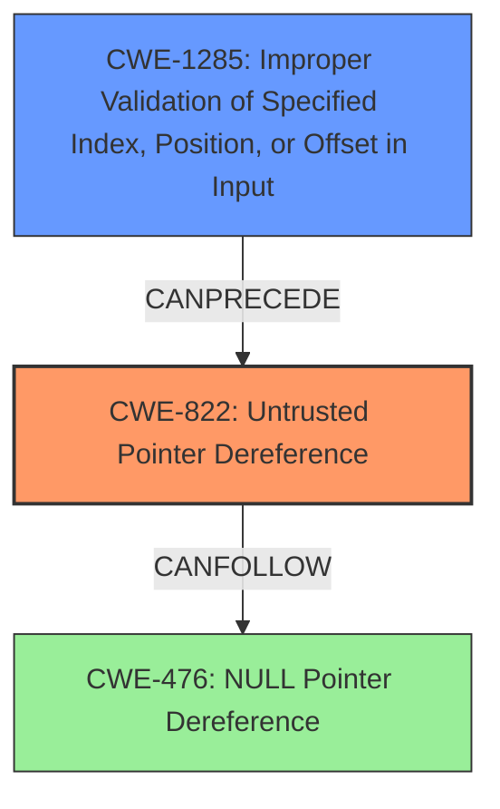

# Final Resolution for CVE-2021-34516

# Summary
| CWE ID | CWE Name | Confidence | CWE Abstraction Level | CWE Vulnerability Mapping Label | CWE-Vulnerability Mapping Notes |
|---|---|---|---|---|---|
| CWE-822 | Untrusted Pointer Dereference | 0.9 | Base | Allowed | The product obtains a value from an untrusted source, converts this value to a pointer, and dereferences the resulting pointer. |
| CWE-1285 | Improper Validation of Specified Index, Position, or Offset in Input | 0.8 | Base | Allowed | The product receives input that is expected to specify an index, position, or offset into an indexable resource such as a buffer or file, but it does not validate or incorrectly validates that the specified index/position/offset has the required properties. |
| CWE-476 | NULL Pointer Dereference | 0.7 | Base | Allowed | The product dereferences a pointer that it expects to be valid but is NULL. |

*   Primary CWEs: CWE-822
*   Secondary Candidates: CWE-1285, CWE-476

## Evidence and Confidence

*   **Confidence Score:** 0.85
*   **Evidence Strength:** HIGH

## Relationship Analysis
The primary focus is on identifying the root cause and related factors contributing to the vulnerability.

*   **Parent-child hierarchical relationships**: While CWE-476 and CWE-822 have parent CWEs like CWE-119 (Improper Restriction of Operations Within the Bounds of a Memory Buffer), focusing on the base CWEs provides more specific information about the vulnerability.
*   **Chain relationships showing progression of vulnerability**: The chain begins with **CWE-1285** (Improper Validation of Input), leading to **CWE-822** (**Untrusted Pointer Dereference**), which can then lead to an out-of-bounds read or write.
*   **Peer relationships that offered alternative classifications**: The peer relationships of CWE-822, such as CWE-416 (Use After Free) and CWE-415 (Double Free), are less relevant as the core issue is the dereferencing of an untrusted pointer rather than memory management errors.

## Vulnerability Chain
The vulnerability chain starts with a lack of input validation (**CWE-1285**), which allows an attacker-controlled value to be used as a pointer. This leads to the dereferencing of an untrusted pointer (**CWE-822**). In some cases, the pointer may be NULL (**CWE-476**). This chain results in a crash or potentially allows for arbitrary code execution if the untrusted pointer points to attacker-controlled memory.

*   **Root Cause:** Lack of input validation (**CWE-1285**) and subsequent **untrusted pointer dereference** (**CWE-822**).
*   **Weakness:** **NULL pointer dereference** (**CWE-476**) as a possible consequence of the untrusted pointer.
*   **Impact:** Elevation of Privilege

## Summary of Analysis
The initial analysis correctly identified CWE-476 and CWE-822. However, the criticism suggested adding CWE-1285 to represent the lack of input validation. I agree with the criticism and am adding CWE-1285 to the analysis.

*   **Evidence:** The vulnerability description explicitly mentions **null pointer dereference vulnerabilities** and **untrusted pointer dereference** in multiple functions within cdd.dll. The functions are affected by **null pointer dereference vulnerabilities**. Additionally, the functions are affected by **untrusted pointer dereference vulnerabilities** due to a lack of proper input validation.
*   **Graph Relationships:** The chain relationship between CWE-1285 and CWE-822 is important. The lack of input validation (CWE-1285) directly leads to the use of an untrusted pointer (CWE-822).
*   **Justification:** CWE-822 is the primary weakness because it directly describes the act of dereferencing a pointer derived from an untrusted source. CWE-1285 is a secondary weakness that describes the cause. CWE-476 is tertiary because it is a possible outcome of the dereference. These CWEs are at the base level of abstraction, which provides sufficient specificity.
*   **Optimal Specificity:** The selected CWEs are at the optimal level of specificity because they directly address the root cause (lack of input validation leading to an untrusted pointer dereference) and potential consequence (null pointer dereference) of the vulnerability.