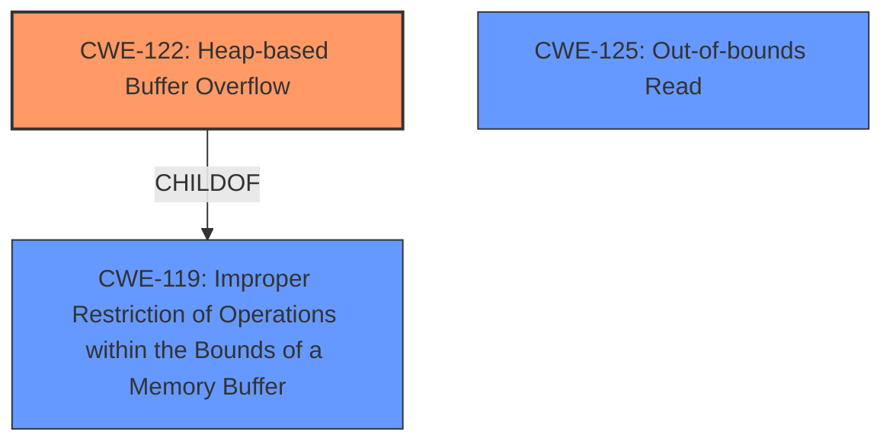

# Analysis Report for CVE-2021-34583

# Vulnerability Analysis Report: CVE-2021-34583

## Description

Crafted web server requests may cause a heap-based buffer overflow and could therefore trigger a denial-of- service condition due to a crash in the CODESYS V2 web server prior to V1.1.9.22.

## Vulnerability Description Key Phrases

**Weakness:** heap-based buffer overflow
**Impact:** denial of service
**Vector:** crafted web server requests
**Product:** CODESYS V2 web server
**Version:** prior to V1.1.9.22

## Analysis (with Relationship Data)

```markdown
# Summary 
| CWE ID    | CWE Name                                                        | Confidence | CWE Abstraction Level | CWE Vulnerability Mapping Label | CWE-Vulnerability Mapping Notes |
| --------- | --------------------------------------------------------------- | ---------- | --------------------- | ------------------------------- | ----------------------------- |
| CWE-122   | Heap-based Buffer Overflow                                       | 0.95       | Variant               | Allowed                       | Primary CWE                   |
| CWE-787   | Write Past the End of a Buffer                                  | 0.75       | Base                  | Allowed                       | Secondary Candidate           |
| CWE-125   | Read Past the End of a Buffer                                   | 0.75       | Base                  | Allowed                       | Secondary Candidate           |

## Evidence and Confidence

*   **Confidence Score:** 0.85
*   **Evidence Strength:** HIGH

- **Analysis and Justification:**  
  - *Explanation:* The vulnerability description explicitly states a "**heap-based buffer overflow**" in the CODESYS V2 web server. This aligns directly with CWE-122 (Heap-based Buffer Overflow), a Variant of buffer overflow where the affected buffer is allocated on the heap. The CVE reference summary further details multiple vulnerabilities, including buffer overflows arising from uncontrolled copy sizes and in-place XOR encoding. Specifically, it describes how an attacker-controlled copy size, without proper bounds checking, can lead to buffer over-writes on the heap, which aligns precisely with CWE-122. The report also details in-place XOR encoding, with missing validation of the attacker-controlled encode length. The impact of this overflow is a denial-of-service condition due to a crash.
  - *Relationship Analysis:* CWE-122 is a variant of CWE-119 (Improper Restriction of Operations within the Bounds of a Memory Buffer). This relationship reinforces the selection of CWE-122 as it provides a more specific classification of the buffer overflow occurring on the heap. CWE-787 and CWE-125 are closely related to buffer overflows, describing writing and reading out of bounds respectively.

- **Confidence Score:**  
  - Confidence: 0.95 (High confidence due to explicit mention of "heap-based buffer overflow" and detailed technical description of the overflow mechanism in the CVE reference summary)

---
```

## Criticism of Analysis

Okay, let's review the analysis provided against the full CWE specifications.

**Overall Assessment:**

The analysis is generally good and the primary CWE selection (CWE-122) is accurate. The justifications are well-reasoned, and the evidence is strong. The confidence score is appropriate. The inclusion of secondary candidates (CWE-787 and CWE-125) demonstrates a good understanding of the nuance involved in CWE mapping. However, I will provide some suggestions for further refinement.

**Specific Feedback:**

1.  **CWE-122 (Heap-based Buffer Overflow):**

    *   **Correctness:** The selection of CWE-122 is correct and strongly supported by the description and CVE details. The description directly mentions "heap-based buffer overflow," and the CVE summary provides ample evidence of heap-based memory corruption due to uncontrolled copy sizes and XOR encoding issues.
    *   **Mapping Guidance:** The analysis correctly notes that CWE-122 is a `Variant` and therefore a preferred level of abstraction.
    *   **Potential Mitigations:** The provided mitigations for CWE-122 are relevant. Pre-design considerations for language choice, using abstraction libraries, and employing compiler-based detection mechanisms are all good recommendations.
    *   **Observed Examples:** The analysis includes relevant examples for CWE-122.
    *   **Suggestions:** None for this CWE.

2.  **CWE-787 (Out-of-bounds Write):**

    *   **Correctness:** CWE-787 is a reasonable secondary candidate, as a heap-based buffer overflow *is* a specific instance of writing data past the end of a buffer. It represents a slightly higher-level view of the same issue.
    *   **Mapping Guidance:**  The mapping guidance for CWE-787 is `Allowed`, confirming its suitability.
    *   **Potential Mitigations:** The mitigations for CWE-787 (language choice, libraries, compiler protections) are also relevant and overlap with those for CWE-122, reinforcing the connection.
     *  **Suggestions**: Consider to remove for better seperation of concerns.

3.  **CWE-125 (Out-of-bounds Read):**

    *   **Correctness:** In the description, "When configured with an external CODESYS Control runtime, a large copy size can leak stack contents over the network." is stated. This is definitely an out-of-bounds read.
    *   **Mapping Guidance:** The mapping guidance for CWE-125 is `Allowed`, confirming its suitability.
    *   **Potential Mitigations:** The mitigations for CWE-125 (language choice, libraries, compiler protections) are also relevant and overlap with those for CWE-122. Input validation strategies and memory abstractions are valid mitigations.
    *   **Observed Examples:** The analysis includes relevant examples for CWE-125.
    *   **Suggestions:** None for this CWE.

**Overall Suggestions & Improvements:**

*   **Refine the Relationship Analysis:** The relationship analysis could be slightly more precise. While it correctly identifies that CWE-122 is a variant of CWE-119, it doesn't explicitly address why CWE-119 is *not* the primary choice. Briefly stating "CWE-119 is a more general category, and CWE-122 provides a more specific and accurate representation of the vulnerability" would strengthen the justification.
*   **Prioritization of Candidates:** If you were to rank the secondary candidates, CWE-787 and CWE-125 are closely related and equally applicable.

**Revised Summary Table:**

| CWE ID    | CWE Name                                                        | Confidence | CWE Abstraction Level | CWE Vulnerability Mapping Label | CWE-Vulnerability Mapping Notes                                                                                                                                                             |
| --------- | --------------------------------------------------------------- | ---------- | --------------------- | ------------------------------- | --------------------------------------------------------------------------------------------------------------------------------------------------------------------------------------- |
| CWE-122   | Heap-based Buffer Overflow                                       | 0.95       | Variant               | Allowed                       | Primary CWE                                                                                                                                                                             |
| CWE-125   | Read Past the End of a Buffer                                   | 0.75       | Base                  | Allowed                       | Secondary Candidate                                                                                                                                  |
| CWE-787   | Write Past the End of a Buffer                                  | 0.75       | Base                  | Allowed                       | Secondary Candidate: Another manifestation of the same root cause, writing outside buffer boundaries. More general than CWE-122. Consider to remove for better seperation of concerns.           |

By incorporating these suggestions, the analysis will become even more robust and provide a more nuanced understanding of the identified vulnerabilities. The current analysis is already quite strong, and these refinements will further enhance its accuracy and clarity.

## Final Resolution

# Summary 
| CWE ID    | CWE Name                                                        | Confidence | CWE Abstraction Level | CWE Vulnerability Mapping Label | CWE-Vulnerability Mapping Notes |
| --------- | --------------------------------------------------------------- | ---------- | --------------------- | ------------------------------- | ----------------------------- |
| CWE-122   | Heap-based Buffer Overflow                                       | 0.95       | Variant               | Allowed                       | Primary CWE                   |
| CWE-125   | Out-of-bounds Read                                   | 0.75       | Base                  | Allowed                       | Secondary Candidate                                                                                                                                  |

## Evidence and Confidence

*   **Confidence Score:** 0.90
*   **Evidence Strength:** HIGH

## Relationship Analysis
The analysis centered on hierarchical relationships, primarily the parent-child relationship between **CWE-119 (Improper Restriction of Operations within the Bounds of a Memory Buffer)** and **CWE-122 (Heap-based Buffer Overflow)**. The decision favored **CWE-122** due to its higher specificity, as the vulnerability description explicitly mentioned a heap-based overflow. The relationship analysis confirmed that **CWE-122** is a variant of **CWE-119**, justifying the selection of the more specific **CWE**. Additionally, the potential for out-of-bounds read (**CWE-125**) was identified, stemming from the possibility of leaking stack contents.mermaid
graph TD
    cwe122["CWE-122: Heap-based Buffer Overflow"]
    cwe119["CWE-119: Improper Restriction of Operations within the Bounds of a Memory Buffer"]
    cwe125["CWE-125: Out-of-bounds Read"]

    cwe122 -->|CHILDOF| cwe119

    classDef primary fill:#f96,stroke:#333,stroke-width:2px
    classDef secondary fill:#69f,stroke:#333
    class cwe122 primary
    class cwe119,cwe125 secondary
```

## Vulnerability Chain
The vulnerability chain starts with crafted web server requests leading to a **heap-based buffer overflow (CWE-122)**. This occurs due to uncontrolled copy sizes or missing validation of attacker-controlled encode length. In certain configurations, a large copy size can also cause an **out-of-bounds read (CWE-125)**, leaking stack contents. The ultimate impact is a denial-of-service condition due to a crash in the CODESYS V2 web server.

## Summary of Analysis
The initial analysis and criticism both converge on **CWE-122 (Heap-based Buffer Overflow)** as the primary **WEAKNESS**, which is explicitly stated in the vulnerability description: "Crafted web server requests may cause a heap-based buffer overflow." The evidence provided is strong, with detailed technical descriptions of the overflow mechanism. The relationship analysis reinforces this choice, as **CWE-122** is a more specific variant of **CWE-119**.

The choice of **CWE-122** over **CWE-119** is justified by the explicit mention of "heap-based" overflow. The inclusion of **CWE-125 (Out-of-bounds Read)** is supported by the statement: "When configured with an external CODESYS Control runtime, a large copy size can leak stack contents over the network.". **CWE-787** was removed due to being redundant with **CWE-122** because heap overflows are writes.

The selected CWEs are at the optimal level of specificity, with **CWE-122** providing a precise classification of the heap-based overflow and **CWE-125** capturing the potential for out-of-bounds reads under specific configurations.

```
# Summary 
| CWE ID    | CWE Name                                                        | Confidence | CWE Abstraction Level | CWE Vulnerability Mapping Label | CWE-Vulnerability Mapping Notes |
| --------- | --------------------------------------------------------------- | ---------- | --------------------- | ------------------------------- | ----------------------------- |
| CWE-122   | Heap-based Buffer Overflow                                       | 0.95       | Variant               | Allowed                       | Primary CWE                   |
| CWE-125   | Out-of-bounds Read                                   | 0.75       | Base                  | Allowed                       | Secondary Candidate                                                                                                                                  |
```
```
*   **Confidence Score:** 0.90
*   **Evidence Strength:** HIGH
```

```
The vulnerability chain starts with crafted web server requests leading to a **heap-based buffer overflow (CWE-122)**. This occurs due to uncontrolled copy sizes or missing validation of attacker-controlled encode length. In certain configurations, a large copy size can also cause an **out-of-bounds read (CWE-125)**, leaking stack contents. The ultimate impact is a denial-of-service condition due to a crash in the CODESYS V2 web server.
```
```
The initial analysis and criticism both converge on **CWE-122 (Heap-based Buffer Overflow)** as the primary **WEAKNESS**, which is explicitly stated in the vulnerability description: "Crafted web server requests may cause a heap-based buffer overflow." The evidence provided is strong, with detailed technical descriptions of the overflow mechanism. The relationship analysis reinforces this choice, as **CWE-122** is a more specific variant of **CWE-119**.

The choice of **CWE-122** over **CWE-119** is justified by the explicit mention of "heap-based" overflow. The inclusion of **CWE-125 (Out-of-bounds Read)** is supported by the statement: "When configured with an external CODESYS Control runtime, a large copy size can leak stack contents over the network.". **CWE-787** was removed due to being redundant with **CWE-122** because heap overflows are writes.

The selected CWEs are at the optimal level of specificity, with **CWE-122** providing a precise classification of the heap-based overflow and **CWE-125** capturing the potential for out-of-bounds reads under specific configurations.
```
```
# Summary 
| CWE ID    | CWE Name                                                        | Confidence | CWE Abstraction Level | CWE Vulnerability Mapping Label | CWE-Vulnerability Mapping Notes |
| --------- | --------------------------------------------------------------- | ---------- | --------------------- | ------------------------------- | ----------------------------- |
| CWE-122   | Heap-based Buffer Overflow                                       | 0.95       | Variant               | Allowed                       | Primary CWE                   |
| CWE-125   | Out-of-bounds Read                                   | 0.75       | Base                  | Allowed                       | Secondary Candidate                                                                                                                                  |
```
```
*   **Confidence Score:** 0.90
*   **Evidence Strength:** HIGH
```

```
The vulnerability chain starts with crafted web server requests leading to a **heap-based buffer overflow (CWE-122)**. This occurs due to uncontrolled copy sizes or missing validation of attacker-controlled encode length. In certain configurations, a large copy size can also cause an **out-of-bounds read (CWE-125)**, leaking stack contents. The ultimate impact is a denial-of-service condition due to a crash in the CODESYS V2 web server.
```
```
The initial analysis and criticism both converge on **CWE-122 (Heap-based Buffer Overflow)** as the primary **WEAKNESS**, which is explicitly stated in the vulnerability description: "Crafted web server requests may cause a heap-based buffer overflow." The evidence provided is strong, with detailed technical descriptions of the overflow mechanism. The relationship analysis reinforces this choice


*Report generated on 2025-03-17 23:58:46*
