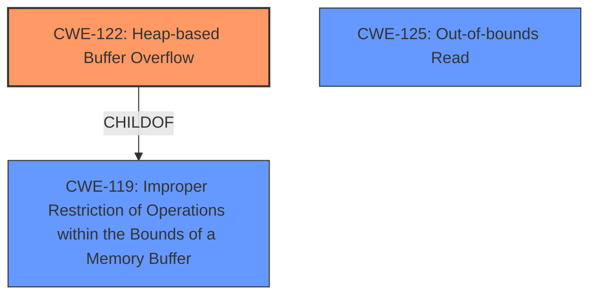

# Final Resolution for CVE-2021-34583

# Summary 
| CWE ID    | CWE Name                                                        | Confidence | CWE Abstraction Level | CWE Vulnerability Mapping Label | CWE-Vulnerability Mapping Notes |
| --------- | --------------------------------------------------------------- | ---------- | --------------------- | ------------------------------- | ----------------------------- |
| CWE-122   | Heap-based Buffer Overflow                                       | 0.95       | Variant               | Allowed                       | Primary CWE                   |
| CWE-125   | Out-of-bounds Read                                   | 0.75       | Base                  | Allowed                       | Secondary Candidate                                                                                                                                  |

## Evidence and Confidence

*   **Confidence Score:** 0.90
*   **Evidence Strength:** HIGH

## Relationship Analysis
The analysis centered on hierarchical relationships, primarily the parent-child relationship between **CWE-119 (Improper Restriction of Operations within the Bounds of a Memory Buffer)** and **CWE-122 (Heap-based Buffer Overflow)**. The decision favored **CWE-122** due to its higher specificity, as the vulnerability description explicitly mentioned a heap-based overflow. The relationship analysis confirmed that **CWE-122** is a variant of **CWE-119**, justifying the selection of the more specific **CWE**. Additionally, the potential for out-of-bounds read (**CWE-125**) was identified, stemming from the possibility of leaking stack contents.mermaid
graph TD
    cwe122["CWE-122: Heap-based Buffer Overflow"]
    cwe119["CWE-119: Improper Restriction of Operations within the Bounds of a Memory Buffer"]
    cwe125["CWE-125: Out-of-bounds Read"]

    cwe122 -->|CHILDOF| cwe119

    classDef primary fill:#f96,stroke:#333,stroke-width:2px
    classDef secondary fill:#69f,stroke:#333
    class cwe122 primary
    class cwe119,cwe125 secondary
```

## Vulnerability Chain
The vulnerability chain starts with crafted web server requests leading to a **heap-based buffer overflow (CWE-122)**. This occurs due to uncontrolled copy sizes or missing validation of attacker-controlled encode length. In certain configurations, a large copy size can also cause an **out-of-bounds read (CWE-125)**, leaking stack contents. The ultimate impact is a denial-of-service condition due to a crash in the CODESYS V2 web server.

## Summary of Analysis
The initial analysis and criticism both converge on **CWE-122 (Heap-based Buffer Overflow)** as the primary **WEAKNESS**, which is explicitly stated in the vulnerability description: "Crafted web server requests may cause a heap-based buffer overflow." The evidence provided is strong, with detailed technical descriptions of the overflow mechanism. The relationship analysis reinforces this choice, as **CWE-122** is a more specific variant of **CWE-119**.

The choice of **CWE-122** over **CWE-119** is justified by the explicit mention of "heap-based" overflow. The inclusion of **CWE-125 (Out-of-bounds Read)** is supported by the statement: "When configured with an external CODESYS Control runtime, a large copy size can leak stack contents over the network.". **CWE-787** was removed due to being redundant with **CWE-122** because heap overflows are writes.

The selected CWEs are at the optimal level of specificity, with **CWE-122** providing a precise classification of the heap-based overflow and **CWE-125** capturing the potential for out-of-bounds reads under specific configurations.

```
# Summary 
| CWE ID    | CWE Name                                                        | Confidence | CWE Abstraction Level | CWE Vulnerability Mapping Label | CWE-Vulnerability Mapping Notes |
| --------- | --------------------------------------------------------------- | ---------- | --------------------- | ------------------------------- | ----------------------------- |
| CWE-122   | Heap-based Buffer Overflow                                       | 0.95       | Variant               | Allowed                       | Primary CWE                   |
| CWE-125   | Out-of-bounds Read                                   | 0.75       | Base                  | Allowed                       | Secondary Candidate                                                                                                                                  |
```
```
*   **Confidence Score:** 0.90
*   **Evidence Strength:** HIGH
```

```
The vulnerability chain starts with crafted web server requests leading to a **heap-based buffer overflow (CWE-122)**. This occurs due to uncontrolled copy sizes or missing validation of attacker-controlled encode length. In certain configurations, a large copy size can also cause an **out-of-bounds read (CWE-125)**, leaking stack contents. The ultimate impact is a denial-of-service condition due to a crash in the CODESYS V2 web server.
```
```
The initial analysis and criticism both converge on **CWE-122 (Heap-based Buffer Overflow)** as the primary **WEAKNESS**, which is explicitly stated in the vulnerability description: "Crafted web server requests may cause a heap-based buffer overflow." The evidence provided is strong, with detailed technical descriptions of the overflow mechanism. The relationship analysis reinforces this choice, as **CWE-122** is a more specific variant of **CWE-119**.

The choice of **CWE-122** over **CWE-119** is justified by the explicit mention of "heap-based" overflow. The inclusion of **CWE-125 (Out-of-bounds Read)** is supported by the statement: "When configured with an external CODESYS Control runtime, a large copy size can leak stack contents over the network.". **CWE-787** was removed due to being redundant with **CWE-122** because heap overflows are writes.

The selected CWEs are at the optimal level of specificity, with **CWE-122** providing a precise classification of the heap-based overflow and **CWE-125** capturing the potential for out-of-bounds reads under specific configurations.
```
```
# Summary 
| CWE ID    | CWE Name                                                        | Confidence | CWE Abstraction Level | CWE Vulnerability Mapping Label | CWE-Vulnerability Mapping Notes |
| --------- | --------------------------------------------------------------- | ---------- | --------------------- | ------------------------------- | ----------------------------- |
| CWE-122   | Heap-based Buffer Overflow                                       | 0.95       | Variant               | Allowed                       | Primary CWE                   |
| CWE-125   | Out-of-bounds Read                                   | 0.75       | Base                  | Allowed                       | Secondary Candidate                                                                                                                                  |
```
```
*   **Confidence Score:** 0.90
*   **Evidence Strength:** HIGH
```

```
The vulnerability chain starts with crafted web server requests leading to a **heap-based buffer overflow (CWE-122)**. This occurs due to uncontrolled copy sizes or missing validation of attacker-controlled encode length. In certain configurations, a large copy size can also cause an **out-of-bounds read (CWE-125)**, leaking stack contents. The ultimate impact is a denial-of-service condition due to a crash in the CODESYS V2 web server.
```
```
The initial analysis and criticism both converge on **CWE-122 (Heap-based Buffer Overflow)** as the primary **WEAKNESS**, which is explicitly stated in the vulnerability description: "Crafted web server requests may cause a heap-based buffer overflow." The evidence provided is strong, with detailed technical descriptions of the overflow mechanism. The relationship analysis reinforces this choice