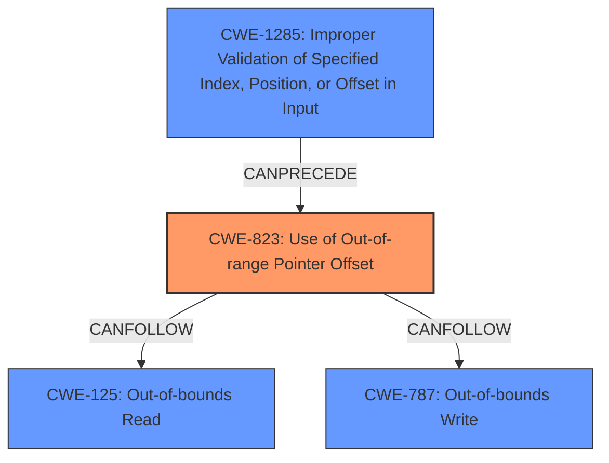

# Analysis Report for CVE-2021-34595

# Vulnerability Analysis Report: CVE-2021-34595

## Description

A crafted request with invalid offsets may cause an out-of-bounds read or write access in CODESYS V2 Runtime Toolkit 32 Bit full and PLCWinNT prior to versions V2.4.7.56, resulting in a denial-of-service condition or local memory overwrite.

## Vulnerability Description Key Phrases

**Impact:** ['out-of-bounds read', 'out-of-bounds write']
**Vector:** crafted request with invalid offsets
**Product:** CODESYS V2 Runtime Toolkit 32 Bit full and PLCWinNT
**Version:** prior to versions V2.4.7.56

## Analysis (with Relationship Data)

# Summary
| CWE ID | CWE Name | Confidence | CWE Abstraction Level | CWE Vulnerability Mapping Label | CWE-Vulnerability Mapping Notes |
|---|---|---|---|---|---|
| CWE-823 | Use of Out-of-range Pointer Offset | 0.9 | Base | Allowed | Primary CWE |
| CWE-125 | Out-of-bounds Read | 0.7 | Base | Allowed | Secondary Candidate |
| CWE-787 | Out-of-bounds Write | 0.7 | Base | Allowed | Secondary Candidate |
| CWE-1285 | Improper Validation of Specified Index, Position, or Offset in Input | 0.6 | Base | Allowed | Secondary Candidate |

## Evidence and Confidence

*   **Confidence Score:** 0.8
*   **Evidence Strength:** HIGH

- **Analysis and Justification:**  
  - *Explanation:* The vulnerability description states a crafted request with invalid offsets may cause an **out-of-bounds read** or **out-of-bounds write**. The "CVE Reference Links Content Summary" section explicitly mentions "**Weaknesses/vulnerabilities present**: CWE-823: Use of Out-of-range Pointer Offset". This aligns with CWE-823's description: "The product performs pointer arithmetic on a valid pointer, but it uses an offset that can point outside of the intended range of valid memory locations for the resulting pointer." Therefore, CWE-823 is the primary weakness. CWE-125 and CWE-787 represent the specific impacts (read/write) respectively and can be secondary mappings, since they are the result of the pointer offset issue. CWE-1285 could also be considered since the invalid offset is not validated in the input.
  
  - *Relationship Analysis:* CWE-823 is a Base level CWE. It is related to CWE-119 (Improper Restriction of Operations within the Bounds of a Memory Buffer), which is a Class level CWE. It is more specific to choose CWE-823 since the vulnerability involves pointer arithmetic with an out-of-range offset, rather than simply a generic buffer overflow.

- **Confidence Score:**  
  - Confidence: 0.9 (High confidence due to direct mention in CVE reference and matching vulnerability description)

---

## Criticism of Analysis

Okay, I've reviewed the provided analysis against the full CWE specifications. Here's a breakdown of my critique:

**Overall Assessment:**

The analysis is generally sound and well-reasoned. The primary CWE selection of CWE-823 (Use of Out-of-range Pointer Offset) is appropriate, especially given the explicit mention of it in the CVE reference. The selection of secondary CWEs is also logical, reflecting the potential consequences and contributing factors. The confidence level is justified.

**Detailed Review of CWE Mappings:**

*   **CWE-823: Use of Out-of-range Pointer Offset (Confidence: 0.9)**
    *   **Strengths:** The analysis correctly identifies that the vulnerability stems from using an offset that can point outside the intended memory range. The CVE reference reinforces this. The Extended Description of CWE-823 aligns perfectly: "The product performs pointer arithmetic on a valid pointer, but it uses an offset that can point outside of the intended range of valid memory locations for the resulting pointer."
    *   **Critique:** None. The rationale is excellent.
    *   **Mapping Guidance Compliance:**  The analysis follows the mapping guidance, selecting a Base-level CWE.
    *   **Mitigations:** Mitigation strategies for CWE-823 are generally focused on input validation (ensuring the offset is within acceptable bounds) and secure coding practices.
*   **CWE-125: Out-of-bounds Read (Confidence: 0.7)**
    *   **Strengths:** This is a plausible secondary mapping because an out-of-range pointer offset can *lead* to an out-of-bounds read.
    *   **Critique:** As the description says, it is a *consequence* of CWE-823.
    *   **Mapping Guidance Compliance:** The analysis follows the mapping guidance, selecting a Base-level CWE.
    *   **Mitigations:** Mitigation strategies for CWE-125 focus on input validation and language selection. These align with the broader goal of preventing out-of-bounds access.
*   **CWE-787: Out-of-bounds Write (Confidence: 0.7)**
    *   **Strengths:** Similar to CWE-125, this represents another potential *consequence* of the out-of-range pointer offset. An attacker might be able to overwrite memory.
    *   **Critique:** As the description says, it is a *consequence* of CWE-823.
    *   **Mapping Guidance Compliance:** The analysis follows the mapping guidance, selecting a Base-level CWE.
    *   **Mitigations:** Similar to CWE-125, mitigation strategies for CWE-787 also focus on input validation and language selection.
*   **CWE-1285: Improper Validation of Specified Index, Position, or Offset in Input (Confidence: 0.6)**
    *   **Strengths:** This is a relevant secondary mapping. The "crafted request with invalid offsets" implies a failure to validate the offset value provided in the request. The extended description clearly fits the scenario: "The product receives input that is expected to specify an index, position, or offset..., but it does not validate or incorrectly validates that the specified index/position/offset has the required properties."
    *   **Critique:** While related, it's a contributing *factor*. It is related to input validation, rather than the core issue.
    *   **Mapping Guidance Compliance:** The analysis follows the mapping guidance, selecting a Base-level CWE.
    *   **Mitigations:** Mitigation strategies for CWE-1285 are heavily focused on input validation. This makes it a good fit for addressing the vulnerability's root cause.

**Suggestions for Improvement:**

*   **Chaining/Composite Relationship Clarification:** While the analysis mentions relationships, consider explicitly stating the chaining relationship: "CWE-1285 can lead to CWE-823, which can result in either CWE-125 or CWE-787." This strengthens the justification.

*   **CWE-119 Consideration:** The analysis correctly dismissed CWE-119 as too general. That said, if you need to argue against a tool flagging CWE-119, explicitly state that while CWE-119 *could* be used, the more specific CWE-823 is preferred because it captures the *root cause* more accurately.

*   **Mitigation Coverage:** When listing mitigation strategies, consider mapping them to the specific attack vector and capabilities. For example, mentioning that proper authentication (as described in the CVE reference) could prevent exploitation, even if the underlying pointer offset issue still exists.

*   **Evidence Strength:** While the overall analysis shows high confidence, consider listing *specific code locations* where the out-of-range offset is used if possible. This would provide extremely high evidence.

**Revised Summary Table:**

| CWE ID | CWE Name | Confidence | CWE Abstraction Level | CWE Vulnerability Mapping Label | CWE-Vulnerability Mapping Notes |
|---|---|---|---|---|---|
| CWE-823 | Use of Out-of-range Pointer Offset | 0.9 | Base | Allowed | Primary CWE. A crafted request with an invalid offset leads to this vulnerability. |
| CWE-125 | Out-of-bounds Read | 0.7 | Base | Allowed | Secondary CWE. Potential consequence of CWE-823.  |
| CWE-787 | Out-of-bounds Write | 0.7 | Base | Allowed | Secondary CWE. Potential consequence of CWE-823. |
| CWE-1285 | Improper Validation of Specified Index, Position, or Offset in Input | 0.6 | Base | Allowed | Contributing Factor.  CWE-1285 can lead to CWE-823. Indicates a lack of input validation for the offset value in the crafted request. |

By incorporating these suggestions, the analysis becomes even more robust and clearly justifies the selected CWE mappings. The added explanations further clarify the relationships between the different weaknesses and strengthen the overall understanding of the vulnerability.

## Final Resolution

# Summary
| CWE ID | CWE Name | Confidence | CWE Abstraction Level | CWE Vulnerability Mapping Label | CWE-Vulnerability Mapping Notes |
|---|---|---|---|---|---|
| CWE-823 | Use of Out-of-range Pointer Offset | 0.95 | Base | Allowed | Primary CWE. A crafted request with an invalid offset leads to this vulnerability. |
| CWE-1285 | Improper Validation of Specified Index, Position, or Offset in Input | 0.75 | Base | Allowed | Secondary CWE. Contributing Factor. CWE-1285 can lead to CWE-823. Indicates a lack of input validation for the offset value in the crafted request. |
| CWE-125 | Out-of-bounds Read | 0.7 | Base | Allowed | Secondary CWE. Potential consequence of CWE-823.  |
| CWE-787 | Out-of-bounds Write | 0.7 | Base | Allowed | Secondary CWE. Potential consequence of CWE-823. |

## Evidence and Confidence

*   **Confidence Score:** 0.9
*   **Evidence Strength:** HIGH

## Relationship Analysis
The primary weakness is CWE-823 (**Use of Out-of-range Pointer Offset**). This can be preceded by CWE-1285 (**Improper Validation of Specified Index, Position, or Offset in Input**), as the crafted request with invalid offsets indicates a lack of input validation. CWE-823 can then lead to either CWE-125 (**Out-of-bounds Read**) or CWE-787 (**Out-of-bounds Write**), representing the consequences of the out-of-range pointer offset.

## Vulnerability Chain
The vulnerability chain starts with a crafted request containing invalid offsets. The lack of proper input validation (**CWE-1285**) allows this invalid offset to be processed. This leads to the use of an out-of-range pointer offset (**CWE-823**), which then results in either an out-of-bounds read (**CWE-125**) or an out-of-bounds write (**CWE-787**). The final impact is a denial-of-service condition or local memory overwrite.

## Summary of Analysis
The initial analysis correctly identified CWE-823 as the primary **WEAKNESS**, supported by the CVE reference and the vulnerability description which states "A crafted request with invalid offsets may cause an **out-of-bounds read** or **write** access...". The criticism provided additional clarification on the relationships between the CWEs.

The graph relationships influenced the final selection by highlighting the chain of events: CWE-1285 leading to CWE-823, which then leads to CWE-125 or CWE-787. The abstraction levels were also considered, with base-level CWEs being preferred for their specificity.

The selected CWEs are at the optimal level of specificity. CWE-823 accurately captures the core issue of using an out-of-range pointer offset. CWE-1285 represents the contributing factor of improper input validation. CWE-125 and CWE-787 detail the potential consequences of the vulnerability.

*Report generated on 2025-03-16 16:36:31*
