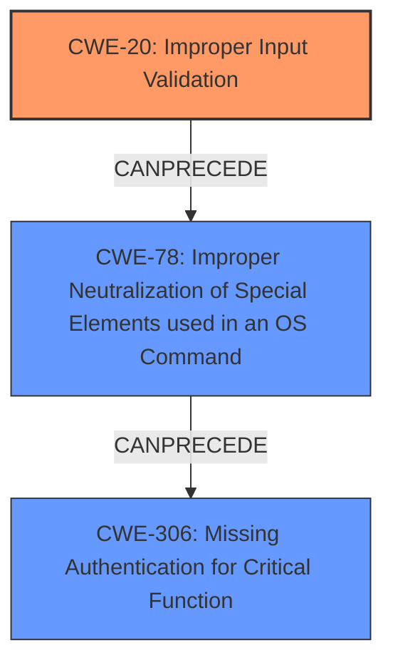

# Final Resolution for CVE-2021-34746

# Summary
| CWE ID | CWE Name | Confidence | CWE Abstraction Level | CWE Vulnerability Mapping Label | CWE-Vulnerability Mapping Notes |
|---|---|---|---|---|---|
| CWE-20 | Improper Input Validation | 0.90 | Class | Allowed-with-Review | Primary CWE: Maps to the root cause of **incomplete validation of user-supplied input**. While broad, the description specifies the **incomplete validation** aspect, making it the primary weakness. Serves as an entry point for chaining to more specific weaknesses. |
| CWE-78 | Improper Neutralization of Special Elements used in an OS Command ('OS Command Injection') | 0.80 | Base | Allowed | Secondary CWE: The **incomplete validation** (CWE-20) leads to OS command injection via user input.  |
| CWE-306 | Missing Authentication for Critical Function | 0.75 | Base | Allowed | Secondary CWE: The **incomplete validation** leads to bypassing authentication. More specifically, authentication checks are circumvented, not entirely missing. |

## Evidence and Confidence

*   **Confidence Score:** 0.85
*   **Evidence Strength:** HIGH

## Relationship Analysis
The classification focuses on a chain of weaknesses. **Improper Input Validation** (CWE-20) is identified as the primary root cause. This lack of validation allows for **Improper Neutralization of Special Elements used in an OS Command ('OS Command Injection')** (CWE-78) and ultimately leads to **Missing Authentication for Critical Function** (CWE-306).

The hierarchical relationships support the chosen CWEs. CWE-78 is a child of CWE-77 (Improper Neutralization of Special Elements used in a Command), but CWE-78 is more specific, aligning with the description's reference to OS command injection. CWE-306 is a child of CWE-287 (Improper Authentication), representing a specific case where authentication is missing for critical functions.

The abstraction levels were considered. CWE-20 is a Class, but it's used because the specific type of input validation failure is not detailed in the provided information. CWE-78 and CWE-306 are Base level, providing more granularity.

## Vulnerability Chain
The vulnerability chain starts with **CWE-20 (Improper Input Validation)**. The product does not sufficiently validate user-supplied input. This leads to **CWE-78 (Improper Neutralization of Special Elements used in an OS Command)** because the unvalidated input is used in an OS command. Finally, this leads to **CWE-306 (Missing Authentication for Critical Function)** because the injected command bypasses the authentication mechanism, allowing an unauthenticated attacker to log in as an administrator.

## Summary of Analysis
The initial analysis correctly identified CWE-20 as a primary weakness due to the **incomplete validation of user-supplied input**. The criticism highlighted the need to emphasize the chaining relationship between CWE-20 and CWE-78, which has been incorporated into this assessment.

The graph relationships influenced the final selection by reinforcing the importance of CWE-20 as the root cause. The relationships also clarified the progression of the vulnerability from input validation failure to command injection to authentication bypass.

The selected CWEs are at the optimal level of specificity because they accurately reflect the available evidence. While more specific input validation CWEs could be considered, the lack of detailed information about the validation process makes CWE-20 the most appropriate choice. CWE-78 and CWE-306 are more specific and align well with the description of command injection and authentication bypass.

The vulnerability description states, "This vulnerability is due to **incomplete validation of user-supplied input** that is passed to an authentication script. An attacker could exploit this vulnerability by injecting parameters into an authentication request. A successful exploit could allow the attacker to bypass authentication and log in as an administrator to the affected device." This statement provides direct evidence for CWE-20 as the root cause, leading to the other weaknesses.