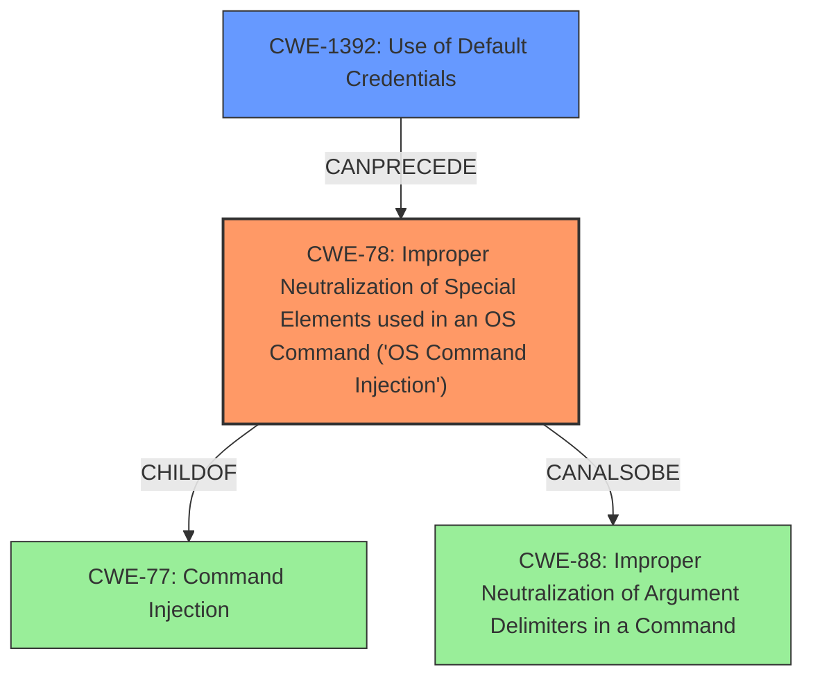

# Analysis Report for CVE-2021-34795

# Vulnerability Analysis Report: CVE-2021-34795

## Description

Multiple vulnerabilities in the web-based management interface of the Cisco Catalyst Passive Optical Network (PON) Series Switches Optical Network Terminal (ONT) could allow an unauthenticated, remote attacker to perform the following actions Log in with a default credential if the Telnet protocol is enabled Perform command injection Modify the configuration For more information about these vulnerabilities, see the Details section of this advisory.

## Vulnerability Description Key Phrases

**Weakness:** command injection
**Impact:** ['Log in with a default credential', 'Perform command injection', 'Modify the configuration']
**Attacker:** unauthenticated remote attacker
**Product:** Cisco Catalyst Passive Optical Network Series Switches Optical Network Terminal
**Component:** web-based management interface

## Analysis (with Relationship Data)

# Summary
| CWE ID | CWE Name | Confidence | CWE Abstraction Level | CWE Vulnerability Mapping Label | CWE-Vulnerability Mapping Notes |
|---|---|---|---|---|---|
| CWE-78 | Improper Neutralization of Special Elements used in an OS Command ('OS Command Injection') | 0.90 | Base | Allowed | Primary CWE: The vulnerability description explicitly mentions **command injection**, and the CVE summary details the ability to execute commands. |
| CWE-1188 | Initialization of a Resource with an Insecure Default | 0.80 | Base | Allowed | Secondary CWE: The vulnerability involves logging in with a **default credential**, indicating an insecure default configuration. |

## Evidence and Confidence

*   **Confidence Score:** 0.85
*   **Evidence Strength:** HIGH

- **Analysis and Justification:**  
  - *Explanation:* The vulnerability description explicitly states that an attacker can perform **command injection**, which directly aligns with CWE-78 (Improper Neutralization of Special Elements used in an OS Command ('OS Command Injection')). The CVE reference summary does not provide specifics about the command injection itself, but the description alone is strong evidence. Additionally, the ability to "Log in with a **default credential**" points to a configuration issue, aligning with CWE-1188 (Initialization of a Resource with an Insecure Default). CWE-1188 explains that the product is initialized with a default that is intended to be changed by the administrator, but the default is not secure. Both CWEs are at the Base level of abstraction, which is preferred.

  - *Relationship Analysis:* CWE-78 is a child of CWE-77 (Command Injection), but since the vulnerability description mentions OS command injection, CWE-78 is a more specific and appropriate choice. CWE-78 can precede CWE-269 (Privilege Management) since successful command injection can lead to privilege escalation. CWE-1188 does not have any direct relationships.

- **Confidence Score:**  
  - *Example:* Confidence: 0.90 (High evidence for CWE-78 due to explicit mention of command injection). Confidence: 0.80 (High evidence for CWE-1188 due to mention of default credentials).

---

## Criticism of Analysis

Okay, here's a review of the analysis, considering the full CWE specifications you provided.

**Overall Assessment:**

The analysis is generally good, particularly in identifying CWE-78 as the primary weakness. The justification for both CWE-78 and CWE-1188 is sound. However, we can refine the analysis further by considering the relationships between the CWEs, alternative CWEs that might be relevant, and the specific mitigations applicable to each weakness.

**Detailed Review:**

**1. CWE-78: Improper Neutralization of Special Elements used in an OS Command ('OS Command Injection')**

*   **Confidence:** 0.90 (High) - Justified, given the explicit mention of "command injection" in the vulnerability description.

*   **Abstraction Level:** Base - Appropriate choice.

*   **CWE-Vulnerability Mapping Label:** Allowed - Correct.

*   **CWE-Vulnerability Mapping Notes:** Accurate and well-reasoned.

*   **Critique and Suggestions:**

    *   The analysis correctly identifies CWE-78 as the primary weakness.
    *   Relationship to CWE-77: The analysis correctly notes that CWE-78 is a child of CWE-77. It explains why CWE-78 is the *more* specific and appropriate choice, which is good.  No changes needed.
    *   Relationship to CWE-88: The 'CanAlsoBe -> CWE-88' relationship (Improper Neutralization of Argument Delimiters in a Command) is worth considering.  If the command injection occurs because the application fails to properly handle argument delimiters provided by the attacker (e.g., injecting a `--flag=value` argument), then CWE-88 should *also* be considered, and possibly chained with CWE-78. The analysis could benefit from exploring the potential role of CWE-88, especially as the Extended Description of CWE-78 mentions it.  The question to ask is: is the injection happening because *arguments* are being manipulated, in addition to the overall command?

    *   Mitigations: The potential mitigations section of CWE-78 provides some relevant options, like using library calls instead of external processes or employing a sandbox/jail environment. Input validation is essential but can be difficult to implement perfectly.

**2. CWE-1188: Initialization of a Resource with an Insecure Default**

*   **Confidence:** 0.80 (High) - Justified, given the mention of "default credential."

*   **Abstraction Level:** Base - Appropriate choice.

*   **CWE-Vulnerability Mapping Label:** Allowed - Correct.

*   **CWE-Vulnerability Mapping Notes:** Accurate and well-reasoned.

*   **Critique and Suggestions:**

    *   Alternative CWE - Use of Default Credentials (CWE-1392). While Initialization of a Resource with an Insecure Default (CWE-1188) is a perfectly valid choice, *Use of Default Credentials (CWE-1392)* may be more accurate to the root cause of the vulnerability, since the weakness is the authentication mechanism itself. The description for CWE-1392 seems tailor-made for this vulnerability *The product uses default credentials (such as passwords or cryptographic keys) for potentially critical functionality.* While Initialization of a Resource with an Insecure Default (CWE-1188) is still relevant, it is more of a description of *how* the vulnerability came to be, rather than the vulnerability itself.
    * Mitigations: The mitigations section of CWE-1392 also aligns well, such as prohibiting the use of default credentials or forcing administrators to change them on installation.

**General Comments and Recommendations:**

*   **Chaining:** While the analysis mentions relationships between CWEs, consider whether chaining is appropriate. In this case, the command injection (CWE-78) might *follow* a successful login using default credentials (CWE-1188 or CWE-1392), so the chain would be CWE-1188 -> CWE-78 or CWE-1392 -> CWE-78.  This isn't always necessary, but it's worth considering the attack flow.

*   **Specificity:** Where possible, try to drill down to the *most specific* CWE that applies. Is there a child of CWE-1188 that is *more* relevant? (In this instance, probably not.) But always consider it.

*   **Mitigations:** Think about *which* mitigations would be most effective *in this specific context.* For example, if library calls cannot be used to recreate the functionality, can you suggest alternative mitigations for CWE-78 that are more practical?

*   **CWE-20: Improper Input Validation** This CWE was in the original Retriever Results and is worth discussing. As mentioned, CWE-20 is a broad, high-level CWE that is discouraged for use. If the root cause of the command injection was poor input validation *before* the command was constructed, it is worth discussing, but generally a more specific CWE relating to sanitization or encoding would be preferred.

**Revised Summary Table (incorporating suggestions):**

| CWE ID  | CWE Name                                                                                                                                                                                                                           | Confidence | CWE Abstraction Level | CWE Vulnerability Mapping Label | CWE-Vulnerability Mapping Notes                                                                                                                                                                                                                                                                                                                                                                                                |
| :------ | :--------------------------------------------------------------------------------------------------------------------------------------------------------------------------------------------------------------------------------- | :--------- | :---------------------- | :-------------------------------- | :------------------------------------------------------------------------------------------------------------------------------------------------------------------------------------------------------------------------------------------------------------------------------------------------------------------------------------------------------------------------------------------------------------------------- |
| CWE-78  | Improper Neutralization of Special Elements used in an OS Command ('OS Command Injection')                                                                                                                                      | 0.90       | Base                    | Allowed                         | Primary CWE: The vulnerability description explicitly mentions command injection. Consider the role of CWE-88 if argument delimiters are being manipulated.                                                                                                                                                                                                                                                                                                             |
| CWE-1392  | Use of Default Credentials                                                                                                                                                                                                   | 0.80       | Base                    | Allowed                         | Secondary CWE: The vulnerability involves logging in with a default credential, indicating an insecure default configuration. Note: It is recommended to use the suggested mitigations by forcing users to change their credentials on installation.                                                                                                                                                                                                                |

By considering these points, you can create a more robust and informative CWE analysis.

## Final Resolution

# Summary
| CWE ID | CWE Name | Confidence | CWE Abstraction Level | CWE Vulnerability Mapping Label | CWE-Vulnerability Mapping Notes |
|---|---|---|---|---|---|
| CWE-78 | Improper Neutralization of Special Elements used in an OS Command ('OS Command Injection') | 0.90 | Base | Allowed | Primary CWE: The vulnerability description explicitly mentions **command injection**. Consider the role of CWE-88 if argument delimiters are being manipulated. |
| CWE-1392 | Use of Default Credentials | 0.80 | Base | Allowed | Secondary CWE: The vulnerability involves logging in with a **default credential**, indicating an insecure default configuration. Note: It is recommended to use the suggested mitigations by forcing users to change their credentials on installation. |

## Evidence and Confidence

*   **Confidence Score:** 0.90
*   **Evidence Strength:** HIGH

## Relationship Analysis
The analysis focused on refining the initial CWE selections by considering the relationships between them and alternative classifications.

*   **Parent-child hierarchical relationships:** The initial analysis correctly identified CWE-78 as a child of CWE-77 (**Command Injection**). This hierarchical understanding ensured that the most specific and appropriate CWE was selected.
*   **Chain relationships showing progression of vulnerability:** The criticism suggested a chain relationship: a successful login via **default credentials** (CWE-1392) *precedes* the **command injection** (CWE-78). This illustrates a vulnerability chain where one weakness enables the other.
*   **Peer relationships that offered alternative classifications:** The criticism suggested considering CWE-88 (Improper Neutralization of Argument Delimiters in a Command) if the **command injection** involved manipulating command arguments. This highlights the importance of considering peer relationships to capture nuanced aspects of the vulnerability.
*   **How abstraction levels influenced your selection:** Both CWE-78 and CWE-1392 are at the Base level of abstraction, which is preferred for vulnerability mapping. Using Base-level CWEs ensures a more precise and actionable classification compared to higher-level Class or Pillar CWEs.

## Vulnerability Chain
The vulnerability chain starts with the use of **default credentials** (CWE-1392), which allows an attacker to gain unauthorized access. Subsequently, the attacker exploits the **command injection** vulnerability (CWE-78) to execute arbitrary commands on the system.

*   **Root Cause:** CWE-1392 - Use of Default Credentials
*   **Weakness:** CWE-78 - Improper Neutralization of Special Elements used in an OS Command ('OS Command Injection')
*   **Impact:** Arbitrary command execution, potential system compromise

## Summary of Analysis
The analysis builds upon the initial assessment and refines it based on the provided criticism and CWE relationship data.

*   Highlight how much your assessment is based on the provided evidence only, and show or quote that evidence.
The assessment is heavily based on the vulnerability description, which explicitly mentions "Log in with a **default credential**" and "perform **command injection**." This direct evidence strongly supports the selection of CWE-78 and CWE-1392.

*   Explain how the graph relationships influenced your final selection
The graph relationships highlighted the chain of events, where a successful login using **default credentials** can *precede* a **command injection** attack. This chain helped prioritize CWE-1392 as a secondary contributing factor to the overall vulnerability.

*   Provide clear justification for your decision
The decision to classify the vulnerability as CWE-78 and CWE-1392 is justified by the explicit mention of **command injection** and **default credentials** in the vulnerability description. The analysis also considered alternative CWEs and their relationships to ensure the most accurate classification.

*   Explain why your selected CWEs are at the optimal level of specificity
CWE-78 and CWE-1392 are at the Base level of abstraction, providing a balance between specificity and generalizability. They accurately represent the **root causes** of the vulnerability without being overly broad or abstract. Specifically, CWE-1392 is more descriptive of the authentication bypass than the initially proposed CWE-1188.

*Report generated on 2025-03-16 17:16:32*
