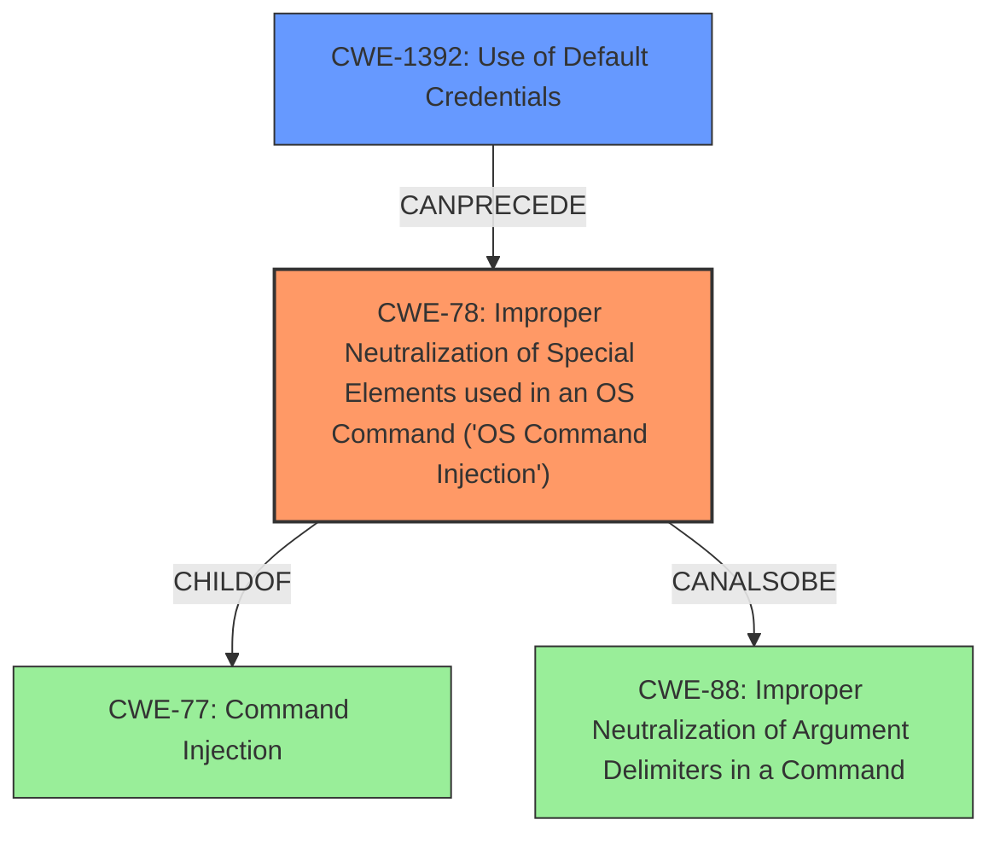

# Final Resolution for CVE-2021-34795

# Summary
| CWE ID | CWE Name | Confidence | CWE Abstraction Level | CWE Vulnerability Mapping Label | CWE-Vulnerability Mapping Notes |
|---|---|---|---|---|---|
| CWE-78 | Improper Neutralization of Special Elements used in an OS Command ('OS Command Injection') | 0.90 | Base | Allowed | Primary CWE: The vulnerability description explicitly mentions **command injection**. Consider the role of CWE-88 if argument delimiters are being manipulated. |
| CWE-1392 | Use of Default Credentials | 0.80 | Base | Allowed | Secondary CWE: The vulnerability involves logging in with a **default credential**, indicating an insecure default configuration. Note: It is recommended to use the suggested mitigations by forcing users to change their credentials on installation. |

## Evidence and Confidence

*   **Confidence Score:** 0.90
*   **Evidence Strength:** HIGH

## Relationship Analysis
The analysis focused on refining the initial CWE selections by considering the relationships between them and alternative classifications.

*   **Parent-child hierarchical relationships:** The initial analysis correctly identified CWE-78 as a child of CWE-77 (**Command Injection**). This hierarchical understanding ensured that the most specific and appropriate CWE was selected.
*   **Chain relationships showing progression of vulnerability:** The criticism suggested a chain relationship: a successful login via **default credentials** (CWE-1392) *precedes* the **command injection** (CWE-78). This illustrates a vulnerability chain where one weakness enables the other.
*   **Peer relationships that offered alternative classifications:** The criticism suggested considering CWE-88 (Improper Neutralization of Argument Delimiters in a Command) if the **command injection** involved manipulating command arguments. This highlights the importance of considering peer relationships to capture nuanced aspects of the vulnerability.
*   **How abstraction levels influenced your selection:** Both CWE-78 and CWE-1392 are at the Base level of abstraction, which is preferred for vulnerability mapping. Using Base-level CWEs ensures a more precise and actionable classification compared to higher-level Class or Pillar CWEs.

## Vulnerability Chain
The vulnerability chain starts with the use of **default credentials** (CWE-1392), which allows an attacker to gain unauthorized access. Subsequently, the attacker exploits the **command injection** vulnerability (CWE-78) to execute arbitrary commands on the system.

*   **Root Cause:** CWE-1392 - Use of Default Credentials
*   **Weakness:** CWE-78 - Improper Neutralization of Special Elements used in an OS Command ('OS Command Injection')
*   **Impact:** Arbitrary command execution, potential system compromise

## Summary of Analysis
The analysis builds upon the initial assessment and refines it based on the provided criticism and CWE relationship data.

*   Highlight how much your assessment is based on the provided evidence only, and show or quote that evidence.
The assessment is heavily based on the vulnerability description, which explicitly mentions "Log in with a **default credential**" and "perform **command injection**." This direct evidence strongly supports the selection of CWE-78 and CWE-1392.

*   Explain how the graph relationships influenced your final selection
The graph relationships highlighted the chain of events, where a successful login using **default credentials** can *precede* a **command injection** attack. This chain helped prioritize CWE-1392 as a secondary contributing factor to the overall vulnerability.

*   Provide clear justification for your decision
The decision to classify the vulnerability as CWE-78 and CWE-1392 is justified by the explicit mention of **command injection** and **default credentials** in the vulnerability description. The analysis also considered alternative CWEs and their relationships to ensure the most accurate classification.

*   Explain why your selected CWEs are at the optimal level of specificity
CWE-78 and CWE-1392 are at the Base level of abstraction, providing a balance between specificity and generalizability. They accurately represent the **root causes** of the vulnerability without being overly broad or abstract. Specifically, CWE-1392 is more descriptive of the authentication bypass than the initially proposed CWE-1188.