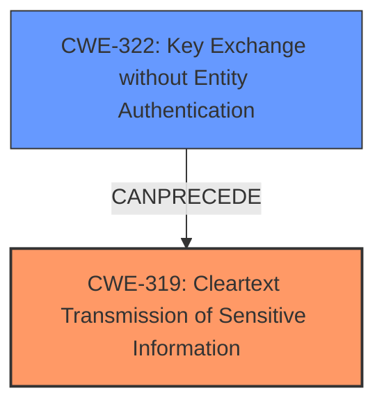

# Final Resolution for CVE-2021-34825

# Summary
| CWE ID | CWE Name | Confidence | CWE Abstraction Level | CWE Vulnerability Mapping Label | CWE-Vulnerability Mapping Notes |
|---|---|---|---|---|---|
| CWE-319 | Cleartext Transmission of Sensitive Information | 0.8 | Base | Primary | Allowed |
| CWE-322 | Key Exchange without Entity Authentication | 0.7 | Base | Secondary | Allowed |

## Evidence and Confidence

*   **Confidence Score:** 0.8
*   **Evidence Strength:** HIGH

## Relationship Analysis
The primary weakness, CWE-319 [Cleartext Transmission of Sensitive Information], directly reflects the **impact** of the vulnerability. The secondary weakness, CWE-322 [Key Exchange without Entity Authentication], describes the **rootcause** of the vulnerability. There is a potential chain relationship where the missing authentication (CWE-322) leads to cleartext transmission (CWE-319).

## Vulnerability Chain
The vulnerability chain starts with the application's failure to properly authenticate the server during the key exchange (CWE-322). This leads to the fallback to plaintext communication, resulting in the transmission of sensitive information in cleartext (CWE-319).

## Summary of Analysis
The initial analysis correctly identified CWE-319 as the primary weakness. However, the criticism made a valid point about the secondary weakness.

Here's how the assessment is based on the provided evidence:

*   The "CVE Reference Links Content Summary" explicitly states: "The core's behavior of falling back to plaintext when SSL/TLS is required creates a **vulnerability**. It fails to enforce the desired encrypted connection, potentially exposing user data to eavesdropping." This supports the selection of **CWE-319 [Cleartext Transmission of Sensitive Information]** as the primary issue.
*   The "CVE Reference Links Content Summary" also states that the "Root Cause of Vulnerability" is that the application "...when launched with the `--require-ssl` flag but unable to load an SSL/TLS certificate... would fall back to plaintext mode instead of terminating." The fallback to plaintext when a valid certificate is not present is a case of **CWE-322 [Key Exchange without Entity Authentication]**.

The graph relationships influenced the final selection by highlighting the chain of events: the **rootcause** is the missing authentication, and the **impact** is the cleartext transmission.

The selected CWEs are at the optimal level of specificity because they directly address the **rootcause** and the **impact** of the vulnerability, as described in the vulnerability description and supporting documentation. **CWE-319 [Cleartext Transmission of Sensitive Information]** is the direct result of the application not properly failing when it is unable to establish an SSL/TLS connection. **CWE-322 [Key Exchange without Entity Authentication]** describes this failure to properly establish the secure channel.