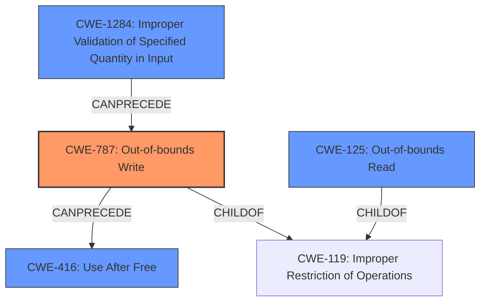

# Final Resolution for CVE-2021-34874

# Summary
| CWE ID | CWE Name | Confidence | CWE Abstraction Level | CWE Vulnerability Mapping Label | CWE-Vulnerability Mapping Notes |
|---|---|---|---|---|---|
| CWE-787 | Out-of-bounds Write | 0.95 | Base | Primary | Allowed |
| CWE-1284 | Improper Validation of Specified Quantity in Input | 0.85 | Base | Secondary Candidate | Allowed |
| CWE-125 | Out-of-bounds Read | 0.75 | Base | Secondary Candidate | Allowed |
| CWE-416 | Use After Free | 0.65 | Variant | Secondary Candidate | Allowed |

## Evidence and Confidence

*   **Confidence Score:** 0.90
*   **Evidence Strength:** HIGH

## Relationship Analysis
The analysis considered parent-child relationships, particularly how CWE-787 and CWE-125 are children of CWE-119 (which was deemed too general). It also considered "can follow" relationships, noting that CWE-787 can precede issues like CWE-825 (Expired Pointer Dereference) and CWE-824 (Access of Uninitialized Variable). The addition of CWE-1284 strengthens the chain by highlighting the initial lack of size validation that leads to the out-of-bounds write. Abstraction levels were also considered, favoring Base-level CWEs for root cause analysis.

## Vulnerability Chain
The vulnerability chain starts with **CWE-1284: Improper Validation of Specified Quantity in Input**. Due to the lack of validation of user-supplied data, this can lead to **CWE-787: Out-of-bounds Write** when processing 3DS files, writing data beyond the intended buffer. The out-of-bounds write can then lead to **CWE-125: Out-of-bounds Read** and **CWE-416: Use After Free**. The ultimate impact is arbitrary code execution.

## Summary of Analysis
The initial analysis was well-reasoned, and the criticism provided a valuable suggestion to include **CWE-1284: Improper Validation of Specified Quantity in Input**. The vulnerability description explicitly states "lack of proper validation of user-supplied data, which can result in a memory corruption condition." This statement, combined with the CVE reference links, supports the selection of **CWE-787 (Out-of-bounds Write)** as the primary **WEAKNESS**. The reference links mentioning "out-of-bounds read/write" support the inclusion of **CWE-125 (Out-of-bounds Read)**. The mention of "use-after-free" conditions supports the inclusion of **CWE-416 (Use After Free)**.

The relationship analysis confirms that **CWE-787** and **CWE-125** are more specific than their parent **CWE-119**. Including **CWE-1284** provides more specificity about the root cause **WEAKNESS**, namely the missing validation of the size/quantity in the input, which then resulted in the **CWE-787**.

The selected CWEs are at the optimal level of specificity, as they directly address the root cause (**CWE-1284**) and the resulting memory corruption (**CWE-787**, **CWE-125**, **CWE-416**).