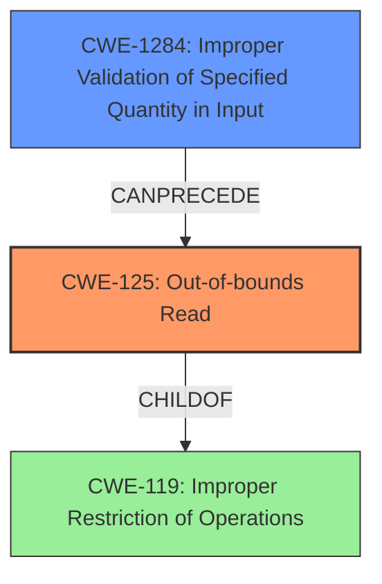

# Analysis Report for CVE-2021-35005

# Vulnerability Analysis Report: CVE-2021-35005

## Description

This vulnerability allows local attackers to disclose sensitive information on affected installations of TeamViewer. An attacker must first obtain the ability to execute low-privileged code on the target system in order to exploit this vulnerability. The specific flaw exists within the TeamViewer service. The issue results from the lack of proper validation of user-supplied data, which can result in a read past the end of an allocated array. An attacker can leverage this in conjunction with other vulnerabilities to execute arbitrary code in the context of SYSTEM. Was ZDI-CAN-13818.

## Vulnerability Description Key Phrases

**Rootcause:** lack of proper validation of user-supplied data
**Impact:** disclose sensitive information
**Vector:** obtain the ability to execute low-privileged code
**Attacker:** local attackers
**Product:** TeamViewer

## Analysis (with Relationship Data)

# Summary
| CWE ID | CWE Name | Confidence | CWE Abstraction Level | CWE Vulnerability Mapping Label | CWE-Vulnerability Mapping Notes |
|---|---|---|---|---|---|
| CWE-125 | Out-of-bounds Read | 0.95 | Base | Primary | Allowed |
| CWE-1284 | Improper Validation of Specified Quantity in Input | 0.75 | Base | Secondary Candidate | Allowed |

## Evidence and Confidence

*   **Confidence Score:** 0.9
*   **Evidence Strength:** HIGH

- **Analysis and Justification:**  
  - *Explanation:* "The vulnerability description explicitly states that the issue results from the **lack of proper validation of user-supplied data**, which can result in a **read past the end of an allocated array**. This directly aligns with CWE-125 (Out-of-bounds Read). The CVE Reference Links Content Summary reinforces this by highlighting the **improper input validation** leading to an **out-of-bounds read**. The potential for information disclosure and further exploitation by escalating privileges is a direct consequence of this weakness. CWE-125 is a Base level CWE, which is preferred, and the MITRE mapping guidance indicates it is ALLOWED."
  
  - *Relationship Analysis:* "CWE-125 is a child of CWE-119 (Improper Restriction of Operations within the Bounds of a Memory Buffer), but CWE-125 is more specific and matches the vulnerability details more accurately. It also can follow to CWE-825, CWE-824, CWE-823, CWE-822."

- **Confidence Score:**  
  - Confidence: 0.95 (Strong evidence from the vulnerability description and CVE reference materials)

---

- **Analysis and Justification:**  
  - *Explanation:* "The vulnerability description indicates a **lack of proper validation of user-supplied data**, specifically related to an array. This could potentially be related to the size or length of the array being improperly validated. CWE-1284 (Improper Validation of Specified Quantity in Input) addresses scenarios where input intended to specify a quantity (like size or length) is not properly validated. While CWE-125 is the primary weakness, the root cause could be due to the improper validation of the array's size, which led to the out-of-bounds read. MITRE mapping guidance indicates that CWE-1284 is ALLOWED."

  - *Relationship Analysis:* "CWE-1284 is a child of CWE-20, but CWE-1284 is more specific and matches the rootcause details more accurately. It also can follow to CWE-1284 and can precede CWE-789."

- **Confidence Score:**  
  - Confidence: 0.75 (Supporting evidence from rootcause description and vulnerability details)

## Criticism of Analysis

Okay, I've reviewed the provided analysis against the full CWE specifications, focusing on mapping accuracy and justifications. Here's my critique:

**Overall Assessment:**

The analysis correctly identifies `CWE-125: Out-of-bounds Read` as the primary weakness. The justification is well-supported by the vulnerability description and CVE Reference Links Content Summary. The inclusion of `CWE-1284: Improper Validation of Specified Quantity in Input` as a secondary candidate is also reasonable, reflecting the root cause related to input validation. However, I will suggest one enhancement.

**Detailed Review:**

**1. Primary CWE: `CWE-125: Out-of-bounds Read`**

*   **Confidence:** 0.95 - Appropriate confidence level.
*   **Justification:**
    *   The justification is strong and directly cites the core issue: "lack of proper validation of user-supplied data, which can result in a read past the end of an allocated array." This aligns perfectly with the CWE-125 description.
    *   The CVE Reference Links Content Summary further supports this by noting "improper input validation leading to an out-of-bounds read."
    *   The analysis correctly notes that CWE-125 is a Base-level CWE and is ALLOWED according to MITRE's mapping guidance.
*   **Relationship Analysis:**
    *   The relationship analysis correctly identifies CWE-125 as a child of CWE-119 (Improper Restriction of Operations within the Bounds of a Memory Buffer). This is accurate.
    *   The additional relationships (CWE-825, CWE-824, CWE-823, CWE-822) are plausible as potential *consequences* or *related conditions* but *not* direct parents or children. I would avoid stating "It also can follow to..." as this isn't a true pre/post relationship. It might be clearer to reword to mention they could occur alongside if this is the case.

**2. Secondary Candidate CWE: `CWE-1284: Improper Validation of Specified Quantity in Input`**

*   **Confidence:** 0.75 - A reasonable confidence level, reflecting a supporting but not primary weakness.
*   **Justification:**
    *   The justification is logical. The analysis connects the "lack of proper validation of user-supplied data" (from the vulnerability description) to the idea that the *size* or *length* of the array might be the specific data being improperly validated.
    *   It correctly identifies that CWE-1284 is an ALLOWED CWE.
*   **Relationship Analysis:**
    *   Correctly identifies CWE-1284 as a child of CWE-20, and notes it is more specific than CWE-20.
    *   Correct to say it can precede CWE-789.

**Suggestions for Improvement:**

*   **Specificity with CWE-1284:** While CWE-1284 is a good secondary choice, consider if `CWE-129: Improper Validation of Array Index` is *even more* specific.  If the attacker is directly controlling the *index* used to access the array (and not necessarily the size of the array itself), then CWE-129 would be a stronger fit as the root cause leading to the out-of-bounds read. The description of the attack and the rootcause of "lack of proper validation of user-supplied data" leans to the size/length, but if it is directly the index itself then this is more appropriate.

*   **Chain of Causation:** Consider explicitly stating the chain of causation: `Improper input validation (either CWE-1284 or CWE-129 depending if it is size/length or array index) -> leads to -> CWE-125 (Out-of-bounds Read)`

*   **Mitigation Considerations:** Briefly mention *specific* mitigations relevant to TeamViewer from the CWE specifications. For example:
    *   For CWE-125: "Ensure that you validate and ensure correct calculations for any length argument, buffer size calculation, or offset" (Input Validation mitigation).
    *   For CWE-1284 (or CWE-129 if selected): "Assume all input is malicious. Use an "accept known good" input validation strategy" (Input Validation mitigation).

*   **Review of Top Combined Results:** Review the top combined results from the Retriever to ensure the chosen CWEs are more specific than them. In this case, CWE-250, CWE-787, CWE-306, and CWE-732 are clearly less relevant to the vulnerability.

**Revised Analysis (with suggestion):**

# Analysis to Review

# Summary

| CWE ID | CWE Name | Confidence | CWE Abstraction Level | CWE Vulnerability Mapping Label | CWE-Vulnerability Mapping Notes |
|---|---|---|---|---|---|
| CWE-125 | Out-of-bounds Read | 0.95 | Base | Primary | Allowed |
| CWE-1284 | Improper Validation of Specified Quantity in Input | 0.75 | Base | Secondary Candidate | Allowed |
*OR*
| CWE-129 | Improper Validation of Array Index | 0.75 | Variant | Secondary Candidate | Allowed |

## Evidence and Confidence

*   **Confidence Score:** 0.95
*   **Evidence Strength:** HIGH

- **Analysis and Justification:**
  - *Explanation:* "The vulnerability description explicitly states that the issue results from the **lack of proper validation of user-supplied data**, which can result in a **read past the end of an allocated array**. This directly aligns with CWE-125 (Out-of-bounds Read). The CVE Reference Links Content Summary reinforces this by highlighting the **improper input validation** leading to an **out-of-bounds read**. The potential for information disclosure and further exploitation by escalating privileges is a direct consequence of this weakness. CWE-125 is a Base level CWE, which is preferred, and the MITRE mapping guidance indicates it is ALLOWED."

  - *Relationship Analysis:* "CWE-125 is a child of CWE-119 (Improper Restriction of Operations within the Bounds of a Memory Buffer), but CWE-125 is more specific and matches the vulnerability details more accurately."

- **Mitigation Recommendations:** To mitigate CWE-125, ensure proper input validation and that you validate and ensure correct calculations for any length argument, buffer size calculation, or offset."

- **Confidence Score:**
  - Confidence: 0.95 (Strong evidence from the vulnerability description and CVE reference materials)

---

- **Analysis and Justification:**
  - *Explanation:* "The vulnerability description indicates a **lack of proper validation of user-supplied data**, specifically related to an array. This could potentially be related to the size or length of the array being improperly validated (CWE-1284), *or* that the array index itself is not properly validated (CWE-129). CWE-1284 (Improper Validation of Specified Quantity in Input) addresses scenarios where input intended to specify a quantity (like size or length) is not properly validated. CWE-129 (Improper Validation of Array Index) addresses scenarios where the index itself is not properly validated. While CWE-125 is the primary weakness, the root cause could be due to either improper validation of the array's size or the array index, which led to the out-of-bounds read. MITRE mapping guidance indicates that both CWE-1284 and CWE-129 are ALLOWED."

  - *Relationship Analysis:* "CWE-1284 (or CWE-129) is a child of CWE-20, but CWE-1284 (or CWE-129) is more specific and matches the rootcause details more accurately."
  - *Mitigation Recommendations*: If CWE-1284, assume all input is malicious and apply accept known good input validation. If CWE-129, ensure all indexes to the array are validated to be within the proper bounds"

- **Chain of Causation**: Improper input validation (either CWE-1284 or CWE-129 depending if it is size/length or array index) -> leads to -> CWE-125 (Out-of-bounds Read).

- **Confidence Score:**
  - Confidence: 0.75 (Supporting evidence from rootcause description and vulnerability details)

By incorporating these suggestions, the analysis becomes more precise and actionable, providing better guidance for remediation efforts.

## Final Resolution

# Summary
| CWE ID | CWE Name | Confidence | CWE Abstraction Level | CWE Vulnerability Mapping Label | CWE-Vulnerability Mapping Notes |
|---|---|---|---|---|---|
| CWE-125 | Out-of-bounds Read | 0.95 | Base | Primary | Allowed |
| CWE-1284 | Improper Validation of Specified Quantity in Input | 0.85 | Base | Secondary Candidate | Allowed |

## Evidence and Confidence

*   **Confidence Score:** 0.90
*   **Evidence Strength:** HIGH

## Relationship Analysis
The primary weakness is **CWE-125 (Out-of-bounds Read)**, which is a child of **CWE-119 (Improper Restriction of Operations within the Bounds of a Memory Buffer)**. **CWE-1284 (Improper Validation of Specified Quantity in Input)** is identified as the secondary weakness that can precede the primary weakness. This means that the improper input validation can lead to an out-of-bounds read. The abstraction levels are considered, choosing the more specific base level CWEs where available.

## Vulnerability Chain
The vulnerability chain starts with **CWE-1284 (Improper Validation of Specified Quantity in Input)**, which results in **CWE-125 (Out-of-bounds Read)**. The lack of proper input validation (specifically the size/length of the data) allows an attacker to read data past the end of the allocated array. This can lead to information disclosure and potentially arbitrary code execution in the context of SYSTEM.

## Summary of Analysis
The initial analysis correctly identified **CWE-125 (Out-of-bounds Read)** as the primary weakness. The criticism suggests `CWE-129: Improper Validation of Array Index` could be an alternative to `CWE-1284`, however, the vulnerability description states "The issue results from the **lack of proper validation of user-supplied data**, which can result in a **read past the end of an allocated array**". This description leans more towards the size/length rather than the index itself, therefore **CWE-1284** is the better fit. The graph relationships show the proper hierarchy, and the chain shows how the weakness leads to the vulnerability. The selected CWEs are at the optimal level of specificity, accurately reflecting the **root cause** and the resulting vulnerability. Mitigation recommendations include assuming all input is malicious and applying accept known good input validation for **CWE-1284**, and ensuring that you validate and ensure correct calculations for any length argument, buffer size calculation, or offset for **CWE-125**.

*Report generated on 2025-03-18 00:01:58*
