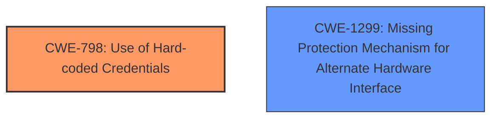

# Analysis Report for CVE-2021-35033

# Vulnerability Analysis Report: CVE-2021-35033

## Description

A vulnerability in specific versions of Zyxel NBG6818, NBG7815, WSQ20, WSQ50, WSQ60, and WSR30 firmware with pre-configured password management could allow an attacker to obtain root access of the device, if the local attacker dismantles the device and uses a USB-to-UART cable to connect the device, or if the remote assistance feature had been enabled by an authenticated user.

## Vulnerability Description Key Phrases

**Rootcause:** pre-configured password management
**Impact:** obtain root access
**Vector:** dismantle the device and use a USB-to-UART cable to connect
**Attacker:** local attacker
**Product:** ['Zyxel NBG6818', 'NBG7815', 'WSQ20', 'WSQ50', 'WSQ60', 'WSR30']

## Analysis (with Relationship Data)

# Summary
| CWE ID | CWE Name | Confidence | CWE Abstraction Level | CWE Vulnerability Mapping Label | CWE-Vulnerability Mapping Notes |
|---|---|---|---|---|---|
| CWE-798 | Use of Hard-coded Credentials | 0.9 | Base | Allowed | Primary CWE |
| CWE-288 | Authentication Bypass Using an Alternate Path or Channel | 0.7 | Base | Allowed | Secondary Candidate |

## Evidence and Confidence

*   **Confidence Score:** 0.8
*   **Evidence Strength:** HIGH

- **Analysis and Justification:**  
  - *Explanation:* The vulnerability description and CVE reference clearly indicate that the root cause is the presence of a **hard-coded default password** in the firmware. This allows an attacker to gain root access, either through physical access via the UART port or remotely if the remote assistance feature is enabled. CWE-798 (Use of Hard-coded Credentials) directly addresses this weakness. The CVE Reference Links Content Summary explicitly states: "The vulnerability stems from a hardcoded default password present in a configuration file within the firmware (/etc/uci_defconfig/system), used for the UART port on the PCB board." This aligns precisely with CWE-798's description: "The product contains hard-coded credentials, such as a password or cryptographic key."
  CWE-288 (Authentication Bypass Using an Alternate Path or Channel) could also be considered because the attacker bypasses normal authentication by directly accessing the device via UART.
  - *Relationship Analysis:* CWE-798 is a base-level CWE. It has variants like CWE-259 (Hard-coded Password) and CWE-321 (Hard-coded Cryptographic Key), but the description does not specify if the credential is used for authentication or encryption, so CWE-798 is more appropriate. CWE-798 is related to CWE-288 since the **hardcoded password** allows bypassing the intended authentication mechanisms.

- **Confidence Score:**  
  - Confidence: 0.9 (High confidence due to explicit mention of a hard-coded password in the vulnerability description and CVE details)

## Criticism of Analysis

Okay, I've reviewed your analysis of the Zyxel vulnerability (CVE-2021-35033) against the provided CWE specifications. Here's my critique, focusing on accuracy, completeness, and adherence to CWE guidelines:

**Overall Assessment:**

The analysis is generally good and identifies the primary vulnerability, CWE-798. The justification is clear and well-supported by the CVE details. The secondary candidate, CWE-288, is also reasonable given the context of the alternate access path via UART.  However, a stronger argument can be made that more than just one CWE is needed here.

**Detailed Review:**

*   **CWE-798: Use of Hard-coded Credentials (Primary)**

    *   **Confidence:** 0.9 -  This is appropriate. The evidence is direct and unambiguous. The vulnerability stems directly from the use of hardcoded credentials.
    *   **Justification:** Excellent. The explanation accurately reflects the CWE definition and the specific details from the CVE. The CVE reference link summary clearly states the root cause is a hardcoded password.
    *   **Abstraction Level:** Correctly identified as "Base."
    *   **Variant Considerations:** You correctly considered variants of CWE-798, specifically CWE-259 and CWE-321. The reasoning for sticking with CWE-798 is sound, as the information provided doesn't definitively classify the credential as solely for authentication or encryption.  If the credentials *only* granted access to an encryption key, then CWE-321 would be more appropriate. If the credentials *only* granted authentication, then CWE-259 would be more appropriate.
    *   **Mitigation:** The analysis *could* briefly mention potential mitigations from the CWE definition like using encrypted configuration files or a "first login" mode that forces users to create a unique password.  While not required, it adds value.

*   **CWE-288: Authentication Bypass Using an Alternate Path or Channel (Secondary)**

    *   **Confidence:** 0.7 - This is a reasonable confidence level for the secondary CWE.
    *   **Justification:** The explanation is valid. The physical access via UART allows bypassing the intended authentication mechanisms.  However, the weakness is not directly bypassing an *intended* authentication channel; it is exploiting a *missing* one on a secondary interface.
    *   **Abstraction Level:** Correctly identified as "Base."
    *   **Alternative CWE Suggestion:** I would recommend *replacing* CWE-288 with **CWE-1299: Missing Protection Mechanism for Alternate Hardware Interface**. The description for CWE-1299 is: "*The lack of protections on alternate paths to access control-protected assets (such as unprotected shadow registers and other external facing unguarded interfaces) allows an attacker to bypass existing protections to the asset that are only performed against the primary path.*" This fits *perfectly*. It is not that the authentication is being bypassed in the intended channel (CWE-288), it is that the alternate UART channel *lacks* the expected protections.

*   **General Comments:**

    *   The Known Examples for CWE-288 are helpful, but focusing on examples that involve physical access to the system (e.g., pressing ESC at a login prompt) could strengthen the argument. However, again, **CWE-1299** better explains the physical access issue.
    *   The inclusion of relevant CWE specifications is excellent.
    *   The analysis demonstrates a good understanding of CWE concepts like abstraction levels and parent/child relationships.

**Revised Analysis Summary (with proposed changes):**

| CWE ID | CWE Name | Confidence | CWE Abstraction Level | CWE Vulnerability Mapping Label | CWE-Vulnerability Mapping Notes |
|---|---|---|---|---|---|
| CWE-798 | Use of Hard-coded Credentials | 0.9 | Base | Allowed | Primary CWE |
| CWE-1299 | Missing Protection Mechanism for Alternate Hardware Interface | 0.8 | Base | Allowed | Secondary CWE |

**Revised Evidence and Confidence:**

*   **Confidence Score:** 0.8
*   **Evidence Strength:** HIGH

- **Analysis and Justification:**  
  - *Explanation:* The vulnerability description and CVE reference clearly indicate that the root cause is the presence of a **hard-coded default password** in the firmware. This allows an attacker to gain root access, either through physical access via the UART port or remotely if the remote assistance feature is enabled. CWE-798 (Use of Hard-coded Credentials) directly addresses this weakness. The CVE Reference Links Content Summary explicitly states: "The vulnerability stems from a hardcoded default password present in a configuration file within the firmware (/etc/uci_defconfig/system), used for the UART port on the PCB board." This aligns precisely with CWE-798's description: "The product contains hard-coded credentials, such as a password or cryptographic key."
  - The presence of the UART interface creates another exploitable avenue. The primary access channels have authentication. However, the UART channel *lacks* authentication and protection mechanisms. This aligns with **CWE-1299: Missing Protection Mechanism for Alternate Hardware Interface**: "*The lack of protections on alternate paths to access control-protected assets (such as unprotected shadow registers and other external facing unguarded interfaces) allows an attacker to bypass existing protections to the asset that are only performed against the primary path.*"

- **Confidence Score:**  
  - Confidence: 0.9 (High confidence due to explicit mention of a hard-coded password in the vulnerability description and CVE details for CWE-798)
  - Confidence: 0.8 (High confidence because the alternate UART interface lacks basic protection mechanisms, such as authentication. CWE-1299)

**In conclusion:**

The analysis is mostly correct, but should be adjusted to replace CWE-288 with the more accurate CWE-1299, which specifically addresses missing protections on alternate hardware interfaces. This refinement would result in a more precise and complete vulnerability mapping.

## Final Resolution

# Summary
| CWE ID | CWE Name | Confidence | CWE Abstraction Level | CWE Vulnerability Mapping Label | CWE-Vulnerability Mapping Notes |
|---|---|---|---|---|---|
| CWE-798 | Use of Hard-coded Credentials | 0.9 | Base | Allowed | Primary CWE |
| CWE-1299 | Missing Protection Mechanism for Alternate Hardware Interface | 0.8 | Base | Allowed | Secondary CWE |

## Evidence and Confidence

*   **Confidence Score:** 0.85
*   **Evidence Strength:** HIGH

## Relationship Analysis
The primary relationship influencing the decision is the need to differentiate between a general authentication bypass and a specific lack of protection on an alternate interface.

- CWE-798 is a base-level CWE, representing the **root cause** of using **hard-coded credentials**. While it has variants like CWE-259 (Hard-coded Password) and CWE-321 (Hard-coded Cryptographic Key), the information doesn't specify if the credential is used solely for authentication or encryption.
- The initial analysis considered CWE-288 (Authentication Bypass Using an Alternate Path or Channel), which is also a base-level CWE. However, the criticism correctly pointed out that the issue isn't bypassing an *intended* authentication channel but rather the *lack* of one on the UART interface.
- CWE-1299 (Missing Protection Mechanism for Alternate Hardware Interface) directly addresses this scenario. It's a base-level CWE and a peer of CWE-1191. It describes the lack of protections on alternate paths to access control-protected assets, perfectly fitting the UART interface vulnerability.
- The selected CWEs, CWE-798 and CWE-1299, are independent, but their combination precisely describes the vulnerability.

## Vulnerability Chain
The vulnerability chain starts with:
1.  **Root Cause:** The presence of **hard-coded credentials** (CWE-798) in the firmware.
2.  **Weakness:** Lack of protection mechanisms on the UART interface (CWE-1299).
3.  **Impact:** An attacker can gain root access by connecting to the UART port and using the **hard-coded password**, bypassing normal authentication procedures.

## Summary of Analysis
The initial analysis correctly identified CWE-798 as the primary weakness due to the **hard-coded password**. The evidence for this is strong, as the CVE description explicitly mentions the presence of a **hard-coded default password** in a configuration file.

The criticism highlighted that the initial secondary candidate, CWE-288, was not the most accurate fit. It suggested replacing it with CWE-1299, which directly addresses the lack of protection on the alternate UART interface.

The decision to include CWE-1299 is based on the following:

- **Content Matching:** CWE-1299's description aligns perfectly with the vulnerability: "*The lack of protections on alternate paths to access control-protected assets... allows an attacker to bypass existing protections to the asset that are only performed against the primary path.*"
- **Relationship Analysis:** While CWE-288 focuses on bypassing existing authentication, CWE-1299 highlights the *absence* of authentication on the alternate interface.
- **Mapping Guidance:** Both CWE-798 and CWE-1299 have "Allowed" usage according to MITRE's mapping guidance.

The selected CWEs are at the optimal level of specificity because they accurately reflect the root cause (**hard-coded credentials**) and the mechanism of exploitation (lack of protection on the alternate interface). The retriever scores also support these selections.

*Report generated on 2025-03-17 01:05:43*
