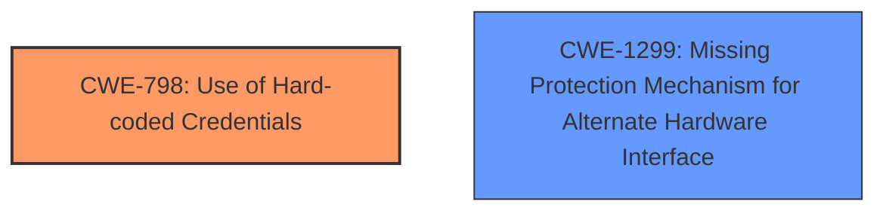

# Final Resolution for CVE-2021-35033

# Summary
| CWE ID | CWE Name | Confidence | CWE Abstraction Level | CWE Vulnerability Mapping Label | CWE-Vulnerability Mapping Notes |
|---|---|---|---|---|---|
| CWE-798 | Use of Hard-coded Credentials | 0.9 | Base | Allowed | Primary CWE |
| CWE-1299 | Missing Protection Mechanism for Alternate Hardware Interface | 0.8 | Base | Allowed | Secondary CWE |

## Evidence and Confidence

*   **Confidence Score:** 0.85
*   **Evidence Strength:** HIGH

## Relationship Analysis
The primary relationship influencing the decision is the need to differentiate between a general authentication bypass and a specific lack of protection on an alternate interface.

- CWE-798 is a base-level CWE, representing the **root cause** of using **hard-coded credentials**. While it has variants like CWE-259 (Hard-coded Password) and CWE-321 (Hard-coded Cryptographic Key), the information doesn't specify if the credential is used solely for authentication or encryption.
- The initial analysis considered CWE-288 (Authentication Bypass Using an Alternate Path or Channel), which is also a base-level CWE. However, the criticism correctly pointed out that the issue isn't bypassing an *intended* authentication channel but rather the *lack* of one on the UART interface.
- CWE-1299 (Missing Protection Mechanism for Alternate Hardware Interface) directly addresses this scenario. It's a base-level CWE and a peer of CWE-1191. It describes the lack of protections on alternate paths to access control-protected assets, perfectly fitting the UART interface vulnerability.
- The selected CWEs, CWE-798 and CWE-1299, are independent, but their combination precisely describes the vulnerability.

## Vulnerability Chain
The vulnerability chain starts with:
1.  **Root Cause:** The presence of **hard-coded credentials** (CWE-798) in the firmware.
2.  **Weakness:** Lack of protection mechanisms on the UART interface (CWE-1299).
3.  **Impact:** An attacker can gain root access by connecting to the UART port and using the **hard-coded password**, bypassing normal authentication procedures.

## Summary of Analysis
The initial analysis correctly identified CWE-798 as the primary weakness due to the **hard-coded password**. The evidence for this is strong, as the CVE description explicitly mentions the presence of a **hard-coded default password** in a configuration file.

The criticism highlighted that the initial secondary candidate, CWE-288, was not the most accurate fit. It suggested replacing it with CWE-1299, which directly addresses the lack of protection on the alternate UART interface.

The decision to include CWE-1299 is based on the following:

- **Content Matching:** CWE-1299's description aligns perfectly with the vulnerability: "*The lack of protections on alternate paths to access control-protected assets... allows an attacker to bypass existing protections to the asset that are only performed against the primary path.*"
- **Relationship Analysis:** While CWE-288 focuses on bypassing existing authentication, CWE-1299 highlights the *absence* of authentication on the alternate interface.
- **Mapping Guidance:** Both CWE-798 and CWE-1299 have "Allowed" usage according to MITRE's mapping guidance.

The selected CWEs are at the optimal level of specificity because they accurately reflect the root cause (**hard-coded credentials**) and the mechanism of exploitation (lack of protection on the alternate interface). The retriever scores also support these selections.