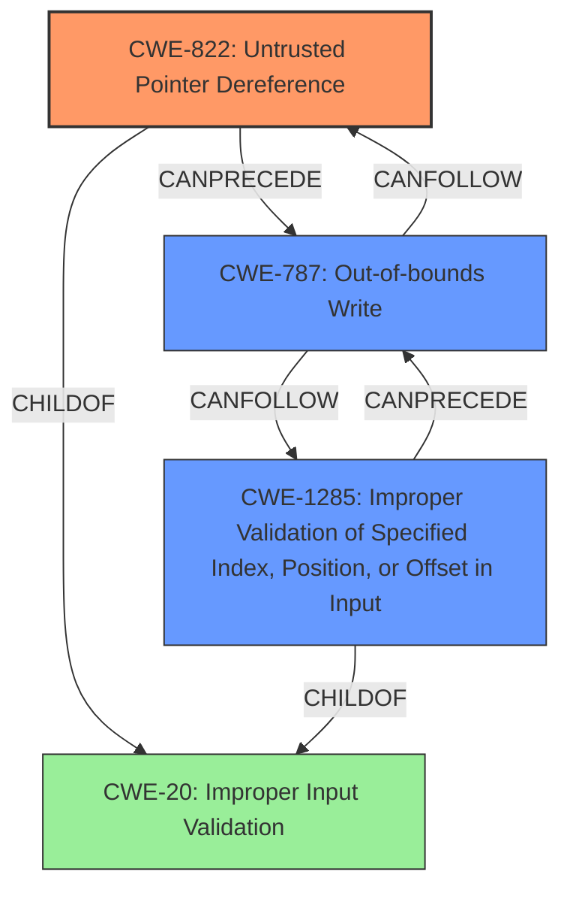

# Final Resolution for CVE-2021-35098

# Summary

| CWE ID | CWE Name | Confidence | CWE Abstraction Level | CWE Vulnerability Mapping Label | CWE-Vulnerability Mapping Notes |
|---|---|---|---|---|---|
| CWE-822 | Untrusted Pointer Dereference | 0.80 | Base | Allowed | Primary CWE |
| CWE-1285 | Improper Validation of Specified Index, Position, or Offset in Input | 0.70 | Base | Allowed | Secondary Candidate |
| CWE-787 | Out-of-bounds Write | 0.50 | Base | Allowed | Consequence of primary weakness |

## Evidence and Confidence

*   **Confidence Score:** 0.75
*   **Evidence Strength:** MEDIUM

## Relationship Analysis
The primary relationship impacting the decision is the potential vulnerability chain. **CWE-822 (Untrusted Pointer Dereference)** or **CWE-1285 (Improper Validation of Specified Index, Position, or Offset in Input)** can lead to **CWE-787 (Out-of-bounds Write)** if the untrusted pointer or index is used to write data outside the intended memory region. The abstraction levels also influenced the selection, focusing on Base level CWEs for root causes.

## Vulnerability Chain
The vulnerability chain starts with the **improper validation of the session ID** within the PCM routing process. This leads to:
1.  An untrusted value being used as a pointer (**CWE-822**) or as an index/offset (**CWE-1285**).
2.  The pointer or index is then used to access memory.
3.  If the pointer or index is invalid, it can lead to writing data outside the intended memory region, causing memory corruption (**CWE-787**).

The missing link in the chain is the specific mechanism by which the session ID is used to access memory, which is not fully detailed in the vulnerability description.

## Summary of Analysis
The analysis focuses on the provided evidence, primarily the vulnerability description. The description states "**Improper validation of session id in PCM routing process can lead to memory corruption**." This strongly suggests a problem with how the session ID is handled, and the memory corruption is the impact.

**CWE-822 (Untrusted Pointer Dereference)** is selected as the primary **ROOTCAUSE** because the session ID, coming from an untrusted source, might be directly used as a pointer without proper validation before dereferencing it. The retriever results also support this selection.

**CWE-1285 (Improper Validation of Specified Index, Position, or Offset in Input)** is a relevant secondary candidate because the session ID could also be interpreted as an index or offset. The "**Improper validation**" aligns perfectly with the description of **CWE-1285**, indicating that the session ID is not properly validated before being used as an index/offset.

**CWE-787 (Out-of-bounds Write)** is included as a consequence, as the **improperly validated pointer or index** could lead to writing data outside the intended memory region, causing the described memory corruption.

**CWE-20 (Improper Input Validation)** was considered but discarded because it is too general.

The selected CWEs are at the optimal level of specificity, with Base level CWEs representing the root causes and a Base level CWE representing the consequence. The graph relationships highlight the potential vulnerability chain, with **CWE-822 or CWE-1285** leading to **CWE-787**.

The final decision is based on the evidence from the vulnerability description, the relationships between CWEs, and the abstraction levels. **CWE-822** is the most direct match for the described vulnerability, with **CWE-1285** as a contributing factor, and **CWE-787** as a consequence.