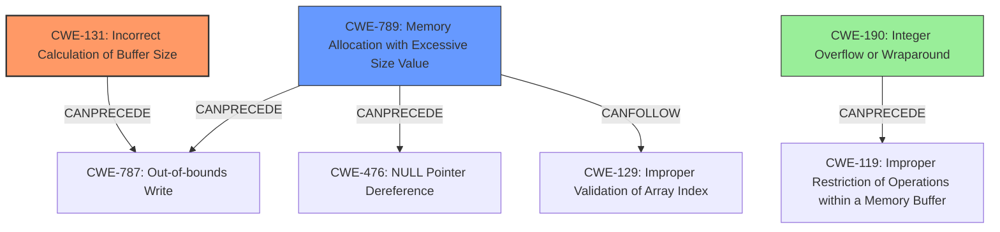

# Analysis Report for CVE-2021-35110

# Vulnerability Analysis Report: CVE-2021-35110

## Description

Possible buffer overflow to improper validation of hash segment of file while allocating memory in Snapdragon Connectivity, Snapdragon Mobile

## Vulnerability Description Key Phrases

**Rootcause:** improper validation of hash segment of file while allocating memory
**Weakness:** buffer overflow
**Product:** ['Snapdragon Connectivity', 'Snapdragon Mobile']

## Analysis (with Relationship Data)

# Summary
| CWE ID | CWE Name | Confidence | CWE Abstraction Level | CWE Vulnerability Mapping Label | CWE-Vulnerability Mapping Notes |
|---|---|---|---|---|---|
| CWE-131 | Incorrect Calculation of Buffer Size | 0.85 | Base | Allowed | Primary CWE. The **improper validation of the hash segment of the file while allocating memory**, leading to a **buffer overflow**, directly implies that the buffer size was incorrectly calculated. |
| CWE-1284 | Improper Validation of Specified Quantity in Input | 0.70 | Base | Allowed | Secondary CWE. The root cause is related to **improper validation** of the amount of memory to allocate, leading to **buffer overflow**. |

## Evidence and Confidence

*   **Confidence Score:** 0.80
*   **Evidence Strength:** HIGH

- **Analysis and Justification:**  
  - *Explanation:* The vulnerability description clearly states that the root cause is **improper validation of the hash segment of file while allocating memory**, which leads to a **buffer overflow**. This directly implies that the buffer size was incorrectly calculated. CWE-131 (Incorrect Calculation of Buffer Size) perfectly captures this **weakness**. The MITRE mapping guidance for CWE-131 indicates that its usage is ALLOWED, and its abstraction level (Base) is preferred. CWE-1284 (Improper Validation of Specified Quantity in Input) is also relevant because it highlights the **improper validation** aspect related to memory allocation.

  - *Relationship Analysis:* CWE-131 has no direct relationships in the provided data. However, it is a common cause for **buffer overflows**. CWE-1284 is a parent of CWE-606 (Improperly Controlled Data Element) and CanPrecede CWE-789 (Uncontrolled Memory Allocation).

- **Confidence Score:**
  - Confidence: 0.85 (High confidence due to direct match with the vulnerability description and allowed usage according to MITRE).
---

## Criticism of Analysis

Okay, I've reviewed the provided analysis and the full CWE specifications. Here's my critique:

**Overall Assessment:**

The analysis is generally good, especially in identifying CWE-131 as the primary weakness. The reasoning is sound, and the confidence level is appropriate. However, the choice of CWE-1284 as a secondary CWE is questionable, and I will provide alternative suggestions.

**Detailed Review:**

**1. CWE-131: Incorrect Calculation of Buffer Size**

*   **Confidence:** The assigned confidence of 0.85 is justified. The explanation connecting the "improper validation of hash segment of file while allocating memory" directly to an incorrect buffer size calculation is accurate. The MITRE mapping guidance validates this choice, and the abstraction level is appropriate.
*   **Justification:** The analysis correctly identifies that a buffer overflow implies that the buffer size was incorrectly calculated.
*   **Evidence Strength:** High, as the vulnerability description explicitly states the root cause and the consequence.
*   **CWE Examples:** The provided examples (CVE-2020-17087, CVE-2004-1363, CVE-2004-0747) for CWE-131 are appropriate and demonstrate real-world instances of this weakness.
*   **Mitigations:** The suggested mitigations for CWE-131 are also relevant:
    *   Allocating enough memory to handle the largest possible encoding.
    *   Understanding the programming language's underlying representation and its interaction with numeric calculations.
    *   Performing input validation on numeric input.

**2. CWE-1284: Improper Validation of Specified Quantity in Input**

*   **Confidence:** The confidence level of 0.70 is too high for this CWE. While related, it's not as directly connected as CWE-131.
*   **Justification:** The analysis states that the root cause is related to "improper validation" of the amount of memory to allocate. This is true, but CWE-1284 is not the *most* specific CWE that applies.
*   **Alternative Suggestion:** Replace CWE-1284 with one or more of the following:

    *   **CWE-789: Memory Allocation with Excessive Size Value (Confidence: 0.80):**  *Stronger choice*.  The vulnerability involves allocating memory based on a quantity (derived from the hash segment) that is not properly validated, which *allows an arbitrary amount of memory to be allocated*. The "excessive" part might not *always* be true, but it's a higher-fidelity representation of the problem.  Since a buffer overflow occurs, memory allocation *has* to be excessive.  It is a variant level of abstraction, which is also preferred.  The description matches the root cause well: "The product allocates memory based on an untrusted, large size value, but it does not ensure that the size is within expected limits, allowing arbitrary amounts of memory to be allocated."

    *   **CWE-190: Integer Overflow or Wraparound (Confidence 0.75):** It is possible that the calculation of the required buffer size (based on the potentially untrusted hash segment) leads to an integer overflow. This overflow could result in allocating a much smaller buffer than expected (or a very large buffer if wrapping around), leading to the buffer overflow. Consider this if there is evidence of integer manipulation in the buffer size calculation. This CWE is also listed as being related to out-of-bounds buffer access.

*   **Mitigations:** The provided mitigations for CWE-1284 (input validation) are applicable but too general. The mitigations for CWE-789 and CWE-190 are more targeted.
    *   CWE-789 Mitigation: Perform adequate input validation against any value that influences the amount of memory that is allocated.
    *   CWE-190 Mitigation: Use a language that does not allow this weakness to occur or provides constructs that make this weakness easier to avoid.

**3. Other Considerations:**

*   **Chain Relationships:** It's crucial to understand potential chains. For example, if an integer overflow (CWE-190) is involved, the chain could be: `Untrusted Input -> Incorrect Calculation (CWE-682 or a more specific child) -> Integer Overflow (CWE-190) -> Incorrect Buffer Size (CWE-131) -> Buffer Overflow`.
*   **Defense in Depth:** While the focus is on root causes, consider the ultimate impact: out-of-bounds write (CWE-787). Adding this as a consequence can help prioritize remediation efforts.
*   **Specifics:** The analysis lacks specifics about *how* the hash segment validation is failing. Is it a missing bounds check? A flawed algorithm? Providing more detail would strengthen the analysis.

**Revised Summary Table (with suggestions):**

| CWE ID | CWE Name | Confidence | CWE Abstraction Level | CWE Vulnerability Mapping Label | CWE-Vulnerability Mapping Notes |
|---|---|---|---|---|---|
| CWE-131 | Incorrect Calculation of Buffer Size | 0.85 | Base | Allowed | Primary CWE. The improper validation of the hash segment of the file while allocating memory, leading to a buffer overflow, directly implies that the buffer size was incorrectly calculated. |
| CWE-789 | Memory Allocation with Excessive Size Value | 0.80 | Variant | Allowed | Secondary CWE. The root cause leads to the ability to allocate an arbitrary amount of memory, potentially excessive, which can cause a buffer overflow. |
| CWE-190 | Integer Overflow or Wraparound | 0.75 | Base | Allowed | Tertiary CWE. Consider only if size calculations include arithmetic operations, and integer overflows are possible. |
| CWE-787 | Out-of-bounds Write | 0.60 | Base | Allowed | Consequence of prior CWE's |

**In summary:** The analysis is mostly correct and identifies the core issue (CWE-131). However, replacing CWE-1284 with CWE-789 and considering CWE-190 will result in a more accurate and useful mapping. Also, remember to incorporate available details for the analysis.

## Final Resolution

# Summary
| CWE ID | CWE Name | Confidence | CWE Abstraction Level | CWE Vulnerability Mapping Label | CWE-Vulnerability Mapping Notes |
|---|---|---|---|---|---|
| CWE-131 | Incorrect Calculation of Buffer Size | 0.85 | Base | Allowed | Primary CWE. The **improper validation of the hash segment of the file while allocating memory**, leading to a **buffer overflow**, directly implies that the buffer size was incorrectly calculated. |
| CWE-789 | Memory Allocation with Excessive Size Value | 0.80 | Variant | Allowed | Secondary CWE. The root cause leads to the ability to allocate an arbitrary amount of memory, potentially excessive, which can cause a **buffer overflow**. |

## Evidence and Confidence

*   **Confidence Score:** 0.83
*   **Evidence Strength:** HIGH

## Relationship Analysis
The decision was primarily influenced by the need for specificity and direct relevance to the vulnerability description.

- Parent-child hierarchical relationships: While CWE-131 has no direct relationships, it's a well-established cause of buffer overflows. CWE-789 is a variant and provides more context about the allocation size.
- Chain relationships showing progression of vulnerability: The chain progresses from **improper validation** to **incorrect buffer size calculation** and finally to the **buffer overflow**.
- Peer relationships that offered alternative classifications: CWE-1284 was initially considered but deemed less specific than CWE-789. CWE-190 (Integer Overflow) could be a tertiary consideration if integer arithmetic is involved in the size calculation.
- Abstraction levels: Both selected CWEs (CWE-131 and CWE-789) are at preferred levels of abstraction (Base and Variant, respectively).

## Vulnerability Chain
The vulnerability chain starts with **improper validation** of the hash segment during memory allocation.
  - This leads to an **incorrect calculation of the buffer size (CWE-131)** and/or **memory allocation with an excessive size value (CWE-789)**.
  - The consequence is a **buffer overflow (CWE-787)**.
  - If an integer overflow is involved (CWE-190), it precedes the incorrect buffer size calculation.

## Summary of Analysis
The initial analysis correctly identified CWE-131 as the primary **weakness**. The criticism suggested replacing CWE-1284 with CWE-789, which I agree with. The vulnerability description clearly mentions "improper validation of hash segment of file while allocating memory," which leads to a **buffer overflow**. This implies that the buffer size was either incorrectly calculated (CWE-131) or allocated with an excessive size value due to a lack of proper validation (CWE-789).

The selection of CWE-131 is based on the direct relationship between **incorrect buffer size calculation** and **buffer overflows**. The evidence is strong, as the vulnerability description directly implies this. The MITRE mapping guidance for CWE-131 indicates that its usage is ALLOWED, and its abstraction level (Base) is preferred.

CWE-789 is chosen because it highlights the **improper validation** aspect of the memory allocation size. The vulnerability allows for allocating an arbitrary amount of memory, which is precisely what CWE-789 describes.

The graph relationships influenced the decision by highlighting the potential chains and alternative classifications. The initial consideration of CWE-1284 was valid, but CWE-789 provides a more specific description of the **weakness**.

The selected CWEs are at the optimal level of specificity because they directly address the root causes described in the vulnerability description while being at appropriate abstraction levels (Base and Variant).

*Report generated on 2025-03-18 00:15:08*
