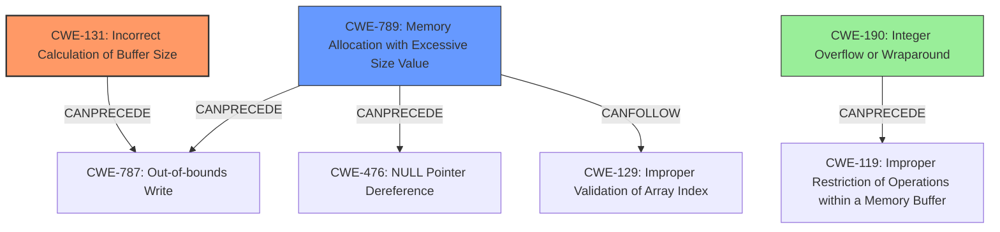

# Final Resolution for CVE-2021-35110

# Summary
| CWE ID | CWE Name | Confidence | CWE Abstraction Level | CWE Vulnerability Mapping Label | CWE-Vulnerability Mapping Notes |
|---|---|---|---|---|---|
| CWE-131 | Incorrect Calculation of Buffer Size | 0.85 | Base | Allowed | Primary CWE. The **improper validation of the hash segment of the file while allocating memory**, leading to a **buffer overflow**, directly implies that the buffer size was incorrectly calculated. |
| CWE-789 | Memory Allocation with Excessive Size Value | 0.80 | Variant | Allowed | Secondary CWE. The root cause leads to the ability to allocate an arbitrary amount of memory, potentially excessive, which can cause a **buffer overflow**. |

## Evidence and Confidence

*   **Confidence Score:** 0.83
*   **Evidence Strength:** HIGH

## Relationship Analysis
The decision was primarily influenced by the need for specificity and direct relevance to the vulnerability description.

- Parent-child hierarchical relationships: While CWE-131 has no direct relationships, it's a well-established cause of buffer overflows. CWE-789 is a variant and provides more context about the allocation size.
- Chain relationships showing progression of vulnerability: The chain progresses from **improper validation** to **incorrect buffer size calculation** and finally to the **buffer overflow**.
- Peer relationships that offered alternative classifications: CWE-1284 was initially considered but deemed less specific than CWE-789. CWE-190 (Integer Overflow) could be a tertiary consideration if integer arithmetic is involved in the size calculation.
- Abstraction levels: Both selected CWEs (CWE-131 and CWE-789) are at preferred levels of abstraction (Base and Variant, respectively).

## Vulnerability Chain
The vulnerability chain starts with **improper validation** of the hash segment during memory allocation.
  - This leads to an **incorrect calculation of the buffer size (CWE-131)** and/or **memory allocation with an excessive size value (CWE-789)**.
  - The consequence is a **buffer overflow (CWE-787)**.
  - If an integer overflow is involved (CWE-190), it precedes the incorrect buffer size calculation.

## Summary of Analysis
The initial analysis correctly identified CWE-131 as the primary **weakness**. The criticism suggested replacing CWE-1284 with CWE-789, which I agree with. The vulnerability description clearly mentions "improper validation of hash segment of file while allocating memory," which leads to a **buffer overflow**. This implies that the buffer size was either incorrectly calculated (CWE-131) or allocated with an excessive size value due to a lack of proper validation (CWE-789).

The selection of CWE-131 is based on the direct relationship between **incorrect buffer size calculation** and **buffer overflows**. The evidence is strong, as the vulnerability description directly implies this. The MITRE mapping guidance for CWE-131 indicates that its usage is ALLOWED, and its abstraction level (Base) is preferred.

CWE-789 is chosen because it highlights the **improper validation** aspect of the memory allocation size. The vulnerability allows for allocating an arbitrary amount of memory, which is precisely what CWE-789 describes.

The graph relationships influenced the decision by highlighting the potential chains and alternative classifications. The initial consideration of CWE-1284 was valid, but CWE-789 provides a more specific description of the **weakness**.

The selected CWEs are at the optimal level of specificity because they directly address the root causes described in the vulnerability description while being at appropriate abstraction levels (Base and Variant).