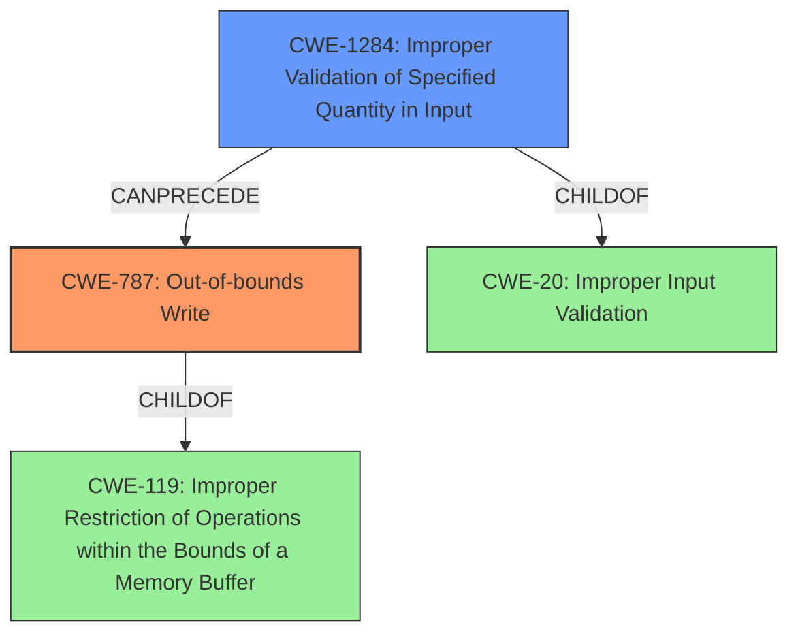

# Analysis Report for CVE-2021-35132

# Vulnerability Analysis Report: CVE-2021-35132

## Description

Out of bound write in DSP service due to improper bound check for response buffer size in Snapdragon Auto, Snapdragon Compute, Snapdragon Connectivity, Snapdragon Consumer IOT, Snapdragon Industrial IOT, Snapdragon Mobile, Snapdragon Wearables

## Vulnerability Description Key Phrases

**Rootcause:** improper bound check
**Weakness:** Out of bound write
**Product:** Snapdragon Auto, Snapdragon Compute, Snapdragon Connectivity, Snapdragon Consumer IOT, Snapdragon Industrial IOT, Snapdragon Mobile, Snapdragon Wearables
**Component:** DSP service

## Analysis (with Relationship Data)

# Summary
| CWE ID | CWE Name | Confidence | CWE Abstraction Level | CWE Vulnerability Mapping Label | CWE-Vulnerability Mapping Notes |
|---|---|---|---|---|---|
| CWE-787 | Out-of-bounds Write | 0.95 | Base | Allowed | Primary CWE |
| CWE-1284 | Improper Validation of Specified Quantity in Input | 0.75 | Base | Allowed | Secondary Candidate |

## Evidence and Confidence

*   **Confidence Score:** 0.85
*   **Evidence Strength:** HIGH

- **Analysis and Justification:**  
  - *Explanation:* The vulnerability is described as an "**Out of bound write**" due to "**improper bound check**" in the DSP service. This directly corresponds to CWE-787 (Out-of-bounds Write), which occurs when software writes data past the end, or before the beginning, of the intended buffer. The vulnerability description explicitly mentions that the root cause is an "**improper bound check**", indicating that the software fails to properly validate the size or boundaries of the data being written, leading to the out-of-bounds write.

  - *Relationship Analysis:* CWE-787 is a base level CWE and has parent child relationships with CWE-124, CWE-123, CWE-122, and CWE-121. It is a child of CWE-119 (Improper Restriction of Operations within the Bounds of a Memory Buffer). Given the provided information, CWE-787 is the most specific and fitting CWE. The related CWEs such as CWE-1284 and CWE-129 highlight the potential issues with input validation.

- **Confidence Score:**
  - Confidence: 0.95 (High confidence due to direct matching of the vulnerability description with the CWE definition and the root cause being clearly identified.)

---
- **Analysis and Justification:**  
  - *Explanation:* CWE-1284 (Improper Validation of Specified Quantity in Input) is a plausible secondary CWE because the primary root cause is "**improper bound check**". While the primary issue leads to an out-of-bounds write (CWE-787), the underlying cause involves the **improper** validation of the buffer size or other quantity related to the write operation. If the size of the response buffer is not correctly validated, it can lead to writing beyond the allocated memory.
  - *Relationship Analysis:* CWE-1284 is a base level CWE and a child of CWE-20 (Improper Input Validation). It can precede CWE-789 (Uncontrolled Memory Allocation).
- **Confidence Score:**
  - Confidence: 0.75 (Medium confidence because the description focuses more on the out-of-bounds write itself, but the **improper bound check** certainly suggests a validation issue.)

## Criticism of Analysis

Okay, here's a detailed review of the provided CWE analysis, incorporating the full CWE specifications.

**Overall Assessment:**

The analysis is generally good and provides strong justification for the selection of CWE-787 as the primary CWE. The reasoning behind including CWE-1284 as a secondary candidate is also sound. The confidence scores are appropriate.

**Detailed Review:**

**1. CWE-787: Out-of-bounds Write**

*   **Confidence:** 0.95 (Excellent)
*   **Justification:**
    *   The analysis directly links the "**Out of bound write**" and "**improper bound check**" from the vulnerability description to the core definition of CWE-787.  This is a clear and direct match, making the high confidence justified.
    *   The relationship analysis is also well-done, correctly identifying CWE-119 as a parent and listing relevant children like CWE-121, CWE-122, etc.
*   **CWE Specification Compliance:**
    *   The analysis aligns with the "Mapping Guidance" for CWE-787, which states "This CWE entry is at the Base level of abstraction, which is a preferred level of abstraction for mapping to the root causes of vulnerabilities." It correctly avoids more general CWEs like CWE-119 and chooses a more specific base level CWE.
    *   Mitigation suggestions are relevant. The listed mitigations (Language Selection, Libraries/Frameworks, Environment Hardening) are all appropriate general strategies for preventing out-of-bounds writes, as suggested by the CWE specification.
*   **Minor Notes:** None.

**2. CWE-1284: Improper Validation of Specified Quantity in Input**

*   **Confidence:** 0.75 (Appropriate)
*   **Justification:**
    *   The analysis correctly recognizes that the "**improper bound check**" strongly suggests an underlying validation issue related to the size or quantity of the response buffer.
    *   The relationship analysis is also on point, highlighting the parent CWE-20 (Improper Input Validation).
*   **CWE Specification Compliance:**
    *   The analysis aligns with the "Mapping Guidance" for CWE-1284, which states "This CWE entry is at the Base level of abstraction, which is a preferred level of abstraction for mapping to the root causes of vulnerabilities."
    *   Mitigation suggestions are fitting. The listed mitigations (Input Validation) are relevant to CWE-1284, as suggested by the CWE specification.
*   **Minor Notes:**
    *   It might be beneficial to explicitly state what "quantity" is being improperly validated (i.e., the response buffer size).
    *   Consider mentioning that CWE-1284 can be part of a chain leading to CWE-787. This would strengthen the link between the primary and secondary CWEs.

**General Observations and Suggestions:**

*   **Clarity of Relationship:** While the analysis mentions parent-child relationships, explicitly stating the chain of events (e.g., "Improper validation of buffer size (CWE-1284) leads to an out-of-bounds write (CWE-787)") can enhance understanding.
*   **Consider CWE-131: Incorrect Calculation of Buffer Size**: It might be worth briefly considering and then explicitly excluding CWE-131. While the description mentions improper bound check, if the size *calculation* itself was flawed, CWE-131 would be relevant. The justification for excluding it would be that the description implies the calculation was correct, but the result was not validated against the buffer's limits.
*   **Avoid Generic CWE-20:** The CWE specification discourages the use of CWE-20, and recommends selecting a lower level child CWE instead. The analysis does a good job of this, because it selects CWE-1284 instead of CWE-20.
*   **Examples:** Adding a few real-world examples (CVEs) related to similar vulnerabilities in DSP services or buffer handling would further strengthen the analysis.

**Revised Summary Table:**

| CWE ID | CWE Name | Confidence | CWE Abstraction Level | CWE Vulnerability Mapping Label | CWE-Vulnerability Mapping Notes |
|---|---|---|---|---|---|
| CWE-787 | Out-of-bounds Write | 0.95 | Base | Allowed | Primary CWE |
| CWE-1284 | Improper Validation of Specified Quantity in Input | 0.75 | Base | Allowed | Secondary Candidate (contributing factor) |

**Conclusion:**

This is a well-reasoned and justified CWE analysis. The selection of CWE-787 as the primary weakness is highly appropriate, and the inclusion of CWE-1284 as a contributing factor is also defensible. The suggestions above are primarily for refinement and further strengthening the justification.

## Final Resolution

# Summary
| CWE ID | CWE Name | Confidence | CWE Abstraction Level | CWE Vulnerability Mapping Label | CWE-Vulnerability Mapping Notes |
|---|---|---|---|---|---|
| CWE-787 | Out-of-bounds Write | 0.95 | Base | Allowed | Primary CWE |
| CWE-1284 | Improper Validation of Specified Quantity in Input | 0.75 | Base | Allowed | Secondary Candidate |

## Evidence and Confidence

*   **Confidence Score:** 0.90
*   **Evidence Strength:** HIGH

## Relationship Analysis
The primary relationship impacting the decision is the parent-child relationship between CWE-787 (**Out-of-bounds Write**) and CWE-119 (**Improper Restriction of Operations within the Bounds of a Memory Buffer**). CWE-787 is a specific type of CWE-119. Also, the secondary CWE-1284 (**Improper Validation of Specified Quantity in Input**) is a child of CWE-20 (**Improper Input Validation**). The chain relationship shows that CWE-1284 can precede CWE-787, as improper validation can lead to out-of-bounds writes.

## Vulnerability Chain
The vulnerability chain starts with **CWE-1284** (**Improper Validation of Specified Quantity in Input**), where the size of the response buffer is not properly validated. This leads to **CWE-787** (**Out-of-bounds Write**) when data is written beyond the allocated memory. The root cause is the lack of proper input validation, which then manifests as an out-of-bounds write, leading to potential impacts like code execution or denial of service.

## Summary of Analysis
The analysis is based on the provided evidence, specifically the vulnerability description stating "**Out of bound write**" due to "**improper bound check**". This directly supports the selection of **CWE-787** (**Out-of-bounds Write**) as the primary weakness. The inclusion of **CWE-1284** (**Improper Validation of Specified Quantity in Input**) as a secondary candidate is justified because the "**improper bound check**" indicates a validation issue with the buffer size or quantity.

The graph relationships reinforce this selection, with **CWE-787** being a specific type of buffer error (child of **CWE-119**) and **CWE-1284** being a type of input validation error (child of **CWE-20**) that can lead to buffer overflows.

The selected CWEs are at the optimal level of specificity because they directly address the root cause and manifestation of the vulnerability. **CWE-787** accurately describes the out-of-bounds write, and **CWE-1284** captures the underlying validation failure that enabled the write.

The criticism also suggests considering CWE-131, but the description focuses on improper bound *check*, rather than incorrect size *calculation*.

*Report generated on 2025-03-18 00:17:43*
