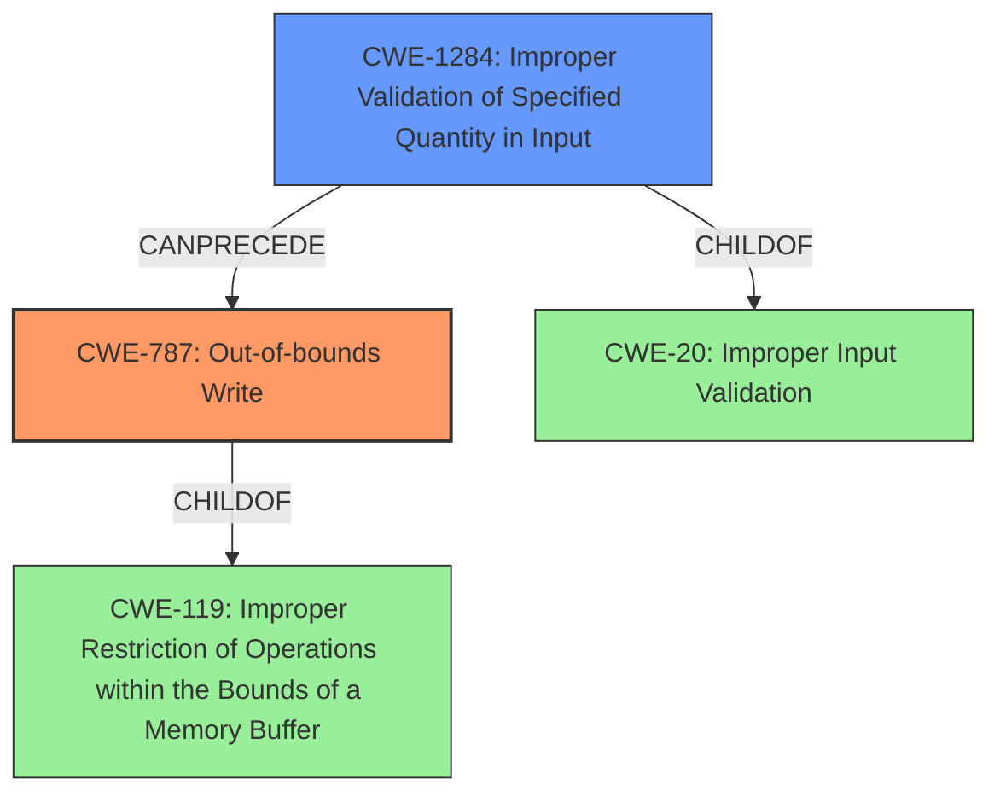

# Final Resolution for CVE-2021-35132

# Summary
| CWE ID | CWE Name | Confidence | CWE Abstraction Level | CWE Vulnerability Mapping Label | CWE-Vulnerability Mapping Notes |
|---|---|---|---|---|---|
| CWE-787 | Out-of-bounds Write | 0.95 | Base | Allowed | Primary CWE |
| CWE-1284 | Improper Validation of Specified Quantity in Input | 0.75 | Base | Allowed | Secondary Candidate |

## Evidence and Confidence

*   **Confidence Score:** 0.90
*   **Evidence Strength:** HIGH

## Relationship Analysis
The primary relationship impacting the decision is the parent-child relationship between CWE-787 (**Out-of-bounds Write**) and CWE-119 (**Improper Restriction of Operations within the Bounds of a Memory Buffer**). CWE-787 is a specific type of CWE-119. Also, the secondary CWE-1284 (**Improper Validation of Specified Quantity in Input**) is a child of CWE-20 (**Improper Input Validation**). The chain relationship shows that CWE-1284 can precede CWE-787, as improper validation can lead to out-of-bounds writes.

## Vulnerability Chain
The vulnerability chain starts with **CWE-1284** (**Improper Validation of Specified Quantity in Input**), where the size of the response buffer is not properly validated. This leads to **CWE-787** (**Out-of-bounds Write**) when data is written beyond the allocated memory. The root cause is the lack of proper input validation, which then manifests as an out-of-bounds write, leading to potential impacts like code execution or denial of service.

## Summary of Analysis
The analysis is based on the provided evidence, specifically the vulnerability description stating "**Out of bound write**" due to "**improper bound check**". This directly supports the selection of **CWE-787** (**Out-of-bounds Write**) as the primary weakness. The inclusion of **CWE-1284** (**Improper Validation of Specified Quantity in Input**) as a secondary candidate is justified because the "**improper bound check**" indicates a validation issue with the buffer size or quantity.

The graph relationships reinforce this selection, with **CWE-787** being a specific type of buffer error (child of **CWE-119**) and **CWE-1284** being a type of input validation error (child of **CWE-20**) that can lead to buffer overflows.

The selected CWEs are at the optimal level of specificity because they directly address the root cause and manifestation of the vulnerability. **CWE-787** accurately describes the out-of-bounds write, and **CWE-1284** captures the underlying validation failure that enabled the write.

The criticism also suggests considering CWE-131, but the description focuses on improper bound *check*, rather than incorrect size *calculation*.