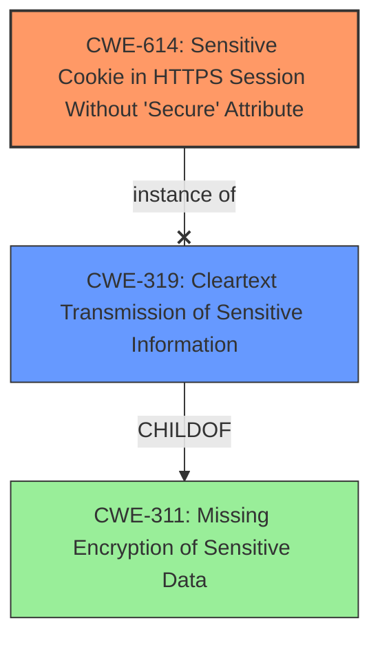

# Final Resolution for CVE-2021-35236

# Summary 
| CWE ID | CWE Name | Confidence | CWE Abstraction Level | CWE Vulnerability Mapping Label | CWE-Vulnerability Mapping Notes |
|---|---|---|---|---|---|
| CWE-614 | Sensitive Cookie in HTTPS Session Without 'Secure' Attribute | 1.0 | Variant | Allowed | Primary CWE: Matches the specific weakness of missing Secure attribute in SSL cookie. |
| CWE-319 | Cleartext Transmission of Sensitive Information | 0.7 | Base | Allowed | Secondary Candidate: Represents the broader risk of transmitting sensitive data in cleartext due to the missing Secure flag. |

## Evidence and Confidence

*   **Confidence Score:** 0.95
*   **Evidence Strength:** HIGH

## Relationship Analysis
The primary CWE, CWE-614, is a variant and doesn't have any direct relationships specified in the provided data, but it is related to the secondary CWE, CWE-319, which is a more general Base CWE. The vulnerability is specifically about the missing "Secure" attribute on a cookie, making CWE-614 the more specific and appropriate choice. The relationship analysis confirms that the initial selection is valid because CWE-614 is a specific case of the broader issue described by CWE-319. No peer relationships influence the choice. The Variant level of CWE-614 makes it ideal.

## Vulnerability Chain
The vulnerability chain starts with the **ROOTCAUSE** of the missing "Secure" attribute on the SSL cookie (**WEAKNESS**: CWE-614). This leads to the consequence that the cookie can be transmitted in cleartext over HTTP (**WEAKNESS**: CWE-319), potentially exposing sensitive information to unauthorized parties. The chain highlights how a seemingly small configuration issue (missing attribute) can result in a significant security risk (cleartext transmission).

## Summary of Analysis
The initial analysis and the criticism both converge on the same conclusion: CWE-614 (Sensitive Cookie in HTTPS Session Without 'Secure' Attribute) is the most appropriate primary CWE. The criticism provides valuable suggestions for improvement, such as including a discussion of mitigations and observed examples from the secondary CWE, CWE-319.

The decision is strongly based on the provided evidence: "The Secure flag is not set in the SSL Cookie of Kiwi Syslog Server 9.7.2 and previous versions. The Secure attribute tells the browser to only send the cookie if the request is being sent over a secure channel such as HTTPS. This will help protect the cookie from being passed over unencrypted requests. If the application can be accessed over both HTTP, there is a potential for the cookie can be sent in clear text." This directly aligns with the description of CWE-614.

The graph relationships influenced the final selection by confirming that CWE-614 is a specific instance of a broader category (CWE-319), thus justifying the choice of the more specific CWE.

The selected CWEs are at the optimal level of specificity because CWE-614 directly addresses the **ROOTCAUSE** (missing "Secure" attribute), while CWE-319 describes a potential consequence.