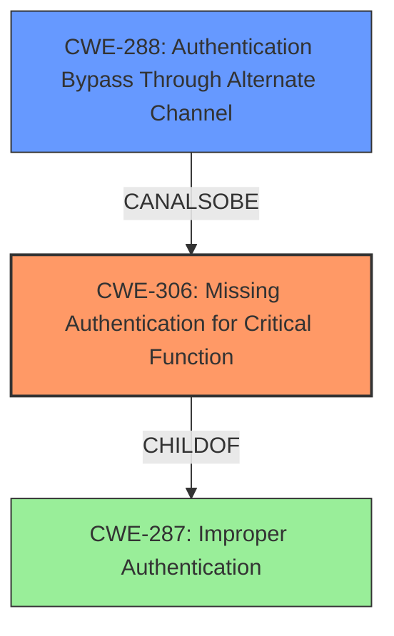

# Final Resolution for CVE-2021-35324

# Summary
| CWE ID | CWE Name | Confidence | CWE Abstraction Level | CWE Vulnerability Mapping Label | CWE-Vulnerability Mapping Notes |
|---|---|---|---|---|---|
| CWE-306 | Missing Authentication for Critical Function | 0.95 | Base | Allowed | Primary CWE. The product does not perform authentication for functionality that requires a provable user identity. |
| CWE-288 | Authentication Bypass Through Alternate Channel | 0.75 | Base | Allowed | Secondary CWE. The product has an alternate path that does not require authentication, achieved by setting `authCode=1`. |

## Evidence and Confidence

*   **Confidence Score:** 0.95
*   **Evidence Strength:** HIGH

## Relationship Analysis
The primary CWE is **CWE-306 (Missing Authentication for Critical Function)**, which represents the core issue of the vulnerability. **CWE-288 (Authentication Bypass Through Alternate Channel)** is a secondary CWE that describes how the authentication is bypassed. The relationship between them is that CWE-288 is a specific way to realize CWE-306. While **CWE-287 (Improper Authentication)** is a parent of **CWE-306**, it is less specific and therefore not chosen.

## Vulnerability Chain
The vulnerability chain starts with the **ROOTCAUSE** of **CWE-306 (Missing Authentication for Critical Function)**, where the product lacks authentication for critical functions. This leads to **CWE-288 (Authentication Bypass Through Alternate Channel)**, allowing attackers to bypass authentication using an alternate path. The final impact is unauthorized access to the admin interface.

## Summary of Analysis
The initial analysis and criticism are both well-justified. The primary **WEAKNESS** is correctly identified as **CWE-306 (Missing Authentication for Critical Function)**, and the secondary **WEAKNESS** as **CWE-288 (Authentication Bypass Through Alternate Channel)**. The vulnerability description clearly states that the `authCode=1` parameter bypasses authentication, directly aligning with CWE-306. The alternate path created by this parameter is also a direct match for CWE-288.

The graph relationships confirm that **CWE-306 (Missing Authentication for Critical Function)** is the more specific and appropriate choice compared to its parent, **CWE-287 (Improper Authentication)**. **CWE-288 (Authentication Bypass Through Alternate Channel)** provides additional context on how the bypass is achieved, strengthening the analysis.

The selected CWEs are at the optimal level of specificity. **CWE-306 (Missing Authentication for Critical Function)** is a Base-level CWE, which is preferred for mapping root causes. **CWE-288 (Authentication Bypass Through Alternate Channel)** is also a Base-level CWE, further contributing to the detailed understanding of the vulnerability.

The evidence from the vulnerability description supports this analysis: *"A vulnerability in the Form_Login function of TOTOLINK A720R A720R_Firmware V4.1.5cu.470_B20200911 allows attackers to bypass authentication."* This statement directly implies a missing authentication check, which is the core of **CWE-306 (Missing Authentication for Critical Function)**.