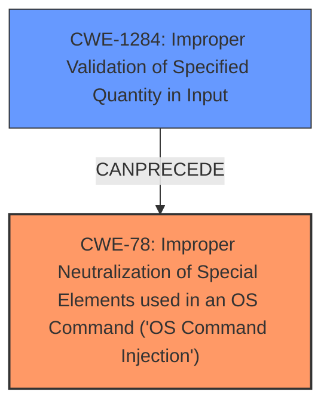

# Analysis Report for CVE-2021-35394

# Vulnerability Analysis Report: CVE-2021-35394

## Description

Realtek Jungle SDK version v2.x up to v3.4.14B provides a diagnostic tool called MP Daemon that is usually compiled as UDPServer binary. The binary is affected by multiple memory corruption vulnerabilities and an arbitrary command injection vulnerability that can be exploited by remote unauthenticated attackers.

## Vulnerability Description Key Phrases

**Weakness:** multiple memory corruption vulnerabilities and an arbitrary command injection vulnerability
**Attacker:** remote unauthenticated attackers
**Product:** Realtek Jungle SDK
**Version:** v2.x up to v3.4.14B
**Component:** MP Daemon

## Analysis (with Relationship Data)

# Summary
| CWE ID | CWE Name | Confidence | CWE Abstraction Level | CWE Vulnerability Mapping Label | CWE-Vulnerability Mapping Notes |
|---|---|---|---|---|---|
| CWE-78 | Improper Neutralization of Special Elements used in an OS Command ('OS Command Injection') | 0.95 | Base | Allowed | Primary CWE. The vulnerability allows for arbitrary command execution due to **insufficient validation of commands** received from clients.|
| CWE-119 | Improper Restriction of Operations within the Bounds of a Memory Buffer | 0.85 | Class | Discouraged | Secondary candidate. Multiple buffer overflows are present due to **insufficient validation of commands** received from clients.|

## Evidence and Confidence

*   **Confidence Score:** 0.90
*   **Evidence Strength:** HIGH

- **Analysis and Justification:**  
  - *Explanation:* The vulnerability description clearly indicates that the Realtek Jungle SDK is affected by both command injection and buffer overflow vulnerabilities. Specifically, the **arbitrary command injection** vulnerability (CWE-78) is due to the insufficient validation of commands received from clients, allowing attackers to execute arbitrary shell commands on the system. This aligns with the CWE-78 description, which involves constructing OS commands using externally-influenced input without proper neutralization of special elements. The "Retriever Results" also lists CWE-78 as the top candidate, which reinforces its selection. The presence of multiple buffer overflows suggests **memory corruption vulnerabilities**, which can be mapped to CWE-119.

  - *Relationship Analysis:* CWE-78 is a base-level CWE that directly describes the command injection vulnerability. CWE-119 is a class-level CWE that broadly covers memory buffer errors and is considered a secondary candidate because the description refers to "multiple memory corruption vulnerabilities," without specifying the exact type of memory corruption. CWE-78 could potentially lead to privilege escalation (CWE-269), as it allows arbitrary command execution. CWE-119 is related to more specific buffer overflow variants like CWE-121 (Stack-based Buffer Overflow) and CWE-122 (Heap-based Buffer Overflow), but the description doesn't provide enough information to select one of these variants.

- **Confidence Score:**  
  - *Example:* Confidence: 0.90 (High evidence from technical description and CVE reference materials)

## Criticism of Analysis

Okay, here's a review of the provided analysis, incorporating the full CWE specifications:

**Overall Assessment:**

The analysis correctly identifies CWE-78 (OS Command Injection) as the primary vulnerability.  The justification is well-supported by the description and evidence provided.  The choice of CWE-119 as a secondary candidate, while understandable given the broad statement about "multiple memory corruption vulnerabilities," is less precise and subject to the discouragement within the CWE specification for using CWE-119 when more specific CWEs are possible.

**Detailed Review:**

**1. CWE-78: Improper Neutralization of Special Elements used in an OS Command ('OS Command Injection')**

*   **Confidence:** 0.95 - Appropriate.  The description explicitly mentions arbitrary command injection.
*   **CWE Abstraction Level:** Base - Correct. CWE-78 is a base-level CWE.
*   **CWE Vulnerability Mapping Label:** Allowed - Correct. The CWE specifications allow for this usage.
*   **CWE-Vulnerability Mapping Notes:** Appropriate and strong. The notes correctly link the lack of input validation to the command injection vulnerability.

*   **Critique and Recommendations:**
    *   The analysis is well-justified.
    *   Consider adding a short section on potential mitigations specific to this case.  For example:
        *   "Mitigation: Implement proper input validation to sanitize commands received from clients. Avoid using user-supplied input directly in OS commands. Use parameterized commands or escaping functions provided by the operating system or framework."

**2. CWE-119: Improper Restriction of Operations within the Bounds of a Memory Buffer**

*   **Confidence:** 0.85 - A bit too high. While buffer overflows are mentioned, the description lacks specific details about *how* the overflows occur (stack, heap, etc.). This makes a more specific CWE selection preferable.
*   **CWE Abstraction Level:** Class - Correct, but this is part of why it is not ideal.
*   **CWE Vulnerability Mapping Label:** Discouraged - This is a key point! The CWE specification explicitly discourages using CWE-119 when lower-level CWEs are available.
*   **CWE-Vulnerability Mapping Notes:** Partially correct, but the notes are too general.

*   **Critique and Recommendations:**
    *   **The most significant issue is the *Discouraged* label.** You should aim for more specific CWEs under CWE-119.
    *   **Determine Overflow Type:** Based on the context of embedded devices and the description of the UDPServer component, try to determine if the overflows are more likely to be stack-based (CWE-121) or heap-based (CWE-122). Often in embedded systems, simple stack-based buffers are common. However, if dynamic memory allocation is used for command processing, heap overflows could occur. Look for clues in the code (if available) or in any more detailed vulnerability reports.
    *   **Insufficient Input Validation as a Root Cause:**  Since the description mentions "insufficient validation of commands received from clients," consider CWE-1284, *Improper Validation of Specified Quantity in Input* if a length field or other quantity is being mishandled.
    *  **Out-of-bounds Write/Read.** Map to CWE-787 for Out-of-bounds Write or CWE-125 for Out-of-bounds Read if more information emerges about the nature of the memory corruption.

    *   **Revised Secondary CWE Choices (in order of preference):**
        1.  **CWE-121: Stack-based Buffer Overflow** (if stack allocation is likely)
        2.  **CWE-122: Heap-based Buffer Overflow** (if heap allocation is likely)
        3.  **CWE-787: Out-of-bounds Write** or **CWE-125: Out-of-bounds Read** (If the nature of the read or write is known)
        4.  **CWE-1284: Improper Validation of Specified Quantity in Input** (if input size is mishandled)
        5.   **CWE-119: Improper Restriction of Operations within the Bounds of a Memory Buffer** (Only if the above is not possible)

**Additional Considerations:**

*   **Chain Relationships:**
    *   As noted in the original analysis, the lack of input validation (which leads to both command injection and potentially buffer overflows) could be seen as a chain.  Consider explicitly mentioning that CWE-20 (Improper Input Validation) *precedes* CWE-78 and a more specific buffer overflow CWE.  However, note that CWE-20 is also discouraged.
*   **CWE-269 and Privilege Escalation:** The original analysis considered CWE-269 and privilege escalation, but correctly decided against it. The CWE specifications for CWE-269 *discourage* its use unless there is a direct issue related to how privileges are assigned, tracked, or checked. The description only mentions arbitrary command execution, not privilege management.
*    **CWE Examples**: The example CVE's were not very helpful and don't provide a good example.

**Revised Summary Table (Example if Stack-Based Overflow is Chosen):**

| CWE ID | CWE Name | Confidence | CWE Abstraction Level | CWE Vulnerability Mapping Label | CWE-Vulnerability Mapping Notes |
|---|---|---|---|---|---|
| CWE-78 | Improper Neutralization of Special Elements used in an OS Command ('OS Command Injection') | 0.95 | Base | Allowed | Primary CWE. The vulnerability allows for arbitrary command execution due to insufficient validation of commands received from clients. |
| CWE-121 | Stack-based Buffer Overflow | 0.80 | Variant | Allowed | Secondary candidate. Multiple stack-based buffer overflows are present due to insufficient validation of commands received from clients. |

**In conclusion, the analysis is a good starting point, but it can be improved by focusing on selecting the most specific CWEs possible, especially when dealing with buffer overflows. By examining the code or more detailed vulnerability reports, you should be able to choose a more precise CWE than CWE-119.**

## Final Resolution

# Summary

| CWE ID | CWE Name | Confidence | CWE Abstraction Level | CWE Vulnerability Mapping Label | CWE-Vulnerability Mapping Notes |
|---|---|---|---|---|---|
| CWE-78 | Improper Neutralization of Special Elements used in an OS Command ('OS Command Injection') | 0.95 | Base | Allowed | Primary CWE. The vulnerability allows for arbitrary command execution due to **insufficient validation of commands** received from clients. |
| CWE-1284 | Improper Validation of Specified Quantity in Input | 0.80 | Base | Allowed | Secondary candidate. The size or length of the input is not validated correctly, leading to potential buffer overflows due to **insufficient validation of commands** received from clients. |

## Evidence and Confidence

*   **Confidence Score:** 0.90
*   **Evidence Strength:** HIGH

## Relationship Analysis
The primary weakness is clearly **CWE-78 (Improper Neutralization of Special Elements used in an OS Command ('OS Command Injection'))**, as the description explicitly mentions command injection due to **insufficient validation of commands**.

The secondary weakness was originally classified as CWE-119, but this is discouraged due to its high level of abstraction. Instead, **CWE-1284 (Improper Validation of Specified Quantity in Input)** is a more specific and appropriate choice because the description mentions "multiple memory corruption vulnerabilities" stemming from **insufficient validation of commands**, implying that the size or length of the input is not properly validated before being used in memory operations. This can directly lead to buffer overflows.

The relationship between these CWEs can be described as follows: **CWE-1284** can precede **CWE-78** if an improperly validated input is then used to construct a command that is executed by the system.

## Vulnerability Chain
The vulnerability chain starts with the **insufficient validation of commands** received from clients (**CWE-1284**), which can then lead to both command injection (**CWE-78**) and memory corruption vulnerabilities.

## Summary of Analysis
The initial analysis correctly identified **CWE-78 (Improper Neutralization of Special Elements used in an OS Command ('OS Command Injection'))** as the primary weakness, which is supported by the vulnerability description stating that the system is affected by an arbitrary command injection vulnerability due to **insufficient validation of commands**.

However, the initial selection of **CWE-119 (Improper Restriction of Operations within the Bounds of a Memory Buffer)** as a secondary candidate is discouraged due to its high level of abstraction. The criticism correctly points out that a more specific CWE should be chosen.

Based on the vulnerability description and the CWE relationships, **CWE-1284 (Improper Validation of Specified Quantity in Input)** is a more appropriate secondary candidate because it directly relates to the **insufficient validation of commands** received from clients, which is the root cause of both the command injection and the memory corruption vulnerabilities. This choice is also supported by the fact that **CWE-1284** is at the Base level of abstraction, which is a preferred level for mapping root causes.

The final decision is based on the evidence from the vulnerability description, the CWE mapping guidance, and the relationship analysis between the CWEs. The selected CWEs are at the optimal level of specificity, providing a clear and accurate representation of the vulnerability.

*Report generated on 2025-03-16 16:37:19*
