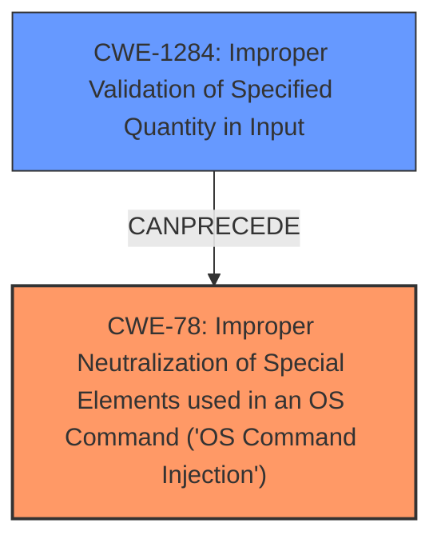

# Final Resolution for CVE-2021-35394

# Summary

| CWE ID | CWE Name | Confidence | CWE Abstraction Level | CWE Vulnerability Mapping Label | CWE-Vulnerability Mapping Notes |
|---|---|---|---|---|---|
| CWE-78 | Improper Neutralization of Special Elements used in an OS Command ('OS Command Injection') | 0.95 | Base | Allowed | Primary CWE. The vulnerability allows for arbitrary command execution due to **insufficient validation of commands** received from clients. |
| CWE-1284 | Improper Validation of Specified Quantity in Input | 0.80 | Base | Allowed | Secondary candidate. The size or length of the input is not validated correctly, leading to potential buffer overflows due to **insufficient validation of commands** received from clients. |

## Evidence and Confidence

*   **Confidence Score:** 0.90
*   **Evidence Strength:** HIGH

## Relationship Analysis
The primary weakness is clearly **CWE-78 (Improper Neutralization of Special Elements used in an OS Command ('OS Command Injection'))**, as the description explicitly mentions command injection due to **insufficient validation of commands**.

The secondary weakness was originally classified as CWE-119, but this is discouraged due to its high level of abstraction. Instead, **CWE-1284 (Improper Validation of Specified Quantity in Input)** is a more specific and appropriate choice because the description mentions "multiple memory corruption vulnerabilities" stemming from **insufficient validation of commands**, implying that the size or length of the input is not properly validated before being used in memory operations. This can directly lead to buffer overflows.

The relationship between these CWEs can be described as follows: **CWE-1284** can precede **CWE-78** if an improperly validated input is then used to construct a command that is executed by the system.

## Vulnerability Chain
The vulnerability chain starts with the **insufficient validation of commands** received from clients (**CWE-1284**), which can then lead to both command injection (**CWE-78**) and memory corruption vulnerabilities.

## Summary of Analysis
The initial analysis correctly identified **CWE-78 (Improper Neutralization of Special Elements used in an OS Command ('OS Command Injection'))** as the primary weakness, which is supported by the vulnerability description stating that the system is affected by an arbitrary command injection vulnerability due to **insufficient validation of commands**.

However, the initial selection of **CWE-119 (Improper Restriction of Operations within the Bounds of a Memory Buffer)** as a secondary candidate is discouraged due to its high level of abstraction. The criticism correctly points out that a more specific CWE should be chosen.

Based on the vulnerability description and the CWE relationships, **CWE-1284 (Improper Validation of Specified Quantity in Input)** is a more appropriate secondary candidate because it directly relates to the **insufficient validation of commands** received from clients, which is the root cause of both the command injection and the memory corruption vulnerabilities. This choice is also supported by the fact that **CWE-1284** is at the Base level of abstraction, which is a preferred level for mapping root causes.

The final decision is based on the evidence from the vulnerability description, the CWE mapping guidance, and the relationship analysis between the CWEs. The selected CWEs are at the optimal level of specificity, providing a clear and accurate representation of the vulnerability.