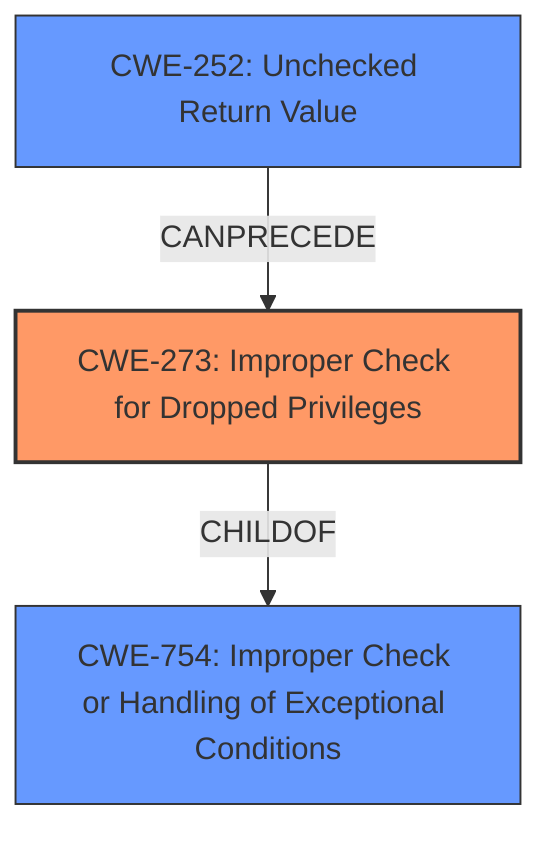

# Final Resolution for CVE-2021-35465

# Summary
| CWE ID | CWE Name | Confidence | CWE Abstraction Level | CWE Vulnerability Mapping Label | CWE-Vulnerability Mapping Notes |
|---|---|---|---|---|---|
| CWE-273 | Improper Check for Dropped Privileges | 0.7 | Base | Allowed | Primary CWE |
| CWE-754 | Improper Check or Handling of Exceptional Conditions | 0.6 | Class | Allowed-with-Review | Secondary Candidate |
| CWE-252 | Unchecked Return Value | 0.5 | Base | Allowed | Secondary Candidate |

## Evidence and Confidence

*   **Confidence Score:** 0.7
*   **Evidence Strength:** MEDIUM

## Relationship Analysis
The analysis focused on reframing the issue from a generic exception handling problem to a more specific privilege management failure. CWE-273, which deals with improper checks for dropped privileges, was identified as a better primary classification because the root cause leads to a non-secure handler gaining access to a secure context.
- Parent-child hierarchical relationships were considered, particularly those under CWE-754, but none matched the privilege context as directly as CWE-273.
- Chain relationships highlight that a mishandled exception (CWE-754) can lead to an unchecked return value (CWE-252), which in turn results in an improper privilege check (CWE-273).
- Peer relationships were assessed to ensure that similar CWEs such as CWE-285 were not more appropriate.
- Abstraction levels influenced the selection, favoring base-level CWEs (CWE-273, CWE-252) for their specificity over class-level CWEs (CWE-754).

## Vulnerability Chain
The vulnerability chain starts with the effect of exceptions on a VLLDM instruction not being properly considered (CWE-754). This leads to a failure to check return values (CWE-252), which ultimately results in a non-secure handler gaining unauthorized access to a secure context due to an improper check for dropped privileges (**CWE-273**).
- The initial flaw is the mishandling of exceptions during the execution of a VLLDM instruction.
- The resulting consequence is a privilege escalation, where a non-secure handler gains access to secure context data.

## Summary of Analysis
The initial analysis correctly identified exception handling as a key aspect of the vulnerability. However, the criticism highlighted the importance of considering the privilege escalation impact. The final determination shifts the focus to **CWE-273 (Improper Check for Dropped Privileges)** as the primary **ROOTCAUSE**, because the ultimate impact is a privilege management failure. The evidence supports this shift because the vulnerability description explicitly states that "a Non-secure handler may have read or write access to part of a Secure context." This directly relates to a failure in privilege separation.

**Quote:** "a Non-secure handler may have read or write access to part of a Secure context"

The graph relationships influenced the final selection by highlighting how the exception handling failure can lead to the privilege escalation. The selected CWEs are at the optimal level of specificity because they directly address the root cause and impact of the vulnerability, rather than remaining at a more general class level.