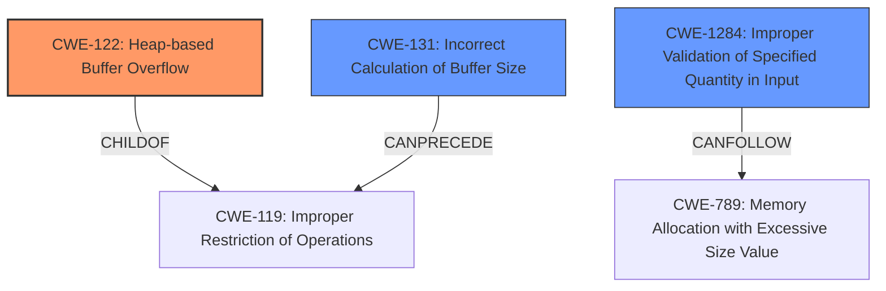

# Analysis Report for CVE-2021-3610

# Vulnerability Analysis Report: CVE-2021-3610

## Description

A heap-based buffer overflow vulnerability was found in ImageMagick in versions prior to 7.0.11-14 in ReadTIFFImage() in coders/tiff.c. This issue is due to an incorrect setting of the pixel array size, which can lead to a crash and segmentation fault.

## Vulnerability Description Key Phrases

**Rootcause:** incorrect setting of pixel array size
**Weakness:** heap-based buffer overflow
**Impact:** ['crash', 'segmentation fault']
**Product:** ImageMagick
**Version:** prior to 7.0.11-14
**Component:** ReadTIFFImage() in coders/tiff.c

## Analysis (with Relationship Data)

# Summary
| CWE ID | CWE Name | Confidence | CWE Abstraction Level | CWE Vulnerability Mapping Label | CWE-Vulnerability Mapping Notes |
|---|---|---|---|---|---|
| CWE-122 | Heap-based Buffer Overflow | 0.95 | Variant |  Primary | Allowed |
| CWE-131 | Incorrect Calculation of Buffer Size | 0.85 | Base | Secondary Candidate | Allowed |
| CWE-789 | Memory Allocation with Excessive Size Value | 0.75 | Variant | Secondary Candidate | Allowed |

## Evidence and Confidence

*   **Confidence Score:** 0.90
*   **Evidence Strength:** HIGH

- **Analysis and Justification:**  
  - *Explanation:* The vulnerability is described as a **heap-based buffer overflow** due to an **incorrect setting of the pixel array size**. This directly corresponds to CWE-122 (Heap-based Buffer Overflow), which is a buffer overflow where the buffer is allocated on the heap. The description also mentions that the issue stems from an **incorrect calculation of the extent variable**, which is used to determine the size of the memory allocation, aligning with CWE-131 (Incorrect Calculation of Buffer Size). The combination of the two weaknesses, the heap buffer overflow, and the cause, the incorrect size calculation, make both CWEs relevant. CWE-789 (Memory Allocation with Excessive Size Value) is also plausible, since the pixel array size is incorrectly set and could lead to a large memory allocation.
  
  - *Relationship Analysis:* CWE-122 is a variant of buffer overflow (CWE-119) and is a good fit because the overflow occurs on the heap. CWE-131 can precede CWE-119. CWE-789 is a child of CWE-770 (Allocation of Resources Without Limits or Throttling).

- **Confidence Score:**  
  - Confidence: 0.95 (High confidence due to the clear description of a heap-based buffer overflow and incorrect size calculation)

## Criticism of Analysis

Okay, I've reviewed the provided analysis and the full CWE specifications. Here's my critique:

**Overall Assessment:**

The analysis is generally good and identifies the key weaknesses. However, there's room for improvement in terms of precision and exploring potential chaining or composite relationships. The high confidence score for CWE-122 is justified, but the secondary candidates need a bit more refinement in their justification.

**Detailed Critique:**

1.  **CWE-122: Heap-based Buffer Overflow (Primary)**

    *   **Assessment:** Correct and well-justified. The vulnerability is explicitly described as a heap-based buffer overflow.
    *   **Confidence:** The 0.95 confidence is appropriate.
    *   **Mapping Guidance:** The analysis correctly identifies that CWE-122 is a variant (preferred abstraction level) of CWE-119.
    *   **Mitigations:** The provided mitigations in the CWE specifications are suitable (language selection, safe libraries, compiler-based protections).
    *   **Observed Examples:** The CVE examples provided are relevant and support the proper application of CWE-122.

2.  **CWE-131: Incorrect Calculation of Buffer Size (Secondary Candidate)**

    *   **Assessment:** Correct and well-justified. The description explicitly mentions "incorrect setting of the pixel array size" and  "incorrect calculation of the extent variable", which directly aligns with CWE-131.
    *   **Confidence:** The 0.85 confidence is justified and could potentially be higher. The documentation provided states "This weakness may be a composite or a chain...This issue may be associated with many different types of incorrect calculations (CWE-682)..."
    *   **Mapping Guidance:** Correctly identifies CWE-131 as a Base level CWE (preferred level). The mapping guidance suggests looking at other types of incorrect calculations (CWE-682).
    *   **Mitigations:** The provided mitigations are appropriate, such as allocating sufficient memory, understanding the programming language's numeric representation, and input validation.
    *   **Observed Examples:** The CVE examples provided are relevant and support the proper application of CWE-131.
    *   **Improvement Suggestion:** Explicitly mention the *potential* chaining relationship with CWE-119 (Improper Restriction of Operations within the Bounds of a Memory Buffer) as outlined in the 'Relationships' section of the CWE Documentation. The full documentation states that it "CanPrecede -> CWE-119". This means the incorrect calculation can lead to a buffer overflow

3.  **CWE-789: Memory Allocation with Excessive Size Value (Secondary Candidate)**

    *   **Assessment:** Potentially misapplied, depending on the specifics of the incorrect calculation. The vulnerability description states that the incorrect setting of pixel array size "can lead to a crash and segmentation fault", which typically occurs when an undersized buffer is allocated and overwritten, not necessarily when an excessively large buffer is allocated.  The updated documentation explicitly states "Integer overflow attacks would concentrate on providing an extremely large number that triggers an overflow that causes less memory to be allocated than expected."
    *   **Confidence:** The 0.75 confidence is too high given the above assessment.
    *   **Mapping Guidance:** Correctly identifies CWE-789 as a Variant level CWE (preferred level). The guidance suggests ensuring the mapping is an appropriate fit, which, in this case, is questionable.
    *   **Mitigations:** While the mitigations (input validation, system resource limits) are generally good practices, they are less directly applicable *if* the issue is primarily due to an *undersized* allocation.
    *   **Observed Examples:** The observed examples shown in the documentation do not support this implementation of the vulnerability. It more correctly fits when *excessive* memory is consumed leading to a denial of service, rather than it leading to a buffer overflow.
    *   **Improvement Suggestions:**

        *   Consider replacing CWE-789 with **CWE-1284: Improper Validation of Specified Quantity in Input.** The root cause is that an incorrect value for image dimensions (width, height) is used to calculate the size of the buffer. This directly aligns with the description of CWE-1284, which addresses vulnerabilities stemming from missing or inadequate input validation of quantities like sizes and lengths. The documentation shows a link between this CWE and CWE-789 "CanFollow -> CWE-789" meaning this is the first step that can lead to the excessive memory allocation.
        *   Alternately, consider replacing it with **CWE-770: Allocation of Resources Without Limits or Throttling**, the parent of CWE-789. Since the amount of memory is not correctly being calculated, it can be said that the system is allocating resources without limits.

**General Suggestions:**

*   **Chaining:** Explicitly discuss potential chaining relationships in the "Relationship Analysis" section.  For example, CWE-131 can precede CWE-119, and CWE-119 can lead to CWE-787 or CWE-125.
*   **Composite Nature:** Briefly mention if the vulnerability could be considered a composite of multiple weaknesses working together.
*   **Leverage Retriever Results:** Reference or consider CWEs from the "Top Combined Results" even if they aren't ultimately chosen. This demonstrates a thorough evaluation.  For example, CWE-190 (Integer Overflow or Wraparound) could be relevant, especially if the size calculation involves multiplications that could overflow, leading to a smaller-than-expected buffer.
*   **Be Precise with Justification:** Avoid generalizations. Each CWE mapping should have a specific and concrete justification based on the vulnerability description.

**Revised Summary Table:**

Here's an example of how the summary table could be revised:

| CWE ID | CWE Name | Confidence | CWE Abstraction Level | CWE Vulnerability Mapping Label | CWE-Vulnerability Mapping Notes |
|---|---|---|---|---|---|
| CWE-122 | Heap-based Buffer Overflow | 0.95 | Variant | Primary |  Allowed |
| CWE-131 | Incorrect Calculation of Buffer Size | 0.90 | Base | Secondary Candidate | Allowed, CanPrecede -> CWE-119 |
| CWE-1284 | Improper Validation of Specified Quantity in Input | 0.80 | Base | Secondary Candidate | Allowed, CanFollow -> CWE-789 |
|---|---|---|---|---|---|

**In summary:** The analysis is a good starting point, but a deeper dive into the CWE specifications, explicit consideration of chaining, and more precise justification of secondary candidates will improve its accuracy and usefulness.

## Final Resolution

# Summary
| CWE ID | CWE Name | Confidence | CWE Abstraction Level | CWE Vulnerability Mapping Label | CWE-Vulnerability Mapping Notes |
|---|---|---|---|---|---|
| CWE-122 | Heap-based Buffer Overflow | 0.95 | Variant | Primary | Allowed |
| CWE-131 | Incorrect Calculation of Buffer Size | 0.90 | Base | Secondary Candidate | Allowed, CanPrecede -> CWE-119 |
| CWE-1284 | Improper Validation of Specified Quantity in Input | 0.80 | Base | Secondary Candidate | Allowed, CanFollow -> CWE-789 |

## Evidence and Confidence

*   **Confidence Score:** 0.92
*   **Evidence Strength:** HIGH

## Relationship Analysis
The analysis focuses on hierarchical and chain relationships between CWEs. CWE-122, a variant of CWE-119 (Improper Restriction of Operations within the Bounds of a Memory Buffer), indicates a buffer overflow on the heap. CWE-131 (Incorrect Calculation of Buffer Size) is identified as a root cause that can precede CWE-119, leading to the overflow. CWE-1284 (Improper Validation of Specified Quantity in Input) can lead to CWE-789 (Memory Allocation with Excessive Size Value). The abstraction levels (Variant, Base) guide the selection of the most specific and relevant CWEs.

## Vulnerability Chain
The vulnerability chain starts with **CWE-1284 (Improper Validation of Specified Quantity in Input)**, where the image dimensions are not properly validated. This leads to **CWE-131 (Incorrect Calculation of Buffer Size)**, resulting in an undersized buffer allocation. This ultimately causes **CWE-122 (Heap-based Buffer Overflow)** when data is written beyond the allocated buffer on the heap. The root cause is the lack of input validation, which propagates to an incorrect size calculation and finally manifests as a heap overflow.

## Summary of Analysis
The initial analysis correctly identified CWE-122 as the primary weakness due to the heap-based buffer overflow. The criticism highlighted the potential misapplication of CWE-789, suggesting CWE-1284 as a more appropriate secondary candidate.

The decision to include CWE-131 and CWE-1284 is based on the vulnerability description indicating an "incorrect setting of the pixel array size." This directly relates to an incorrect calculation and a lack of input validation of the image dimensions (width, height).

*Relationship Analysis:* The graph relationships confirm that CWE-131 can precede CWE-119, contributing to the buffer overflow (CWE-122). The "CanFollow" relationship between CWE-1284 and CWE-789 reinforces the idea that an improper quantity validation can lead to memory allocation issues.

*Optimal Specificity:* CWE-122 accurately represents the type of buffer overflow. CWE-131 and CWE-1284 provide additional context about the root cause and the flawed calculation/validation process. These CWEs are at the base and variant levels, providing sufficient granularity without being overly abstract.

*Evidence:* The vulnerability description states, "This issue is due to an incorrect setting of the pixel array size, which can lead to a crash and segmentation fault." This provides direct evidence for CWE-131 (incorrect size calculation). The implied lack of validation of image dimensions justifies the inclusion of CWE-1284.

*Report generated on 2025-03-18 00:20:53*
