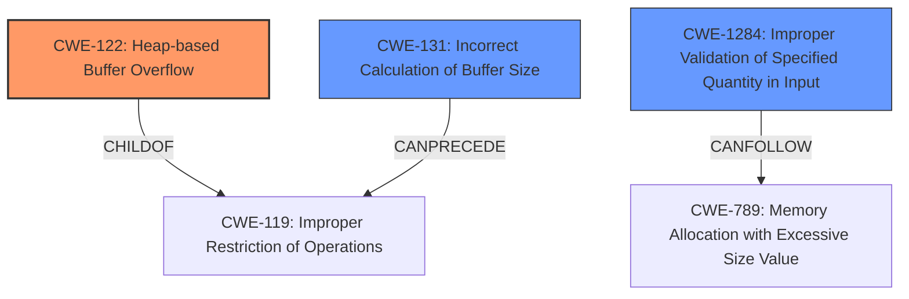

# Final Resolution for CVE-2021-3610

# Summary
| CWE ID | CWE Name | Confidence | CWE Abstraction Level | CWE Vulnerability Mapping Label | CWE-Vulnerability Mapping Notes |
|---|---|---|---|---|---|
| CWE-122 | Heap-based Buffer Overflow | 0.95 | Variant | Primary | Allowed |
| CWE-131 | Incorrect Calculation of Buffer Size | 0.90 | Base | Secondary Candidate | Allowed, CanPrecede -> CWE-119 |
| CWE-1284 | Improper Validation of Specified Quantity in Input | 0.80 | Base | Secondary Candidate | Allowed, CanFollow -> CWE-789 |

## Evidence and Confidence

*   **Confidence Score:** 0.92
*   **Evidence Strength:** HIGH

## Relationship Analysis
The analysis focuses on hierarchical and chain relationships between CWEs. CWE-122, a variant of CWE-119 (Improper Restriction of Operations within the Bounds of a Memory Buffer), indicates a buffer overflow on the heap. CWE-131 (Incorrect Calculation of Buffer Size) is identified as a root cause that can precede CWE-119, leading to the overflow. CWE-1284 (Improper Validation of Specified Quantity in Input) can lead to CWE-789 (Memory Allocation with Excessive Size Value). The abstraction levels (Variant, Base) guide the selection of the most specific and relevant CWEs.

## Vulnerability Chain
The vulnerability chain starts with **CWE-1284 (Improper Validation of Specified Quantity in Input)**, where the image dimensions are not properly validated. This leads to **CWE-131 (Incorrect Calculation of Buffer Size)**, resulting in an undersized buffer allocation. This ultimately causes **CWE-122 (Heap-based Buffer Overflow)** when data is written beyond the allocated buffer on the heap. The root cause is the lack of input validation, which propagates to an incorrect size calculation and finally manifests as a heap overflow.

## Summary of Analysis
The initial analysis correctly identified CWE-122 as the primary weakness due to the heap-based buffer overflow. The criticism highlighted the potential misapplication of CWE-789, suggesting CWE-1284 as a more appropriate secondary candidate.

The decision to include CWE-131 and CWE-1284 is based on the vulnerability description indicating an "incorrect setting of the pixel array size." This directly relates to an incorrect calculation and a lack of input validation of the image dimensions (width, height).

*Relationship Analysis:* The graph relationships confirm that CWE-131 can precede CWE-119, contributing to the buffer overflow (CWE-122). The "CanFollow" relationship between CWE-1284 and CWE-789 reinforces the idea that an improper quantity validation can lead to memory allocation issues.

*Optimal Specificity:* CWE-122 accurately represents the type of buffer overflow. CWE-131 and CWE-1284 provide additional context about the root cause and the flawed calculation/validation process. These CWEs are at the base and variant levels, providing sufficient granularity without being overly abstract.

*Evidence:* The vulnerability description states, "This issue is due to an incorrect setting of the pixel array size, which can lead to a crash and segmentation fault." This provides direct evidence for CWE-131 (incorrect size calculation). The implied lack of validation of image dimensions justifies the inclusion of CWE-1284.