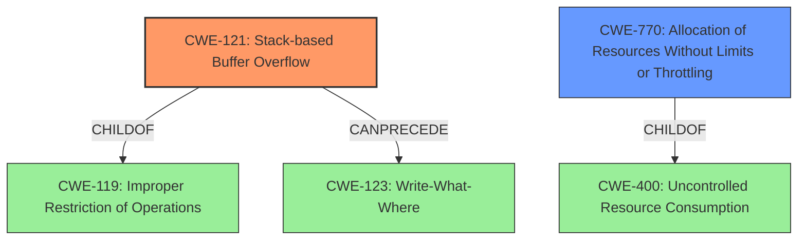

# Final Resolution for CVE-2021-3611

# Summary
| CWE ID | CWE Name | Confidence | CWE Abstraction Level | CWE Vulnerability Mapping Label | CWE-Vulnerability Mapping Notes |
|---|---|---|---|---|---|
| **CWE-121** | **Stack-based Buffer Overflow** | 0.95 | Variant | Primary | Allowed |
| **CWE-770** | **Allocation of Resources Without Limits or Throttling** | 0.60 | Base | Secondary | Allowed |

## Evidence and Confidence

*   **Confidence Score:** 0.92
*   **Evidence Strength:** HIGH

## Relationship Analysis
The primary weakness is **CWE-121 (Stack-based Buffer Overflow)**, a variant of **CWE-119 (Improper Restriction of Operations within the Bounds of a Memory Buffer)**. **CWE-121** can **CanPrecede** **CWE-123 (Write-What-Where)** if critical data is overwritten. The secondary weakness, **CWE-770 (Allocation of Resources Without Limits or Throttling)**, is related to **CWE-400 (Uncontrolled Resource Consumption)**, but less directly related to the stack overflow itself. The analysis considers these relationships to determine the most specific and relevant CWEs.

## Vulnerability Chain
The vulnerability chain starts with a re-entrancy issue in QEMU's Intel HD Audio device, where the DMA engine can re-enter the MMIO handler. This leads to uncontrolled consumption of stack space, resulting in a **stack overflow (CWE-121)**. If the overflow overwrites critical data, this can lead to a **write-what-where condition (CWE-123)**. The lack of limits on the stack usage can be viewed as related to **CWE-770 (Allocation of Resources Without Limits or Throttling)**, contributing to the **stack overflow**.

## Summary of Analysis
The initial analysis correctly identifies **CWE-121 (Stack-based Buffer Overflow)** as the primary **WEAKNESS**. The justification is supported by the vulnerability description mentioning **stack overflow** and the technical details describing the re-entrancy issue. The inclusion of **CWE-770 (Allocation of Resources Without Limits or Throttling)** as a secondary **WEAKNESS** is weaker but justifiable as a contributing factor.

The graph relationships influenced the decision by highlighting the relationship between **CWE-121** and its parent **CWE-119**, as well as the potential for **CWE-121** to **CanPrecede** **CWE-123**. The analysis also considered the relationship between **CWE-770** and **CWE-400**.

The selected CWEs are at the optimal level of specificity. **CWE-121** is a variant of **CWE-119**, providing a more precise classification of the **stack overflow**. **CWE-770** is a base CWE that captures the aspect of resource allocation without limits, although its connection to the **STACK OVERFLOW** is less direct.

The analysis is based on the provided evidence, including the vulnerability description and technical details. The decision is justified by the explicit mention of **stack overflow** and the detailed technical description of the re-entrancy issue. The selection of **CWE-121** and **CWE-770** reflects the most relevant aspects of the vulnerability.