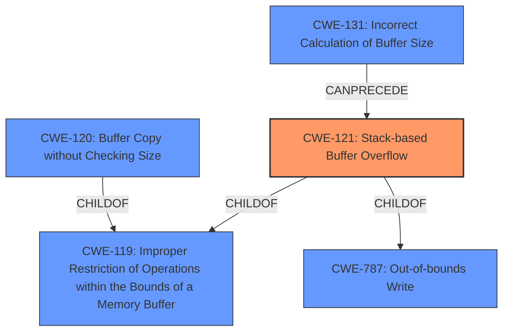

# Analysis Report for CVE-2021-36193

# Vulnerability Analysis Report: CVE-2021-36193

## Description

Multiple stack-based buffer overflows in the command line interpreter of FortiWeb before 6.4.2 may allow an authenticated attacker to achieve arbitrary code execution via specially crafted commands.

## Vulnerability Description Key Phrases

**Weakness:** stack-based buffer overflows
**Impact:** arbitrary code execution
**Vector:** specially crafted commands
**Attacker:** authenticated attacker
**Product:** FortiWeb
**Version:** before 6.4.2
**Component:** command line interpreter

## Analysis (with Relationship Data)

# Summary
| CWE ID | CWE Name | Confidence | CWE Abstraction Level | CWE Vulnerability Mapping Label | CWE-Vulnerability Mapping Notes |
|---|---|---|---|---|---|
| CWE-121 | Stack-based Buffer Overflow | 1.0 | Variant | Allowed | Primary CWE |
| CWE-120 | Buffer Copy without Checking Size of Input ('Classic Buffer Overflow') | 0.6 | Base | Allowed-with-Review | Secondary Candidate |
| CWE-131 | Incorrect Calculation of Buffer Size | 0.5 | Base | Allowed | Secondary Candidate |

## Evidence and Confidence

*   **Confidence Score:** 1.0
*   **Evidence Strength:** HIGH

- **Analysis and Justification:**
  - *Explanation:* The vulnerability description explicitly states "**stack-based buffer overflows**" in the command line interpreter. The CVE Reference Links Content Summary confirms this, explicitly stating "**CWE-121:** Stack-based buffer overflow. This occurs when a program writes data beyond the allocated buffer on the stack, potentially overwriting adjacent memory." This aligns perfectly with CWE-121 (Stack-based Buffer Overflow), which is a Variant level CWE and ALLOWED according to MITRE mapping guidance. The impact is arbitrary code execution, indicating successful exploitation.

  - The retriever results list CWE-121 as a candidate, although not with the highest score. However, given the explicit mention of "stack-based buffer overflow" in both the vulnerability description and the CVE summary, it's the most appropriate primary mapping.

  - *CWE-120:* (Buffer Copy without Checking Size of Input) is a possibility if the root cause is a buffer copy operation. However, the description doesn't explicitly state this, so it's a secondary candidate.
  - *CWE-131:* (Incorrect Calculation of Buffer Size) is a lower probability, however, it could be a contributing factor to the buffer overflow.

- **Relationship Analysis:**
  - CWE-121 is a variant of CWE-119 (Improper Restriction of Operations within the Bounds of a Memory Buffer). Exploitation can lead to CWE-787 (Out-of-bounds Write).

- **Confidence Score:**
  - Confidence: 1.0 (Direct evidence from the vulnerability description and CVE Reference Links Content Summary).

## Criticism of Analysis

Okay, here's a review of the provided CWE analysis, incorporating the full CWE specifications you've supplied, and paying close attention to mapping guidance and potential mitigations.

**Overall Assessment:**

The analysis is generally good, particularly in identifying the primary CWE. The justification is sound and based on the provided information. However, there's room for improvement in considering alternative root causes and the potential for chained weaknesses. The confidence score of 1.0 is appropriate.

**Detailed Review:**

*   **CWE-121: Stack-based Buffer Overflow (Primary CWE)**

    *   **Assessment:** Correct and well-justified.
    *   **Rationale:** The explicit mention of "stack-based buffer overflow" in the vulnerability description makes this the most obvious and appropriate primary mapping.  The impact (arbitrary code execution) further supports this.
    *   **CWE Specifications Considerations:**
        *   The analysis acknowledges that CWE-121 is a *Variant* level CWE, which is acceptable. The mapping guidance for CWE-119 *discourages* its use, and recommends using more specific children. CWE-121 fits that bill in this case.
        *   The "Potential Mitigations" for CWE-121 are relevant: compiler-based buffer overflow detection (like /GS, FORTIFY_SOURCE), using abstraction libraries, and implementing bounds checking. These are all valid strategies for mitigating stack-based overflows.

*   **CWE-120: Buffer Copy without Checking Size of Input ('Classic Buffer Overflow') (Secondary Candidate)**

    *   **Assessment:**  A reasonable secondary candidate, but perhaps overemphasized.
    *   **Rationale:** If the underlying *mechanism* of the stack-based overflow is a `memcpy` or similar function without bounds checking, then CWE-120 would be relevant. However, it's not guaranteed that a buffer copy is the direct cause. There could be other scenarios leading to the overflow.
    *   **CWE Specifications Considerations:**
        *   The analysis should note that CWE-120 is "Allowed-with-Review." The review aspect is important because CWE-120 can be misused as a generic "buffer overflow" CWE.  The analysis *does* acknowledge this by stating "However, the description doesn't explicitly state this, so it's a secondary candidate."
        *   The mitigations for CWE-120 are similar to CWE-121, which reinforces the idea that if CWE-120 is relevant, it's likely as a contributing factor alongside CWE-121.

*   **CWE-131: Incorrect Calculation of Buffer Size (Secondary Candidate)**

    *   **Assessment:** Plausible, but lower probability than CWE-120.
    *   **Rationale:** A common precursor to buffer overflows is an incorrect size calculation that leads to a buffer being allocated too small.  If the allocated buffer on the stack is too small, then a buffer overflow can occur.
    *   **CWE Specifications Considerations:**
        *   The analysis correctly notes that this is "Allowed."
        *  The mitigations for CWE-131 focus on:
        1.  Allocating enough memory to handle the largest possible encoding or transformation.
        2.  Understanding the programming language's underlying representation and how it interacts with numeric calculation (CWE-681).
        3.  Input validation on any numeric input by ensuring that it is within the expected range.

        *   If this is the root cause, *then* the analysis should consider CWE-190, integer overflow if applicable.

**Suggestions for Improvement:**

1.  **Chain Analysis:**  More emphasis on potential *chains* of weaknesses. For example:
    *   `CWE-20: Improper Input Validation` -> `CWE-131: Incorrect Calculation of Buffer Size` -> `CWE-121: Stack-based Buffer Overflow`
    *   The attacker-controlled commands could be combined with improper input validation (CWE-20), where the application does not properly sanitize the commands before using them in a system call. This could lead to command injection. So, it might be worth considering CWE-78 as a contributing factor if command injection is possible.

2.  **Alternative Root Causes:** While "stack-based buffer overflow" is explicit, consider *why* the overflow occurs. Is it due to:
    *   **CWE-120:**  An unbounded `strcpy` or similar call?
    *   **CWE-131:** A size calculation error, making the stack buffer too small?
    *   **CWE-170:** Improper Null Termination potentially causing an overflow when string functions are used.

3.  **Mitigation Focus:** The analysis could benefit from briefly mentioning the key mitigations for each of the considered CWEs, especially the primary CWE. This demonstrates a deeper understanding of the vulnerability and its implications.

4.  **Retriever Results:** Address the Retriever Results. Even though the analysis correctly identifies CWE-121, the Retriever assigned it a lower score than other CWEs (e.g., CWE-190, CWE-120, CWE-126). The analysis should explain why, despite the lower score, it considered CWE-121 the most appropriate. The retriever scores are a result of the description matching with potential weaknesses that are classified in the retriever. This is normal and it is up to the analyst to determine the final CWE and justify that choice.

5.  **CWE-787 Out-of-bounds Write:** Acknowledging that the root cause eventually leads to CWE-787 (Out-of-bounds write) would be good. CWE-121 is a child of CWE-787, so it is important to mention this in the analysis.

**Revised Summary Table:**

| CWE ID  | CWE Name                                                              | Confidence | CWE Abstraction Level | CWE Vulnerability Mapping Label | CWE-Vulnerability Mapping Notes                                                                             |
| :------- | :-------------------------------------------------------------------- | :--------- | :---------------------- | :------------------------------ | :---------------------------------------------------------------------------------------------------------- |
| CWE-121 | Stack-based Buffer Overflow                                           | 1.0        | Variant                 | Allowed                         | Primary CWE. Direct evidence from vulnerability description.                                           |
| CWE-120 | Buffer Copy without Checking Size of Input ('Classic Buffer Overflow') | 0.6        | Base                    | Allowed-with-Review           | Secondary Candidate.  Potential contributing factor if `memcpy` or similar is used without bounds checking. |
| CWE-131 | Incorrect Calculation of Buffer Size                                  | 0.5        | Base                    | Allowed                         | Secondary Candidate. Could contribute to the overflow by causing the stack buffer to be too small.          |
| CWE-787 | Out-of-bounds Write                                  | 0.9        | Base                    | Allowed                         | Out-of-bounds write is the result.         |

**Conclusion:**

The analysis is a solid starting point. By incorporating the suggestions above, focusing on chain analysis, alternative root causes, and mitigation strategies, the analysis can be further strengthened.

## Final Resolution

# Summary
| CWE ID | CWE Name | Confidence | CWE Abstraction Level | CWE Vulnerability Mapping Label | CWE-Vulnerability Mapping Notes |
|---|---|---|---|---|---|
| CWE-121 | Stack-based Buffer Overflow | 1.0 | Variant | Allowed | Primary CWE |
| CWE-120 | Buffer Copy without Checking Size of Input ('Classic Buffer Overflow') | 0.6 | Base | Allowed-with-Review | Secondary Candidate |
| CWE-131 | Incorrect Calculation of Buffer Size | 0.5 | Base | Allowed | Secondary Candidate |
| CWE-787 | Out-of-bounds Write | 0.9 | Base | Allowed | Secondary Candidate |

## Evidence and Confidence

*   **Confidence Score:** 0.95
*   **Evidence Strength:** HIGH

## Relationship Analysis
The primary CWE is CWE-121 (**CWE-121: Stack-based Buffer Overflow**), which is a variant of **CWE-787 (Out-of-bounds Write)** and **CWE-119 (Improper Restriction of Operations within the Bounds of a Memory Buffer)**. The vulnerability could also involve **CWE-120 (Buffer Copy without Checking Size of Input)** if a buffer copy operation without bounds checking is the mechanism causing the overflow, and **CWE-131 (Incorrect Calculation of Buffer Size)** if the allocated buffer on the stack is too small due to an incorrect size calculation.

## Vulnerability Chain
The vulnerability chain starts with a specially crafted command being sent to the command line interpreter. If the interpreter does not properly validate the input (potentially **CWE-20: Improper Input Validation**), and if the calculation of the buffer size is incorrect (**CWE-131**), or if a buffer copy operation is performed without checking the size of the input (**CWE-120**), then a stack-based buffer overflow occurs (**CWE-121**), leading to out-of-bounds write (**CWE-787**) and potentially arbitrary code execution.

## Summary of Analysis
The initial analysis and criticism both converge on **CWE-121 (Stack-based Buffer Overflow)** as the primary **WEAKNESS**. The explicit mention of "stack-based buffer overflow" in the vulnerability description serves as strong evidence: "Multiple stack-based buffer overflows in the command line interpreter of FortiWeb before 6.4.2 may allow an authenticated attacker to achieve arbitrary code execution via specially crafted commands."

The secondary candidates (**CWE-120, CWE-131**, and **CWE-787**) represent potential contributing factors or consequences of the **ROOTCAUSE**. **CWE-120** could be involved if a buffer copy operation without bounds checking is the specific mechanism triggering the overflow. **CWE-131** could contribute if the buffer size is incorrectly calculated, leading to a smaller-than-expected stack buffer. **CWE-787** is the result of a buffer overflow.

The graph relationships confirm that **CWE-121** is a variant of **CWE-119** and **CWE-787**, indicating that it is at an appropriate level of specificity. The chain analysis highlights how these weaknesses can interact. The retriever scores were taken into account, however, the explicit mention of "stack-based buffer overflow" makes **CWE-121** the most appropriate primary mapping. The confidence is high due to the direct evidence and corroborating relationship analysis. The selected CWEs are at the optimal level of specificity because **CWE-121** directly reflects the vulnerability described, while the secondary CWEs capture potential contributing factors and outcomes.

*Report generated on 2025-03-18 00:23:22*
