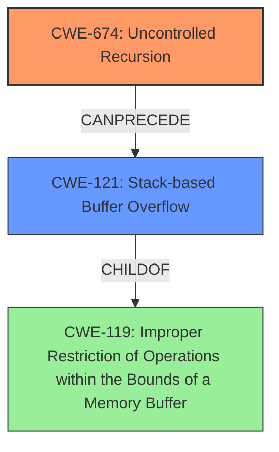

# Final Resolution for CVE-2021-3622

# Summary
| CWE ID | CWE Name | Confidence | CWE Abstraction Level | CWE Vulnerability Mapping Label | CWE-Vulnerability Mapping Notes |
|---|---|---|---|---|---|
| CWE-674 | **Uncontrolled Recursion** | 0.9 | Class | Allowed-with-Review | The vulnerability is caused by recursive call to the `_get_children()` function in the `hivex` library when processing a specially crafted Windows Registry hive file. The fix, limiting recursion depth, directly addresses this **root cause**. |
| CWE-121 | **Stack-based Buffer Overflow** | 0.7 | Variant | Allowed | The **uncontrolled recursive calls** (CWE-674) lead to a **stack overflow** (CWE-121), exhausting the stack memory. While buffer overflow protections could provide defense in depth, the primary mitigation involves limiting recursion. |

## Evidence and Confidence

*   **Confidence Score:** 0.9
*   **Evidence Strength:** HIGH

## Relationship Analysis
The primary relationship is that CWE-674 **Uncontrolled Recursion** *leads to* CWE-121 **Stack-based Buffer Overflow**. CWE-121 is a variant of CWE-119 **Improper Restriction of Operations within the Bounds of a Memory Buffer**. This means that the uncontrolled recursion is the **root cause**, and the stack overflow is the resulting impact. The analysis considered other potential CWEs, like CWE-125, CWE-190, and CWE-835, but determined that CWE-674 and CWE-121 best represented the specific vulnerability.

## Vulnerability Chain
The vulnerability chain starts with a specially crafted Windows Registry file that, when processed by the hivex library, causes the `_get_children()` function to recursively call itself without proper limits (CWE-674). This **uncontrolled recursion** leads to excessive memory allocation on the stack, ultimately resulting in a **stack overflow** (CWE-121). The impact is a denial of service due to the program crashing.

## Summary of Analysis
The initial analysis, along with the criticism, provides a strong foundation for classifying this vulnerability. The vulnerability description clearly indicates the **uncontrolled recursion** as the **root cause**, and the resulting **stack overflow** as the impact. The graph relationships confirm that CWE-674 *leads to* CWE-121, with CWE-121 being a specific type of buffer overflow (CWE-119). The analysis explicitly considered and rejected other potential CWEs like CWE-125, CWE-190, and CWE-835, justifying the selection of CWE-674 and CWE-121. The mapping guidance for both CWEs supports their use in this context, with CWE-674 being *Allowed-with-Review* and CWE-121 being *Allowed*. The selected CWEs are at the optimal level of specificity, accurately representing both the **root cause** and the impact of the vulnerability. The fix (limiting recursion depth) directly addresses the **root cause**, further validating the classification.