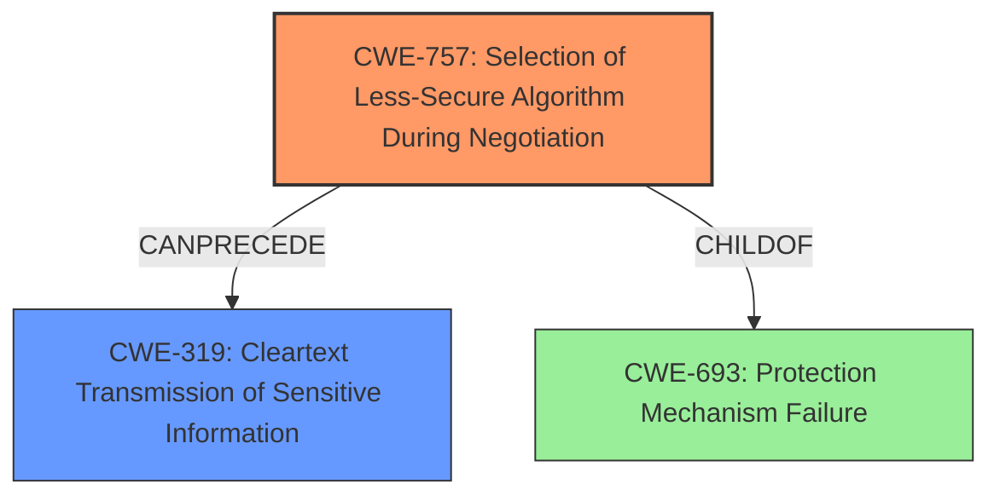

# Analysis Report for CVE-2021-36326

# Vulnerability Analysis Report: CVE-2021-36326

## Description

Dell EMC Streaming Data Platform, versions prior to 1.3 contain an SSL Strip Vulnerability in the User Interface (UI). A remote unauthenticated attacker could potentially exploit this vulnerability, leading to a downgrade in the communications between the client and server into an unencrypted format.

## Vulnerability Description Key Phrases

**Weakness:** SSL Strip Vulnerability
**Impact:** downgrade in the communications between the client and server into an unencrypted format
**Attacker:** remote unauthenticated attacker
**Product:** Dell EMC Streaming Data Platform
**Version:** versions prior to 1.3
**Component:** User Interface (UI)

## Analysis (with Relationship Data)

# Summary
| CWE ID | CWE Name | Confidence | CWE Abstraction Level | CWE Vulnerability Mapping Label | CWE-Vulnerability Mapping Notes |
|---|---|---|---|---|---|
| CWE-757 | Selection of Less-Secure Algorithm During Negotiation ('Algorithm Downgrade') | 0.9 | Base | Allowed | Primary CWE: The vulnerability allows an attacker to force the use of a less secure algorithm. |
| CWE-319 | Cleartext Transmission of Sensitive Information | 0.7 | Base | Allowed | Secondary CWE: Downgrading to an unencrypted format results in cleartext transmission. |

## Evidence and Confidence

*   **Confidence Score:** 0.8
*   **Evidence Strength:** HIGH

- **Analysis and Justification:**  
  - *Explanation:* The vulnerability description explicitly states an **SSL strip vulnerability** that leads to a downgrade in communications to an unencrypted format. This directly aligns with CWE-757, Selection of Less-Secure Algorithm During Negotiation ('Algorithm Downgrade'), as the attacker is forcing the system to use a less secure (unencrypted) communication channel. The CVE Reference Links Content Summary confirms this, stating the root cause is an SSL stripping attack leading to unencrypted communication, potentially exposing sensitive information. CWE-757 is a base-level CWE, and the MITRE mapping guidance indicates its usage is ALLOWED. While CWE-319, Cleartext Transmission of Sensitive Information, is also relevant as a consequence of the downgrade, CWE-757 represents the core **weakness** more accurately.
  
  - *Relationship Analysis:* CWE-757 does not have direct parent-child relationships listed in the provided information. However, it can lead to other vulnerabilities related to information exposure. CWE-319 is a related weakness, representing the direct consequence of the algorithm downgrade.

- **Confidence Score:**  
  - Confidence: 0.9 (High confidence due to explicit description of SSL stripping and algorithm downgrade)

---

## Criticism of Analysis

Okay, here's a review of the provided CWE analysis, incorporating the full CWE specifications, focusing on mapping guidance, abstraction levels, and potential mitigations.

**Overall Assessment:**

The analysis is generally sound and well-reasoned. The primary CWE mapping to **CWE-757: Selection of Less-Secure Algorithm During Negotiation ('Algorithm Downgrade')** is appropriate and well-justified.  The secondary mapping to **CWE-319: Cleartext Transmission of Sensitive Information** is also relevant, as it describes the direct consequence of the algorithm downgrade. The confidence levels assigned (0.9 and 0.7, respectively) seem reasonable.

**Detailed Review:**

**1. CWE-757: Selection of Less-Secure Algorithm During Negotiation ('Algorithm Downgrade')**

*   **Correctness:** This is the most accurate primary CWE. The description of the vulnerability explicitly mentions "SSL strip vulnerability" and "downgrade in communications to an unencrypted format," which aligns perfectly with CWE-757.  The "Extended Description" of CWE-757 reinforces this: *"When a security mechanism can be forced to downgrade to use a less secure algorithm, this can make it easier for attackers to compromise the product by exploiting weaker algorithm."*
*   **Abstraction Level:** Base.  As noted in the analysis, CWE-757 is a Base level CWE, which is the preferred level.
*   **Mapping Guidance:**  The "Usage: Allowed" guidance is correctly followed. The analysis explicitly references the description to ensure proper fit.
*   **Confidence:** The confidence score of 0.9 is justified due to the clear match with the vulnerability description.
*   **Potential Mitigations:** While not explicitly mentioned in the original analysis, it might be valuable to consider mitigation strategies outlined in the CWE documentation during remediation. For example, ensuring the server always selects the strongest available cipher suite and properly implements features like HTTP Strict Transport Security (HSTS) to prevent downgrade attacks.
*   **Relationship Analysis:** The analysis correctly states that CWE-757 can lead to other vulnerabilities related to information exposure. The mention of CWE-300 is useful, although not directly related in this case.

**2. CWE-319: Cleartext Transmission of Sensitive Information**

*   **Correctness:** This is a valid secondary CWE, as the ultimate impact of the SSL stripping attack is the transmission of sensitive information in cleartext. However, as stated in the analysis, CWE-757 is a more direct representation of the core weakness.
*   **Abstraction Level:** Base. CWE-319 is at the Base level of abstraction, which is a preferred level for mapping.
*   **Mapping Guidance:** The "Usage: Allowed" guidance is correctly followed.
*   **Confidence:** The confidence of 0.7 is appropriate, as it's a consequence rather than the root cause.
*   **Potential Mitigations:** The CWE-319 specification suggests mitigations such as encrypting data before transmission using reliable cryptographic protocols and ensuring SSL is used for the entire session. These are relevant and should be considered alongside mitigations for CWE-757.
*   **Relationship Analysis:** The analysis correctly identifies the relationship between CWE-757 and CWE-319 (CWE-319 is a consequence).

**Review of Retriever Results and Suggestions for Other CWEs Considered:**

The retriever results provide valuable context, but not all are directly applicable. Here's a breakdown:

*   **CWE-256: Plaintext Storage of a Password:** Not directly relevant. This vulnerability is about *transmission* in cleartext, not storage.
*   **CWE-532: Insertion of Sensitive Information into Log File:** Less relevant. While logging cleartext traffic is a potential concern, it's not the primary vulnerability.
*   **CWE-327: Use of a Broken or Risky Cryptographic Algorithm:** Not directly relevant in this specific case, as the issue is about a *downgrade* to *no* encryption (cleartext), rather than the use of a weak algorithm.
*   **CWE-200: Exposure of Sensitive Information to an Unauthorized Actor:**  This is a class-level CWE and is generally discouraged as per its mapping guidance. While it is a consequence of this vulnerability, it is too broad to be a primary or secondary mapping.
*   **CWE-522: Insufficiently Protected Credentials:** Not the best fit, as it focuses more on storage or handling of credentials, not the communication channel.
*   **CWE-311: Missing Encryption of Sensitive Data:** This Class CWE is less precise than CWE-319, which is a child of CWE-311 and applies more directly.
*   **CWE-287: Improper Authentication:**  Not directly related. Authentication might be compromised through the cleartext channel, but the core issue is the lack of encryption during communication.
*   **CWE-20: Improper Input Validation:**  Not applicable here. Input validation isn't the primary concern.

**Potential Additional Considerations:**

*   **CWE-300: Channel Accessible by Non-Endpoint:** This *might* be relevant, as an SSL stripping attack involves a man-in-the-middle. However, the CWE-300 description notes it's often misused when the adversary *requires* being in a privileged "in-the-middle" position. The root cause is still better represented by CWE-757.
*   **CWE-693: Protection Mechanism Failure:** This is the parent of CWE-757, but mapping directly to this is discouraged as it's a Pillar.
*   **CWE-5: J2EE Misconfiguration: Data Transmission Without Encryption:** This variant of CWE-319 is potentially applicable, as it directly relates to data transmission without encryption, and it could be argued that the server is misconfigured to allow for SSL stripping attacks. However, CWE-319 is the broader and more appropriate base-level CWE in this instance.
* **CWE-345: Insufficient Verification of Data Authenticity:** This is a broader concern that can be exacerbated by cleartext transmission. If the server isn't properly verifying the authenticity of data, an attacker could inject malicious content.

**Recommendations:**

*   The current mappings to CWE-757 and CWE-319 are accurate and well-justified.
*   Consider mentioning potential mitigations based on CWE-757 and CWE-319 specifications in the analysis.
*   Explicitly note why other potential CWEs (e.g., CWE-300, CWE-345, CWE-5, CWE-693) were considered and rejected. This demonstrates thoroughness.

By incorporating these suggestions, the analysis can be further strengthened and provide more actionable insights for remediation.

## Final Resolution

# Summary
| CWE ID | CWE Name | Confidence | CWE Abstraction Level | CWE Vulnerability Mapping Label | CWE-Vulnerability Mapping Notes |
|---|---|---|---|---|---|
| CWE-757 | Selection of Less-Secure Algorithm During Negotiation ('Algorithm Downgrade') | 0.95 | Base | Allowed | Primary CWE: The vulnerability allows an attacker to force the use of a less secure algorithm. |
| CWE-319 | Cleartext Transmission of Sensitive Information | 0.8 | Base | Allowed | Secondary CWE: Downgrading to an unencrypted format results in cleartext transmission. |

## Evidence and Confidence

*   **Confidence Score:** 0.9
*   **Evidence Strength:** HIGH

## Relationship Analysis
The primary relationship impacting the decision is the direct consequence of **CWE-757 (Selection of Less-Secure Algorithm During Negotiation)** leading to **CWE-319 (Cleartext Transmission of Sensitive Information)**. While other CWEs were considered, their abstraction levels or direct applicability were not as strong. CWE-757 acts as the root cause, forcing a downgrade, while CWE-319 is the immediate result.

## Vulnerability Chain
The vulnerability chain starts with the **ROOTCAUSE** being **CWE-757**, where the system fails to enforce the strongest available encryption algorithm. This leads to a downgrade to an unencrypted connection, resulting in **CWE-319**, the **WEAKNESS**, which is the cleartext transmission of sensitive data.

## Summary of Analysis
The initial analysis correctly identifies **CWE-757** and **CWE-319** as the primary and secondary CWEs. The vulnerability description explicitly mentions the "SSL strip vulnerability" and "downgrade in communications between the client and server into an unencrypted format," providing strong evidence for these classifications.

The retriever results and the criticism provided further context, but did not change the core assessment. **CWE-757** remains the most accurate representation of the root cause, with **CWE-319** as its direct consequence.

The decision is based on the direct evidence from the vulnerability description and the clear chain relationship between the two CWEs. The selected CWEs are at the optimal level of specificity, as **CWE-757** and **CWE-319** are base-level CWEs that accurately describe the vulnerability and its impact.

*Report generated on 2025-03-16 23:58:32*
